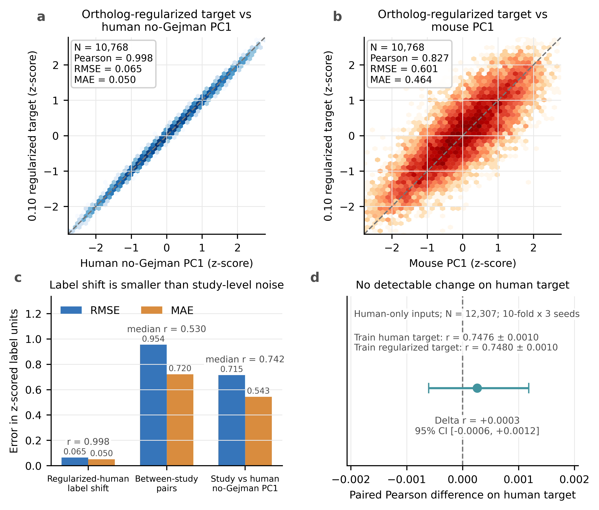
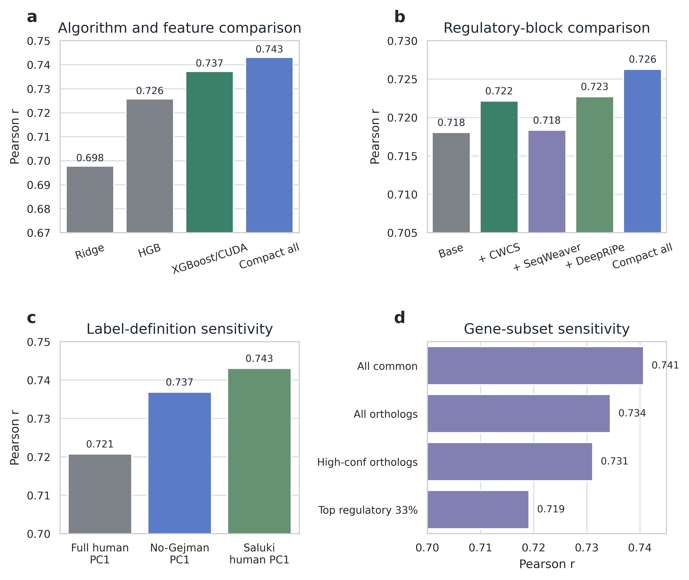
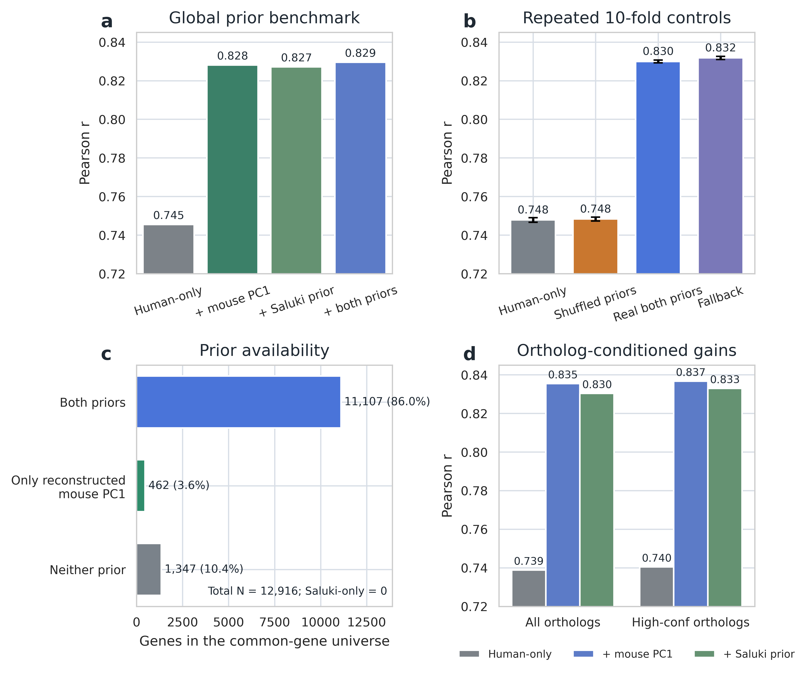

# 面向哺乳动物 mRNA 半衰期预测的 study-aware 标签审计、弱同源正则化与跨物种迁移

**稿件类型：** 中文内部审阅版（对应 *Bulletin of Mathematical Biology* 投稿稿）  
**作者：** Xu Jin1,2，Wenzhuo Wang3，Anhui Wang1,4，Yuebin Zhang1,4，Yingchen Mao*2，Dinglin Zhang*1,4  
**单位：** 1 辽宁师范大学生物与化学交叉研究中心，辽宁大连 116029；2 辽宁师范大学物理与电子技术学院，辽宁大连 116029；3 大连海事大学理学院，辽宁大连 116026；4 分子模拟与设计实验室，分子反应动力学国家重点实验室，中国科学院大连化学物理研究所，辽宁大连 116023  
**通讯作者：** Yingchen Mao，myc@lnnu.edu.cn；Dinglin Zhang，dlzhang@dicp.ac.cn  
**基金：** 国家自然科学基金（22373101、22203089、22573043）  
**关键词：** mRNA half-life；study heterogeneity；label audit；ortholog regularization；cross-species transfer；XGBoost

## 摘要

哺乳动物 mRNA 半衰期数据通常汇集自不同实验方案、细胞状态和处理流程，使标签质量与模型性能难以分离。本文提出一个可复现的 study-aware 框架，依次完成共识标签审计、固定目标预测和弱同源基因正则化。Leave-one-study-out 的第一主成分（PC1）稳定性筛查首先将 `Gejman` 定位为 human compendium 中影响最大的 study；随后以 Saluki human PC1 和 human-mouse ortholog 一致性验证其影响。剔除该 study 后，可用基因上的 Saluki 一致性由 r=0.948 提升至 r=0.983；在共同基因上的配对增益为 0.0314（95% bootstrap CI 0.0298-0.0330），ortholog 一致性由 r=0.741 提升至 r=0.755（增益 0.0147，95% CI 0.0111-0.0181）。在固定 Saluki human PC1 目标下，human-only 模型在重复 10-fold 评估中达到 r=0.748±0.001；加入 mouse ortholog priors 后达到 r=0.830±0.001，而 fold 内打乱基因-prior 对应关系后回落至 r=0.748±0.001。三组折外预测合并后的 real-versus-shuffled 配对增益为 0.0794（95% CI 0.0735-0.0855）。`λ = 0.10` 的弱同源正则化目标与 human no-Gejman PC1 高度一致（r=0.998，RMSE=0.065）；使用相同 human-only 特征训练时，其在原 human 目标上的相关变化仅为 +0.0003（95% CI -0.0006 至 0.0012），未显示原 human 标签可预测性下降。该目标在显式跨物种输入下达到 r=0.855±0.001。上述结果支持把标签审计、跨物种迁移与弱同源正则化作为三个边界清楚、可分别检验的任务。

## 1. 引言

mRNA 稳定性调控是基因表达程序中不可忽视的一层。即便转录水平相同，不同转录本也会因降解速率差异而表现出截然不同的稳态丰度和翻译输出(Ross 1995; Garneau et al. 2007; Schoenberg and Maquat 2012; Rambout and Maquat 2024)。经典研究已经证明，密码子组成、核糖体推进速率、3′UTR 元件、RNA 结合蛋白结合位点、RNA 结构和 RNA 修饰都会影响 mRNA 半衰期(Meyer et al. 2012; Wang et al. 2014; Presnyak et al. 2015; Wu et al. 2019; Hia et al. 2019; Grimson et al. 2007; Agarwal et al. 2015; Mauger et al. 2019)。这也是为什么 half-life 预测在基础生物学、变异功能解释和 RNA 药物工程中都具有较高价值(Leppek et al. 2022; Sample et al. 2019; Cetnar et al. 2024; Musaev et al. 2024)。

从数据层面看，哺乳动物 mRNA 半衰期测量已经从小规模实验发展到跨研究 compendium。转录抑制法、4sU/5EU 代谢标记、核苷重编码及相关高通量流程，使研究者得以在不同细胞背景中对数千到上万基因估计降解速率(Schwanhausser et al. 2011; Rabani et al. 2011; Tani et al. 2012; Schwalb et al. 2012; Duffy et al. 2015; Herzog et al. 2017; Schofield et al. 2018; Muhar et al. 2018)。但这类资源的最大难点并不只是“数据多”，而是“数据 heterogeneity 强”；常规标准化之后，高通量矩阵仍可能保留明显的 batch effect 和 study-specific processing structure(Johnson et al. 2007; Leek et al. 2010)。研究来源、实验方法、时间点设计、细胞背景和后续变换流程都会在 gene × sample 矩阵中留下结构性痕迹。若把这些观测值简单当作同质样本，后续训练得到的模型就很可能同时吸收技术结构和生物结构。

Saluki 相关工作对这一问题给出了一个非常重要的第一代解决方案：先把多个研究整合为 compendium，再在统一预处理后提取 PC1 共识标签，以此作为序列建模目标(Agarwal and Kelley 2022)。该工作既提供了 mammalian half-life benchmark，也展示了深度序列模型在此任务上的潜力。与此同时，它也暴露出一个更深的问题：如果共识标签本身仍带有 study-level 偏差，那么下游性能比较反映的就不只是模型能力，也会混入标签质量差异。对于 benchmark 导向的计算生物学研究，这一点必须先被说清楚。

本研究把标签诊断而非更大模型作为首个问题，并将全文收敛为三项贡献。第一，通过完整 leave-one-study-out 重建流程审计共识标签稳定性：不使用 Saluki 标签的 PC1 stability 负责筛查高影响 study，Saluki human PC1 一致性和 human-mouse ortholog 一致性负责验证其后果。第二，在 Saluki human PC1 固定不变时，分别量化 human-only sequence/regulatory baseline 与引入外部 mouse ortholog priors 的 cross-species transfer setting，并用 permutation control 和 residual analysis 检查增益来源。第三，构建 `λ = 0.10` 的弱同源基因正则化目标，量化其标签偏移，并通过 cross-target evaluation 检查它是否仍保留原 human 标签的可预测结构。

因此，本文建立的是一条有边界的证据链：数据来源异质性存在；高影响 study 可由标签几何稳定性筛查，并由两个外部口径验证；human-only 模型给出透明基线；cross-species transfer 只有在保留 gene-specific mouse prior values 时才取得增益；弱同源正则化则改变目标定义，但不降低原 human 标签上的折外可预测性。后两类结果分别改变输入信息和监督目标，因而始终分开报告。

## 2. 相关工作

### 2.1 哺乳动物 mRNA 半衰期的大规模测量与整合

早期关于 mRNA 稳定性的综述与系统研究已经指出，不同转录本的降解速率差异是哺乳动物基因表达控制的重要来源(Ross 1995; Garneau et al. 2007; Schoenberg and Maquat 2012)。随后，转录组尺度实验扩展到传统抑制法、代谢标记和核苷重编码等多条技术路线(Schwanhausser et al. 2011; Rabani et al. 2011; Tani et al. 2012; Schwalb et al. 2012; Duffy et al. 2015; Herzog et al. 2017; Schofield et al. 2018; Muhar et al. 2018)。Duan 等人测量了 human lymphoblastoid cell lines 间的 RNA stability 差异；该数据源在 Saluki compendium 中对应 `Gejman` study(Duan et al. 2013)。Friedel 等人较早展示了 mammalian half-life 的保守规律(Friedel et al. 2009)，Agarwal 与 Kelley 则把这一方向推进为系统 compendium 和 sequence-based benchmark(Agarwal and Kelley 2022)。然而，现有工作大多把“如何从 noisy multi-study matrix 中得到 gene-level consensus label”视为隐含步骤，而非独立方法问题。

### 2.2 决定 mRNA 稳定性的序列与生化因素

从机制角度看，密码子最优性、翻译效率与降解耦合是近年来最有影响力的发现之一(Presnyak et al. 2015; Wu et al. 2019; Hia et al. 2019)。与此同时，miRNA 靶向规则、3′UTR 顺式元件和 RNA 结构也被证明会系统影响半衰期(Mayr 2017; Grimson et al. 2007; Agarwal et al. 2015; Mauger et al. 2019)。m6A 等 RNA 修饰研究则提供了另一层解释(Meyer et al. 2012; Wang et al. 2014)。这一系列结果说明，sequence-to-stability 预测并非无意义的黑箱任务，而是有明确生物学可解释基础的监督学习问题。

### 2.3 计算模型：从表格学习到深度序列模型

在计算建模层面，随机森林、梯度提升树及其现代实现如 XGBoost/LightGBM 仍是异构特征建模的强基线(Breiman 2001; Friedman 2001; Chen and Guestrin 2016; Ke et al. 2017)。更靠近原始序列输入的方向，则包括 DeepBind、跨物种序列活性预测模型、Enformer 与 DNABERT 等(Alipanahi et al. 2015; Kelley 2020; Avsec et al. 2021; Ji et al. 2021)。对本文而言，重要的不是再证明深度模型能强，而是在一个统一、透明的 feature-learning 框架中定量标签诊断和跨物种先验对预测表现的影响。

## 3. 材料与方法

本研究包含三个相互衔接但解释边界独立的模块。第一项是**标签审计**：筛查哪些 study 显著改变共识标签，并分别用 Saluki 处理口径和跨物种 ortholog 结构验证。第二项是**固定目标预测**：监督目标始终为 Saluki human PC1，在同一基因宇宙中比较 human-only 输入与加入外部 mouse ortholog priors 的 cross-species transfer 输入。第三项是**弱同源基因正则化**：按 `λ = 0.10` 在 human consensus label 中加入少量 mapped mouse signal，并检验目标仍由 human 主导且不会降低原 human 标签上的可预测性。第二项改变输入信息，第三项改变监督目标，二者不作同一排行榜解释。图 1 给出总体流程，表 1 总结各模块的输入、操作与验证作用；具体数据路径、脚本入口和复现命令见补充材料 S15 及 Data and Code Availability。

**图 1** study-aware benchmark 的总体方法框架。a，共识标签重建与审计：`MOESM2` 先保留至少 3 个样本有观测值的基因，再经 sample-wise z-score、迭代 PCA 插补、quantile normalization 和 PC1 提取后进行 leave-one-study-out 检查；`MOESM3` 与 Ensembl ortholog 分别提供 Saluki 口径参照和跨物种验证。b，固定目标预测：目标始终为 Saluki human PC1，分别评估 human-only 输入与 mouse-prior transfer 输入，并以 fold-wise permutation 检查 gene identity mapping。c，弱同源基因正则化：90% human no-Gejman PC1 与 10% mapped mouse PC1 构成新目标；标签距离、study-noise comparison 和 cross-target evaluation 共同检查其 human 主导性。所有数值均来自对应结果表，流程图由可复现的矢量绘图脚本生成。

**表 1** 方法模块、逻辑输入与验证目的。主文只保留每个模块的分析逻辑和结论用途；具体文件名、脚本路径、结果表和复现命令见补充材料 S15 及 Data and Code Availability 中指定的版本化 GitHub 仓库。

| 方法模块 | 逻辑输入 | 核心操作 | 验证作用 |
| --- | --- | --- | --- |
| 数据整理 | 公开 human/mouse half-life 矩阵与样本元信息 | 解析物种、study、实验方法、细胞类型和重复；建立 human、mouse 与 no-Gejman 子集 | 明确样本结构和基因宇宙，避免把不同任务口径混在一起 |
| 共识标签重建 | gene × sample half-life 矩阵 | 覆盖度过滤、样本标准化、缺失值插补、分布对齐和 PC1 提取 | 得到可复现的 half-life consensus label，并与 Saluki 发布 PC1 标签对齐 |
| Study influence | 按 study 分组的样本子集 | 每次移除一个 study 后完整重建标签；以 PC1 stability 筛查，再用 Saluki agreement 验证 | 分离 reference-free 筛查与 reference-informed 验证；下游模型分数不参与排序 |
| Ortholog validation | human-mouse one-to-one ortholog genes | 比较 human full PC1、no-Gejman PC1、Saluki human PC1 与 mouse 标签的一致性 | 检查标签清理是否提升跨物种保守结构 |
| Human-only prediction | human sequence/regulatory features | gene-level out-of-fold XGBoost benchmark | 定量 human-only 表征的预测表现；作为透明 human-only 基线 |
| Prior-enhanced prediction | human features + mouse ortholog priors | prior-enhanced OOF benchmark、permutation control 和 residual analysis | 检验 gene-specific cross-species signal；mouse-side covariates 独立于 human target 构建 |
| 0.10 弱同源基因正则化 | human consensus label + mapped mouse ortholog label | 标准化后按 90:10 加权组合；量化标签 shift、study-noise scale 与 cross-target performance | 构建 human-dominant mammalian stability target；与固定目标 benchmark 分开解释 |

### 3.1 数据来源、元信息解析与共同基因宇宙

本文使用 Agarwal 与 Kelley 的 Saluki 论文公开补充数据(Agarwal and Kelley 2022)。其中，`MOESM2` 提供 human 和 mouse 的 transformed mRNA half-life gene × sample 矩阵，是标签重建和留一研究影响审计的主输入；前两列为 Ensembl gene ID 和 gene name，后续列为不同 study、实验方法、细胞类型和重复样本的 transformed values。`MOESM3` 则提供 Saluki 发布的 `half-life (PC1)` summary label 以及 processed sample values；在本文叙述中，human 侧记为 Saluki human PC1，mouse 侧记为 Saluki mouse prior。`MOESM3` 的 human 工作表说明该 PC1 基于剔除 `Gejman` 后的数据集，mouse 工作表基于全部 mouse 数据集，因此它在本文中主要充当 Saluki 处理口径的参照和控制，而不是替代主线重建流程的训练标签来源。预计算的 Saluki sequence/regulatory feature blocks 来自配套公开数据集（DOI：[10.5281/zenodo.6326409](https://doi.org/10.5281/zenodo.6326409)）。由于 `MOESM2` 已经是 transformed values，本研究不再重复执行 log transform，而是从 sample-wise standardization 开始。

样本元信息由样本名和本地整理表解析得到，包括 `species`、`study`、`method`、`cell type` 和 `replicate`。human 全量分析包含 54 个样本、19 个 study 和 5 类实验方法；mouse 分析包含 27 个样本、17 个 study 和 3 类实验方法；剔除 `Gejman` 后的 human 子集包含 39 个样本和 18 个 study。不同分析使用不同但显式定义的基因宇宙：标签审计使用 species-specific coverage-filtered genes；global prior benchmark 使用 12,916 个共同 human genes；0.10 ortholog-regularized target 使用 12,307 个 shared genes，其中 10,768 个具有 one-to-one ortholog pair。human-mouse ortholog 映射来自 Ensembl release 115 comparative genomics 资源(Martin et al. 2023)。

**图 2** 数据来源、样本结构与分析基因宇宙。a，human、mouse 和 no-Gejman human 子集的样本数、study 数和实验方法数。b，预处理后进入共识标签分析的基因覆盖。c，不同下游分析实际使用的 gene universe 或 ortholog-pair universe，包括 MOESM3 控制分析、global prior benchmark、ortholog validation 以及 0.10 ortholog-regularized target 分析。d，`MOESM2`、`MOESM3` 和 Ensembl ortholog 资源在本文中的分工：分别对应主线标签重建、Saluki 口径参照/控制以及跨物种验证与映射。该图用于帮助读者区分数据来源、标签来源和分析宇宙。

### 3.2 样本层面 PCA 与 compendium 异质性诊断

在构建监督标签之前，我们首先在 sample level 检查 compendium 的主要结构。对 raw transformed matrix，仅在缺失位置执行 iterative low-rank PCA 插补以便可视化；该处理沿用不完整高维矩阵的低秩估计思路(Tipping and Bishop 1999; Troyanskaya et al. 2001)。对 processed matrix，则执行与标签重建一致的 sample-wise z-score、iterative PCA imputation 和 quantile normalization(Bolstad et al. 2003)。随后在 sample × gene 空间计算前两个主成分，并将样本按 study 或 method 着色。两种 PCA 视图的矩阵口径、插补参数和使用边界见补充表 S3。

这一步不是为了产生最终标签，而是为了确认一个关键前提：矩阵中的主要变异是否已经包含明显的 study/method 结构。如果样本主要按 study 聚类，那么 downstream model 的性能就不能只被解释为 sequence-to-stability signal，也必须审计标签来源。human PCA 显示，预处理可减弱但不能消除 study/method structure，因此需要进一步进行 leave-one-study-out 分析；mouse 结果作为补充材料保留，用于说明 human 与 mouse 的异质性并不完全对称。

**图 3** Human sample-level PCA 诊断。a，raw transformed matrix 的 sample-level PCA。b，经过 sample-wise z-score、iterative PCA imputation 和 quantile normalization 后的 processed matrix。每个点代表一个实验样本，颜色表示实验方法，点形表示 study，图内 legend 给出对应关系。两个面板均显示 human compendium 中存在明显 study/method 相关结构；预处理可减弱但不能完全消除该结构，因此需要进一步进行 study influence 审计。

### 3.3 共识标签重建流程

共识标签重建在 gene × sample 矩阵上执行。对每个 species 或 study-removal 子集，我们依次执行 coverage filter、sample-wise z-score、iterative PCA imputation 和 quantile normalization；随后在处理后的矩阵上提取 PC1，并将其方向与 gene-wise mean 对齐。这样得到的 PC1 被用作本地共识标签。

这一本地流程并不声称精确复制 Saluki 原文未完全公开的每个处理细节，而是构建一个可审计、可反复运行、并与 Saluki 发布 PC1 标签足够接近的 baseline consensus label。实际验证中，human 全量重建 PC1 与 Saluki human PC1 的 Pearson 为 0.948，mouse 为 0.958，说明该流程足以支撑留一研究影响诊断。对于 0.10 weak ortholog regularization，我们进一步采用 Saluki-like coverage 口径，即 human 至少 10 个 non-missing samples、mouse 至少 5 个 non-missing samples，以便更接近 Saluki 标签构建边界。这里的 “Saluki-like” 仅指 coverage filter 阈值；对应的 human 和 mouse PC1 仍基于 `MOESM2` 本地重建，而不是直接使用 Saluki mouse prior。

### 3.4 留一研究剔除（leave-one-study-out）影响分析

Study influence 分析不是在最终标签上简单删除一列，而是对每个 study 重复完整标签重建流程。对每个候选 study，我们移除该 study 的全部样本，重新执行 coverage filter、z-score、PCA imputation、quantile normalization 和 PC1 extraction。随后计算两个指标：`PC1 stability` 为 leave-one-study-out 标签与 full PC1 的 Pearson/Spearman 相关；`Saluki-PC1 agreement gain` 定义为 `Pearson(leave-one-study-out PC1, Saluki human PC1) - Pearson(full PC1, Saluki human PC1)`。

为降低使用 Saluki 参照造成的循环选择风险，study audit 采用两阶段解释。第一阶段只依据 `PC1 stability` 筛查高影响 study；该指标不使用 `MOESM3`、Saluki human PC1 或任何下游模型分数。第二阶段才检查 `Saluki-PC1 agreement gain`，用于判断几何变化是否朝向 Saluki 的处理口径，并进一步用 3.5 节的 human-mouse ortholog concordance 作正交的跨物种验证。Saluki 数据说明已经标注 `Gejman`；本文的贡献是由 reference-free stability screen 重现其主导影响，并定量验证移除它的后果。Mouse 中虽有 study 会改变 PC1 geometry，但没有出现同等级的多证据一致性，因而不采用相同删除策略。

### 3.5 Ortholog 一致性作为跨物种标签验证

为避免标签诊断只在 human 内部自洽，我们把 human-mouse one-to-one ortholog 作为外部生物学参照(Koonin 2005; Gabaldon and Koonin 2013)。具体来说，我们将 human full PC1、human no-Gejman PC1、Saluki human PC1 分别映射到 one-to-one ortholog genes，并与 mouse PC1 或 Saluki mouse prior 比较 Pearson/Spearman 相关。分析同时在全部 one-to-one ortholog pairs 与 high-confidence ortholog subset 中重复。这里的 high-confidence 不是本文重新定义的人工标签，而是直接沿用 Ensembl Compara release 115 同源表中的二元字段 `is_high_confidence`；在脚本中我们保留所有 `ortholog_one2one` pairs，并把 `is_high_confidence == 1` 的子集单独作为高置信分析集合。

这一设计提供了与 Saluki human PC1 一致性正交的验证轴。如果移除某个 human study 只提高与 Saluki 标签的一致性，却不提高 human-mouse ortholog consistency，那么结果更符合对 Saluki 处理口径的机械贴近；二者同步改善则支持恢复跨物种保守的 mRNA stability structure。本文对 `Gejman` 影响的解释建立在这两类证据共同成立之上。

### 3.6 0.10 弱同源基因正则化目标的构建与 cross-target 验证

这一模块讨论的是**改目标，不改 human 特征定义**。其目的不是宣称新的 pure human half-life ground truth，而是检验少量 ortholog constraint 能否构成一个仍由 human 标签主导、同时反映哺乳动物保守稳定性的监督目标。我们分别构建本地重建的 human no-Gejman PC1 和采用 Saluki-like coverage 口径的 mouse PC1，并各自执行 z-score；随后通过 one-to-one ortholog 将 mouse label 映射到 human genes。对有 ortholog signal 的 human gene，目标定义为 `T_0.10 = 0.90 × human z-scored label + 0.10 × mapped mouse z-scored label`；其余 gene 保留 human label。加权组合后整体重新 z-score，并按 Saluki human PC1 的方向对齐。下文将其简称为 **0.10 ortholog-regularized target**。

该目标接受三类预先分开的检查。第一，在相同 one-to-one ortholog universe 中计算它与 human、mouse 标签的 Pearson、Spearman、MSE、RMSE 和 MAE，确认方向和偏移量。第二，把 `T_0.10 - human label` 的误差与 no-Gejman human studies 之间的 study-to-study variability 放在同一 z-scored label scale 上比较。第三，执行 cross-target evaluation：在相同的 12,307 个 genes、相同 1802 维 human-only `compact_all` 特征、相同 10-fold × 3 random seeds 和相同模型参数下，分别以 human no-Gejman PC1 或 `T_0.10` 训练模型，再统一在原 human no-Gejman PC1 上评估折外预测。两套折外预测的 Pearson 差值用 gene-level paired bootstrap 给出 95% CI。该设计直接检验正则化是否通过牺牲原 human target 的可预测性获得表面优势。

`λ = 0.10` 是本文用于主分析的保守操作点：它把 mouse contribution 限制在 10%，而不是选择使 prior-enhanced CV 最高的权重。`λ = 0.05`、0.10 和 0.30 的敏感性结果全部在补充材料中报告；较大的 `λ` 虽可进一步提高与 mouse prior 对齐后的可预测性，但也产生更大的 target shift，因此不作为本文主结论的操作点。

### 3.7 序列/调控特征构建与 human-only 基线评估

这一节回到**目标不变、只用 human 输入**的主线 benchmark。Human-only 路线使用两层特征空间。第一层为 526 维 base sequence features，由 Ensembl release 115 的 representative transcripts 生成，覆盖 5′UTR、CDS 和 3′UTR 的长度、GC content、codon frequency、region-level 3-mer 以及 3′UTR 4-mer。第二层为 1802 维 `compact_all` features，即在 base sequence features 上合并 Saluki datapack 中已预计算的 CWCS、SeqWeaver 和 DeepRiPe regulatory blocks(Alipanahi et al. 2015; Kelley 2020; Avsec et al. 2021)。

所有 human-only benchmark 均以 Saluki human PC1 为主监督目标，并采用 gene-level out-of-fold evaluation。主结果使用 XGBoost/CUDA；树模型参数在主线实验中保持固定，避免为单个图件过度调参。典型设置包括 `tree_method=hist`、`device=cuda`、`max_depth=6`、`learning_rate=0.02`、`min_child_weight=4`、`subsample=0.9`、`colsample_bytree=0.75`、`reg_lambda=1.0` 和 early stopping。主文报告 5-fold OOF 结果，并用 10-fold × 3 random seeds 作为 split-sensitivity robustness check。

本文没有构造与 Saluki 完全相同的固定 test split；所有主结果均为 gene-level OOF benchmark。这样做的目的，是在统一特征表和统一标签宇宙中比较标签处理、prior 输入和控制实验的相对影响。因此，human-only 路线在文中被定位为透明、可复现的基线。

### 3.8 跨物种先验增强评估

这一节与 3.6 正好相反：**这里不改标签，只改输入。** 在 global prior-enhanced benchmark 中，监督目标仍然是 Saluki human PC1，建模单位仍然是每个 human gene。对每个 gene，我们先保留原有的 human `compact_all` 特征，再额外拼接 6 列 mouse 相关信息：两列 prior 数值（`mouse_pc1` 和 Saluki mouse prior）、两列“这个 prior 是否存在”的 0/1 指示列，以及两列“这个 ortholog 映射是否属于 high-confidence”的 0/1 指示列。这里的 `mouse_pc1` 是我们本地重建的 mouse prior，Saluki mouse prior 是 Saluki 发布的小鼠侧先验；两者提供相关但不完全相同的跨物种稳定性信息。两类 prior 均只由 mouse-side measurements 和 ortholog mapping 构建，并在 human cross-validation 之前固定；训练折和 held-out 折的 human target values 均不参与 prior 构建。预测时它们作为外部跨物种协变量输入模型，因此该设定属于 cross-species transfer，而不是 human-only prediction。

这些指示列的作用，是把“prior 数值本身”和“这个 prior 是否存在、是否高置信”分开告诉模型。具体实现上，如果某个 human gene 没有对应的 mouse prior，我们把该 prior 数值暂记为 0，同时把对应的“has prior”指示列记为 0；如果有值，则该指示列记为 1。high-confidence 列同理，用来标记该 human-mouse ortholog 是否属于 Ensembl Compara 标记的高置信映射，即 `is_high_confidence == 1`。采用 global 而非 only-prior-available 子集，是为了在完整共同基因宇宙上报告性能，而不是只在 prior 完整的基因子集里报一个更好看的数字。

因此，本文 fixed-target prediction benchmark 的训练和评估集合是同一个 `global prediction universe`，共 12,916 个 human genes，监督目标固定为 Saluki human PC1。Human-only `compact_all`、加入单个 mouse prior、加入双 mouse priors 以及 shuffled-prior control 都在这 12,916 个 genes 上做 gene-level OOF evaluation。`both-priors` 子集包含其中 11,107 个同时具有 `mouse_pc1` 和 Saluki mouse prior 的 genes，主要用于 prior coverage 解读和 residual analysis，而不是主线训练全集。0.10 ortholog-regularized analysis 使用独立的 12,307-gene universe；其中用于 label-distance 比较的 one-to-one ortholog 集合为 10,768 pairs，因此不能与 `both-priors` 子集混同。

这一设定与 human-only benchmark 的区别在于：监督目标不变，但输入中显式加入了跨物种 prior。因此，3.7 回答的是“只用 human 特征能做到什么”，3.8 回答的则是“加入 ortholog prior 后 human target 还能提升多少”。

### 3.9 控制实验、评价指标与使用边界

本文用四类控制回答四个直接问题。第一，permutation control 检查 prior-enhanced gain 是否依赖 gene-specific prior，而不只是多出几列特征或特定缺失模式：在每个 fold 内，只在原本具有 prior 数值的 genes 之间打乱 `mouse_pc1` 和 Saluki mouse prior，同时保持 prior 可用性与 high-confidence 指示列不变。第二，residual analysis 检查 transfer result 是否只是在复述 prior：分析限定在同时具有两类 mouse priors 的 `both_priors_available` 子集（N=11,107），先用两类 prior 得到 prior-only OOF prediction，再只用 human `compact_all` 拟合 `Saluki human PC1 - prior prediction`。第三，no-direct-prior ablation 检查 0.10 ortholog-regularized target 的高分是否完全依赖构造目标时使用的本地重建 `mouse PC1`。第四，3.6 节的 cross-target evaluation 检查目标正则化是否损害原 human label 上的折外预测。

模型性能报告 Pearson、Spearman 和 R2；标签距离报告 Pearson、Spearman、MSE、RMSE、MAE、median absolute error 和 p95 absolute error。除非特别说明，所有 prediction results 都是 out-of-fold predictions，而不是训练集内拟合分数。`mean ± SD` 表示不同 random seeds 对数据划分的敏感性，不作为抽样置信区间；关键相关差值另用 paired gene/ortholog bootstrap 给出 95% CI，cross-target comparison 使用 2,000 次重采样，其余主张使用 5,000 次重采样（补充表 S13-S14）。主文报告支撑核心结论的结果，补充材料保留完整 ranking、multi-seed summaries、prior ablation、label distance、study-noise comparison 与 bootstrap 输出。

最后，本文的预测使用边界分为三层。base sequence model 只需要明确分区的 5′UTR、CDS 和 3′UTR，可用于新转录本或人工序列，但不等同于完整 `compact_all`。`compact_all` 适用于已有 Ensembl human genes，因为 regulatory blocks 来自 Saluki datapack 的预计算特征。prior-enhanced model 还需要 mouse ortholog prior；若两类 mouse prior 均缺失，则退回 human-only compact model。

生成式 AI 工具用于文稿结构与语言起草支持、代码审查和图形布局建议，未用于生成分析数据或最终图件。所有算法实现、统计数值、文献引用、图件和最终表述均由作者核验；作者对最终稿及其可复现性承担责任。

**表 2** 预测设定、目标、输入与解释边界。

| 建模设定 | 目标标签 | 输入特征 | 适用解释与边界 |
| --- | --- | --- | --- |
| Base sequence | Saluki human PC1 | 526 维序列统计特征 | 可用于新序列，但仅对应基础序列层级 |
| Compact human-only | Saluki human PC1 | 1802 维 `compact_all` | pure human sequence/regulatory benchmark；作为 human-only 基线 |
| Global prior-enhanced | Saluki human PC1 | `compact_all` + two mouse priors + flags | 使用独立于 human target 构建的 mouse-side covariates 进行 cross-species transfer |
| 0.10 弱同源基因正则化 | 0.10 ortholog-regularized target | human-only 或 prior-enhanced 特征 | human-dominant mammalian stability target；用 cross-target evaluation 检查原 human 可预测性 |
| Shuffled/no-direct controls | 同对应主目标 | 打乱 prior 或移除 direct prior value | 检查性能增益是否来自 gene-specific cross-species signal |

后文结果围绕三项主 claim 报告：study-aware label audit；固定 Saluki human PC1 目标下的 human-only 与 cross-species transfer benchmark；以及经标签距离、study-noise 和 cross-target evaluation 共同验证的 0.10 weak ortholog regularization。

## 4. 结果

### 4.1 study-aware 审计识别主导 study 影响，并获得跨物种验证

全量 human 重建标签与 Saluki human PC1 的 Pearson 为 0.948，说明本地流程复现了 Saluki 标签的主要结构。仅依据 leave-one-study-out PC1 stability 排序时，移除 `Gejman` 后的稳定性最低（r=0.955；下一个 study 为 0.973），因此该 study 在不使用 Saluki 标签和下游预测分数的筛查阶段即表现出最强影响。随后进行的 reference-informed validation 显示，移除 `Gejman` 后，重建标签与 Saluki human PC1 在各自可用基因上的 Pearson 由 0.948 提升至 0.983，Spearman 由 0.950 提升至 0.986。

为避免不同覆盖范围造成的比较偏差，我们又在 13,265 个共同 genes 上进行 paired bootstrap。全量与 no-Gejman 标签对 Saluki human PC1 的 Pearson 分别为 0.9515 和 0.9829，配对增益为 0.0314（95% CI 0.0298-0.0330）。不依赖参照的 stability screen 因而重现了 Saluki 数据说明中的 `Gejman` 影响，统一基因宇宙和不确定性区间则量化了其幅度。整个排序未使用 human-only、prior-enhanced 或 ortholog-regularized 模型的任何性能结果。

**图 4** Leave-one-study-out 审计重现 `Gejman` 的主导影响。a，圆点表示 `PC1 stability`，即每个 leave-one-study-out PC1 与完整 human PC1 的相关系数，图中展示对 full-label geometry 影响最大的 8 个 study，虚线表示完全一致的 r = 1；该筛查不使用 Saluki PC1。b，按 `delta Pearson = Pearson(leave-one-study-out PC1, Saluki human PC1) - Pearson(full PC1, Saluki human PC1)` 展示 reference-informed agreement change。`Gejman` 同时具有最低 stability 和唯一明显的正向 agreement gain。完整排名见补充材料 S4，仓库内相对结果路径见补充表 S15。

为了检验 `Gejman` 剔除的收益是否超出 human-label agreement，我们进一步使用 human-mouse ortholog 作为正交的跨物种验证。在 12,592 对 one-to-one ortholog 上，human full PC1 与 mouse PC1 的 Pearson 为 0.741，去除 `Gejman` 后提升至 0.755，配对增益为 0.0147（95% bootstrap CI 0.0111-0.0181）；Spearman 同样由 0.730 提升至 0.744。限制到 Ensembl high-confidence ortholog 子集后，Pearson 增益仍为 0.0146（95% CI 0.0110-0.0181）。

该结果说明 `Gejman` 的影响延伸到了标签的跨物种结构。由于物种间仍存在真实生物学差异和测量差异，ortholog concordance 不能单独定义唯一的“最佳 human 标签”；但它提供了超出 Saluki human PC1 agreement 的证据：移除该 study 后，human 共识标签更接近跨物种保守的稳定性轴，而不是某一 study 主导的方向。

**图 5** Ortholog 验证表明去除 `Gejman` 后跨物种一致性在多个层面同步提高。a-b，每个点代表一对 one-to-one human-mouse ortholog；横轴为 human consensus PC1，纵轴为 mouse consensus PC1。a 使用 full human PC1，b 使用 no-Gejman human PC1；拟合线和相关系数显示，去除 `Gejman` 后整体散点云更贴近共同主轴。c，Pearson 与 Spearman 汇总比较 full PC1、no-Gejman PC1 及各自的 high-confidence ortholog 子集，显示提升不依赖单一相关指标。d，直接报告去除 `Gejman` 后的相关提升幅度；无论在全部 one-to-one ortholog 还是 high-confidence 子集中，Pearson 和 Spearman 都保持同方向增益。

### 4.2 0.10 弱同源基因正则化保持 human 主导标签并通过 cross-target 检验

我们首先检查 `λ = 0.10` 的 weak ortholog regularization 是否仍保留 dominant human signal。正则化之前，human no-Gejman PC1 与本地重建的 mouse PC1（采用 Saluki-like coverage 口径）在 10,768 个 one-to-one ortholog 上的 Pearson 为 0.789，RMSE 为 0.663，MAE 为 0.512，说明二者明显相关，但并不相同。

表 3 和图 6 给出了正则化目标的直接定位：在同一 one-to-one ortholog 空间内，0.10 ortholog-regularized target 与原始 human no-Gejman PC1 几乎重合，Pearson 为 0.9982（95% bootstrap CI 0.9981-0.9983），RMSE 为 0.065，MAE 为 0.050；相比之下，它与 mouse PC1 的 Pearson 为 0.827，RMSE 为 0.601，MAE 为 0.464。`λ = 0.10` 的主要作用不是重写 human label，而是把目标轻度拉向跨物种保守方向。

**表 3** 0.10 ortholog-regularized target 与 human/mouse 标签及 study-level noise 的同尺度比较。所有误差指标均在 z-scored label 单位上计算；study-level 行报告中位数。

| 比较对象 | N 或比较数 | Pearson | RMSE | MAE | 解释 |
| --- | ---: | ---: | ---: | ---: | --- |
| regularized target vs human no-Gejman PC1 | 10,768 genes | 0.998 | 0.065 | 0.050 | 基本保持 human 标签主结构 |
| regularized target vs mouse PC1 | 10,768 genes | 0.827 | 0.601 | 0.464 | 向跨物种保守方向轻度移动 |
| human no-Gejman PC1 vs mouse PC1 | 10,768 genes | 0.789 | 0.663 | 0.512 | 正则化前 human 与 mouse 本就不相同 |
| no-Gejman study-study label pair（中位） | 153 study pairs | 0.530 | 0.954 | 0.720 | 正常 study 间噪音尺度 |
| single-study vs human no-Gejman PC1（中位） | 18 studies | 0.742 | 0.715 | 0.543 | 单个 study 相对 human no-Gejman PC1 的偏差 |

**图 6** 0.10 弱同源基因正则化保持 human 主导结构，且未显示原 human 标签可预测性下降。a，regularized target 与 human no-Gejman PC1 几乎沿对角线分布。b，它与 mouse PC1 相关但散布更大，说明该目标并非 mouse-like label。c，regularized-target shift 远小于 study-study 和 study-consensus 差异。d，在相同 12,307 genes、相同 human-only 特征和相同 10-fold × 3 seeds 下，分别训练 human target 与 regularized target 后统一在原 human target 上评估；paired Pearson 差值为 +0.0003，95% CI 跨 0。

这个 shift 相对于 ordinary study-level variability 也很小。排除 `Gejman` 后，不同 study mean labels 两两比较的中位 Pearson 为 0.530，RMSE 为 0.954，MAE 为 0.720；单个 study 相对 human no-Gejman PC1 的中位 Pearson 为 0.742，RMSE 为 0.715，MAE 为 0.543。相比之下，`λ = 0.10` 相对原 human no-Gejman PC1 的 RMSE 仅为 0.065，MAE 为 0.050。图 6c 将这些量放到同一 z-scored label scale 后，可以看到 regularized-target shift 明显小于 normal study noise；完整计算见补充表 S12。

更关键的是，cross-target evaluation 没有发现正则化通过损害 human target 获得优势。在原 human no-Gejman PC1 上，直接训练 human target 的模型为 r=0.7476±0.0010，训练 regularized target 后再回到同一 human target 评估为 r=0.7480±0.0010。三组 OOF prediction 合并后的 paired difference 为 +0.0003（95% CI -0.0006 至 0.0012）。因此，`λ = 0.10` 在当前数据分辨率下保留了原 human 标签的可预测结构。本文将它作为一个独立的 human-dominant mammalian stability target，而不是固定 Saluki human PC1 benchmark 的替代或更高排名版本。

### 4.3 pure human compact sequence/regulatory 模型给出稳定基线

在 pure human 路线上，我们首先比较基础序列特征与 `compact_all` 特征的预测表现。主 global fixed-target 分析中，`compact_all` 在 12,916 个共同 genes 上达到 Pearson 0.745、Spearman 0.737、R2 0.554。作为独立的 matched comparison，图 7a 在同一 common universe 和同一比较流程中展示 Ridge、HGB、GPU XGBoost 与 `compact_all`，对应最高值为 0.743；它与 0.745 的小差异来自交叉验证划分和训练流程，而不是模型融合。图 7b 则是 feature-block comparison：CWCS 和 DeepRiPe 单独加入时改善基础序列结果，SeqWeaver 单独加入时基本持平，而全部 blocks 合并后的 `compact_all` 最高。因此，该结果支持互补特征整合，而不是“每个 block 都连续增益”。

Human-only 性能也依赖标签定义。图 7c 显示，在相同共同基因宇宙上，`compact_all` 对 `human_full_pc1` 的 Pearson 为 0.721，对 human no-Gejman PC1 和 Saluki human PC1 则分别为 0.737 和 0.743，说明 no-Gejman 标签在 matched feature setting 下具有更高的下游可预测性。图 7d 进一步显示，在 all-common、ortholog 和多个高信号子集中，`compact_all` 的表现保持有序变化，结论并非由某一个容易子集单独支撑。

**图 7** Human-only benchmark 的四个互补证据面板。a，algorithm/feature comparison：在 matched common-universe 分析中比较 Ridge、HGB、GPU XGBoost 与 `compact_all`。b，regulatory-block comparison：各单独 block 的贡献并不单调，但全部 blocks 合并的 `compact_all` 最高；该面板不是逐步累加消融。c，label-definition sensitivity：在相同共同基因宇宙上比较 full human PC1、human no-Gejman PC1 和 Saluki human PC1。d，gene-subset sensitivity：报告 all-common、all orthologs、high-confidence orthologs 和 top regulatory 33% 子集，不把子集结果外推为全局性能。

### 4.4 跨物种迁移产生依赖 gene identity 的 prior-enhanced 增益

当把重建 `mouse PC1` 与 Saluki mouse prior 两类先验引入 `compact_all` 后，性能出现了明显跃迁。图 8a 直接比较四个全局设定：human-only `compact_all` 的 Pearson 为 0.745；只加入重建 `mouse PC1` 时升至 0.828；只加入 Saluki mouse prior 时为 0.827；同时加入两类先验时达到 0.829。也就是说，两类单 prior 已经分别提供大幅增益，而双 prior 单模型给出最高结果，说明这两个 mouse priors 提供的是相关但不完全冗余的跨物种稳定性信息。

为了排除这一结论依赖单一划分，我们进一步执行三组独立随机划分的 10-fold gene-level OOF 评估。图 8b 显示，这个趋势高度稳定：human-only `compact_all` 为 Pearson 0.748±0.001，shuffled-prior control 为 0.748±0.001，真实双 prior 模型为 0.830±0.001，而按 prior 可用性选择预测层级的 `coverage-aware fallback` 为 0.832±0.001。这里的 `±` 是三组 random seeds 的 SD，不是置信区间。结果表明 prior-enhanced 增益不依赖某一次 split；对于 prior 缺失 genes，显式回退到 human-only predictor 也比把不同输入条件混为一谈更符合部署边界。

prior 覆盖本身也并不均匀。图 8c 显示，在 12,916 个共同 human 基因中，11,107 个同时具有两类 mouse priors，462 个仅具有重建 `mouse PC1`，1,347 个两类 prior 都缺失，且不存在“仅有 Saluki mouse prior 而没有重建 `mouse PC1`”的基因。这个分布界定了模型的使用边界：prior-enhanced 结果属于输入 mouse-side covariates 的 cross-species transfer setting；对于 missing-prior genes，我们采用 coverage-aware fallback，而不是把它们与 prior-complete genes 放在同一输入条件下解释。

**图 8** Prior-enhanced benchmark 的四个互补证据面板。a，全局 fixed-target benchmark：比较 human-only `compact_all`、加入重建 `mouse PC1`、加入 Saluki mouse prior 以及双 prior 模型。b，三组 repeated 10-fold controls；误差线为 across-seed SD，shuffling 保留 prior availability 但破坏 gene identity mapping；当 gene-prior identity 被打乱后，增益消失。c，共同 human 基因宇宙中的 prior availability，用于界定模型可用边界。d，ortholog-conditioned gains 在 all one-to-one 与 high-confidence 子集中保持一致方向。

Permutation control 直接检验 prior-enhanced gain 是否依赖基因特异性的 prior 数值。真实 `compact_all_plus_both_mouse_priors_global` 的 Pearson 为 0.829，而在每个 fold 内打乱 prior 数值后的 `compact_all_plus_both_mouse_priors_shuffled_global` 回落到 0.745，R2 也从 0.688 回落到 0.553，几乎与 human-only `compact_all_global` 重合。打乱过程中 prior 可用性和 high-confidence 指示列保持不变，因此增益消失反映的是 prior 数值与基因身份之间的映射被破坏，而不是简单的 feature-count 或 missingness 效应。

三组独立随机划分的 10-fold 重复结果给出同样趋势：真实双 prior 模型为 0.830±0.001，shuffled control 为 0.748±0.001。将每个 gene 的三组 OOF predictions 取平均后做 paired gene bootstrap，real-prior seed-averaged OOF prediction 为 r=0.8324，shuffled-prior 对应值为 r=0.7531，差值 0.0794（95% CI 0.0735-0.0855）；相对于 human-only seed-averaged OOF prediction 的差值为 0.0799（95% CI 0.0740-0.0862）。这里的平均只用于汇总 split sensitivity，不构成额外的模型融合步骤。图 8d 还显示，该增益在 all one-to-one ortholog 与 high-confidence ortholog 子集中保持。因此，prior-enhanced gain 的核心来源是 **gene-specific cross-species prior information**；打断 prior 数值与 gene identity 的映射即消除增益。这是受控的 mouse ortholog label transfer signal，而不是 human sequence alone 的性能。

残差分解进一步说明，prior 很强，但 human 特征仍然提供额外信息。该分析仅在 `both_priors_available` 子集上执行（N=11,107），用于分解 prior signal，而不是替代主线 12,916-gene benchmark。Prior-only RidgeCV 的 OOF 结果为 Pearson 0.792、R2 0.627；只用 human `compact_all` 时为 Pearson 0.739、R2 0.544；若先用两类 mouse prior 得到 prior prediction，再只用 human `compact_all` 拟合 `Saluki human PC1 - prior prediction` 这一残差，最终可达到 Pearson 0.826、R2 0.675。按 `(R2_final - R2_prior) / (1 - R2_prior)` 计算，human 特征在 prior 已解释的部分之外又解释了约 12.8% 的剩余方差。因此，两阶段 residual model 更接近“mouse-prior signal + human-feature correction”。

### 4.5 弱同源正则化提高 conserved-target 可预测性，但不改变 fixed-target 排名

在确认 0.10 ortholog-regularized target 仍由 human 标签主导且通过 cross-target 检验后，我们评估它在不同输入条件下的可预测性。该目标与 Saluki human PC1 仍高度相关（r=0.987）。在同一 12,307-gene universe 上，human-only prediction 为 0.754±0.001；显式加入两类 mouse priors 后达到 0.855±0.001，而同宇宙固定 Saluki human PC1 的 prior-enhanced baseline 为 0.839±0.001。后两个数值不用于同一 target 排名，因为监督目标不同；它们说明的是，弱正则化使目标更贴近可由 ortholog priors 捕获的 conserved component。

Prior ablation 支持这一解释。移除构造目标时使用的本地重建 `mouse PC1` 数值、仅保留另一类 Saluki mouse prior 及指示列后，仍可达到 0.852±0.001；只保留 missingness/high-confidence indicators 时则回到 0.753±0.001，接近 human-only 水平。与此同时，图 6d 的 cross-target 结果表明，用 regularized target 训练并不会降低原 human no-Gejman PC1 上的折外预测。因而，本文将 `λ = 0.10` 视为一个有实证边界的核心标签构建结果：它产生 human-dominant mammalian stability target，并提高使用外部 ortholog 信息时的 conserved-target predictability；它不构成 Saluki human PC1 或 pure sequence benchmark 的替代排名。

## 5. 讨论

本研究把 mRNA half-life benchmark 中常被混写的三个问题拆开处理：如何审计 multi-study consensus label；固定 human target 时，human-only 与 cross-species transfer 各能支持什么结论；以及弱 ortholog constraint 能否构造一个仍保持 human 主导性的 mammalian stability target。三条主线分别由 stability/ortholog validation、permutation/residual controls 和 label-distance/cross-target evaluation 支撑，而不是由单一最高分支撑。

`Gejman` 结果由两个证据层级支撑。PC1 stability 在不使用 Saluki 参照时已把它列为影响最大的 study；与 Saluki human PC1 的 agreement gain 是 reference-informed validation，ortholog concordance 则提供正交的跨物种验证。这个设计证明它对当前 consensus-label geometry 具有主导影响，但不外推为所有生物学问题都应删除该 study。随后，human-only `compact_all` 给出固定目标基线；permutation control、paired bootstrap 与 residual analysis 共同说明 prior-enhanced gain 依赖 gene-specific cross-species signal，而非简单增加特征列。`MOESM3` 派生标签主要发挥参照和控制作用，并未替代 Saluki human PC1 成为新的主监督目标（补充表 S6-S7）。

本文的第三项核心贡献是 `λ = 0.10` ortholog-regularized target。几何分析显示该目标仍几乎等同于 human no-Gejman PC1，study-noise comparison 将其偏移限定在普通 study 间差异之下，cross-target evaluation 也未发现原 human label 折外可预测性下降。更高的 prior-enhanced score 表明，显式 ortholog covariates 更容易捕获其中的 conserved component。该目标由此被定义为一个可审计的 human-dominant mammalian stability score，而不是直接实验 half-life measurement 或 pure human sequence benchmark。

## 6. 局限性

本文仍有三方面局限。第一，标签审计和主要 benchmark 均建立在同一公开 compendium 上，尚未在第二个独立 half-life compendium 中验证；当前分析也主要处理 study-level influence，尚未建立 sample、cell type 与 study 的层次模型。Leave-one-study-out influence 同时包含被删除 study 的样本数和 profile 方向差异；在尚无 size-matched null 的情况下，`Gejman` 应解释为当前 compendium 中的主导影响来源，而不是经样本数校正的统计异常值。第二，cross-species transfer 与 0.10 ortholog regularization 分别改变输入信息和目标定义，不能与 pure human fixed-target task 合并排名；`λ = 0.10` 目前是保守经验权重，仍需在独立数据上检验其可迁移性和生物学标度。第三，本文没有重新训练 Saluki 等大规模深度序列模型；当前实现也不是任意裸序列的一键预测器，因为 base sequence、compact regulatory 和 prior-enhanced 三个层级依赖不同输入条件。

## 7. 结论

基于公开哺乳动物 mRNA 半衰期 compendium 的 study-aware 再分析表明，reference-free PC1 stability screen 可以重现 `Gejman` 对 human 共识标签的主导影响，Saluki agreement 与 ortholog concordance 则量化并验证该影响。在固定 Saluki human PC1 目标下，compact human-only 模型提供透明基线；加入 mouse priors 后，cross-species transfer model 在重复 10-fold 评估中达到 Pearson 0.830，打乱 gene-prior 对应关系会消除增益。0.10 weak ortholog regularization 构建了与 human no-Gejman PC1 几乎一致的 mammalian stability target，并在 cross-target evaluation 中保持原 human 标签的可预测性。本文由此提供一套将标签审计、固定目标迁移和弱同源正则化分开验证的可复现框架。

## 8. Statements and Declarations

### Funding

本工作受国家自然科学基金（22373101、22203089、22573043）资助。

### Author Contributions

Xu Jin 负责数据整理、计算分析、结果复现、图表制作和论文初稿撰写。Dinglin Zhang 与 Yingchen Mao 参与研究构思、方法设计、结果解释、项目监督和论文修改。Wenzhuo Wang、Anhui Wang 和 Yuebin Zhang 参与结果讨论和文稿审阅。所有作者阅读并批准最终稿。

### Data Availability

本文使用的 half-life 矩阵来自 Saluki 论文公开补充材料；预计算 Saluki feature datapack 可从 Zenodo 获取（DOI：[10.5281/zenodo.6326409](https://doi.org/10.5281/zenodo.6326409)）；ortholog 映射来自 Ensembl comparative genomics 资源(Agarwal and Kelley 2022; Martin et al. 2023)。结果表、图件源数据和复现说明将在正式投稿前通过版本化仓库 [wwzdl/mrna-pc1-label](https://github.com/wwzdl/mrna-pc1-label) 公开。

### Code Availability

代码、图件生成脚本和结果复现流程将通过版本化仓库 [wwzdl/mrna-pc1-label](https://github.com/wwzdl/mrna-pc1-label) 提供。

### Competing Interests

作者声明不存在任何已知的、可能对本文所报告工作产生影响的竞争性经济利益或个人关系。

### Ethics Approval

本研究基于公开数据和计算分析完成，不涉及新的动物实验、人体受试者招募或临床干预；因此伦理审批不适用。

## 9. 参考文献

Agarwal V, Bell GW, Nam JW, Bartel DP (2015) Predicting effective microRNA target sites in mammalian mRNAs. eLife 4:e05005. https://doi.org/10.7554/eLife.05005

Agarwal V, Kelley DR (2022) The genetic and biochemical determinants of mRNA degradation rates in mammals. Genome Biology 23(1):245. https://doi.org/10.1186/s13059-022-02811-x

Alipanahi B, Delong A, Weirauch MT, Frey BJ (2015) Predicting the sequence specificities of DNA- and RNA-binding proteins by deep learning. Nature Biotechnology 33:831-838. https://doi.org/10.1038/nbt.3300

Avsec Z, Agarwal V, Visentin D, Ledsam JR, Grabska-Barwinska A, Taylor KR, Assael Y, Jumper J, Kohli P, Kelley DR (2021) Effective gene expression prediction from sequence by integrating long-range interactions. Nature Methods 18:1196-1203. https://doi.org/10.1038/s41592-021-01252-x

Bolstad BM, Irizarry RA, Astrand M, Speed TP (2003) A comparison of normalization methods for high density oligonucleotide array data based on variance and bias. Bioinformatics 19(2):185-193. https://doi.org/10.1093/bioinformatics/19.2.185

Breiman L (2001) Random forests. Machine Learning 45:5-32. https://doi.org/10.1023/A:1010933404324

Cetnar DP, Hossain A, Vezeau GE, Salis HM (2024) Predicting synthetic mRNA stability using massively parallel kinetic measurements, biophysical modeling, and machine learning. Nature Communications 15:9601. https://doi.org/10.1038/s41467-024-54059-7

Chen T, Guestrin C (2016) XGBoost: A scalable tree boosting system. Proceedings of the 22nd ACM SIGKDD International Conference on Knowledge Discovery and Data Mining 785-794. https://doi.org/10.1145/2939672.2939785

Duan J, Shi J, Ge X, Dolken L, Moy W, He D, Shi S, Sanders AR, Ross J, Gejman PV (2013) Genome-wide survey of interindividual differences of RNA stability in human lymphoblastoid cell lines. Scientific Reports 3:1318. https://doi.org/10.1038/srep01318

Duffy EE, Rutenberg-Schoenberg M, Stark CD, Kitchen RR, Gerstein MB, Simon MD (2015) Tracking distinct RNA populations using efficient and reversible covalent chemistry. Molecular Cell 59(5):858-866. https://doi.org/10.1016/j.molcel.2015.07.023

Friedel CC, Dolken L, Ruzsics Z, Koszinowski UH, Zimmer R (2009) Conserved principles of mammalian transcriptional regulation revealed by RNA half-life. Nucleic Acids Research 37(17):e115. https://doi.org/10.1093/nar/gkp542

Friedman JH (2001) Greedy function approximation: A gradient boosting machine. The Annals of Statistics 29(5):1189-1232. https://doi.org/10.1214/aos/1013203451

Gabaldon T, Koonin EV (2013) Functional and evolutionary implications of gene orthology. Nature Reviews Genetics 14(5):360-366. https://doi.org/10.1038/nrg3456

Garneau NL, Wilusz J, Wilusz CJ (2007) The highways and byways of mRNA decay. Nature Reviews Molecular Cell Biology 8:113-126. https://doi.org/10.1038/nrm2104

Grimson A, Farh KKH, Johnston WK, Garrett-Engele P, Lim LP, Bartel DP (2007) MicroRNA targeting specificity in mammals: determinants beyond seed pairing. Molecular Cell 27(1):91-105. https://doi.org/10.1016/j.molcel.2007.06.017

Herzog VA, Reichholf B, Neumann T, Rescheneder P, Bhat P, Burkard TR, Wlotzka W, von Haeseler A, Zuber J, Ameres SL (2017) Thiol-linked alkylation of RNA to assess expression dynamics. Nature Methods 14:1198-1204. https://doi.org/10.1038/nmeth.4435

Hia F, Yang SR, Shichino Y, Yoshinaga M, Murakawa Y, Vandenbon A, Fukao A, Fujiwara T, Landthaler M, Natsume T, Adachi S, Iwasaki S, Takeuchi O (2019) Codon bias confers stability to human mRNAs. EMBO Reports 20(11):e48220. https://doi.org/10.15252/embr.201948220

Ji Y, Zhou Z, Liu H, Davuluri RV (2021) DNABERT: pre-trained Bidirectional Encoder Representations from Transformers model for DNA-language in genome. Bioinformatics 37(15):2112-2120. https://doi.org/10.1093/bioinformatics/btab083

Johnson WE, Li C, Rabinovic A (2007) Adjusting batch effects in microarray expression data using empirical Bayes methods. Biostatistics 8(1):118-127. https://doi.org/10.1093/biostatistics/kxj037

Ke G, Meng Q, Finley T, Wang T, Chen W, Ma W, Ye Q, Liu TY (2017) LightGBM: A highly efficient gradient boosting decision tree. Advances in Neural Information Processing Systems 30. https://proceedings.neurips.cc/paper_files/paper/2017/hash/6449f44a102fde848669bdd9eb6b76fa-Abstract.html

Kelley DR (2020) Cross-species regulatory sequence activity prediction. PLOS Computational Biology 16(7):e1008050. https://doi.org/10.1371/journal.pcbi.1008050

Koonin EV (2005) Orthologs, paralogs, and evolutionary genomics. Annual Review of Genetics 39:309-338. https://doi.org/10.1146/annurev.genet.39.073003.114725

Leek JT, Scharpf RB, Bravo HC, Simcha D, Langmead B, Johnson WE, Geman D, Baggerly K, Irizarry RA (2010) Tackling the widespread and critical impact of batch effects in high-throughput data. Nature Reviews Genetics 11(10):733-739. https://doi.org/10.1038/nrg2825

Leppek K, Byeon GW, Kladwang W, Wayment-Steele HK, Kerr CH, Xu AF, Kim DS, Topkar VV, Choe C, Rothschild D, et al (2022) Combinatorial optimization of mRNA structure, stability, and translation for RNA-based therapeutics. Nature Communications 13:1536. https://doi.org/10.1038/s41467-022-28776-w

Martin FJ, Amode MR, Aneja A, Austine-Orimoloye O, Azov AG, Barnes I, Becker A, Bennett R, Berry A, Bhai J, et al (2023) Ensembl 2023. Nucleic Acids Research 51(D1):D933-D941. https://doi.org/10.1093/nar/gkac958

Mauger DM, Cabral BJ, Presnyak V, Su SV, Reid DW, Goodman B, Link K, Khatwani N, Reynders J, Moore MJ, McFadyen IJ (2019) mRNA structure regulates protein expression through changes in functional half-life. Proceedings of the National Academy of Sciences 116(48):24075-24083. https://doi.org/10.1073/pnas.1908052116

Mayr C (2017) Regulation by 3'-untranslated regions. Annual Review of Genetics 51:171-194. https://doi.org/10.1146/annurev-genet-120116-024704

Meyer KD, Saletore Y, Zumbo P, Elemento O, Mason CE, Jaffrey SR (2012) Comprehensive analysis of mRNA methylation reveals enrichment in 3' UTRs and near stop codons. Cell 149(7):1635-1646. https://doi.org/10.1016/j.cell.2012.05.003

Muhar M, Ebert A, Neumann T, Umkehrer C, Jude J, Wieshofer C, Rescheneder P, Lipp JJ, Herzog VA, Reichholf B, et al (2018) SLAM-seq defines direct gene-regulatory functions of the BRD4-MYC axis. Science 360(6390):800-805. https://doi.org/10.1126/science.aao2793

Musaev D, Abdelmessih M, Vejnar CE, Yartseva V, Weiss LA, Strayer EC, Takacs CM, Giraldez AJ (2024) UPF1 regulates mRNA stability by sensing poorly translated coding sequences. Cell Reports 43:114074. https://doi.org/10.1016/j.celrep.2024.114074

Presnyak V, Alhusaini N, Chen YH, Martin S, Morris N, Kline N, Olson S, Weinberg D, Baker KE, Graveley BR, Coller J (2015) Codon optimality is a major determinant of mRNA stability. Cell 160(6):1111-1124. https://doi.org/10.1016/j.cell.2015.02.029

Rabani M, Levin JZ, Fan L, Adiconis X, Raychowdhury R, Garber M, Gnirke A, Nusbaum C, Hacohen N, Friedman N, Amit I, Regev A (2011) Metabolic labeling of RNA uncovers principles of RNA production and degradation dynamics in mammalian cells. Nature Biotechnology 29:436-442. https://doi.org/10.1038/nbt.1861

Rambout X, Maquat LE (2024) Nuclear mRNA decay: regulatory networks that control gene expression. Nature Reviews Genetics 25:679-697. https://doi.org/10.1038/s41576-024-00712-2

Ross J (1995) mRNA stability in mammalian cells. Microbiological Reviews 59(3):423-450. https://doi.org/10.1128/mr.59.3.423-450.1995

Sample PJ, Wang B, Reid DW, Presnyak V, McFadyen IJ, Morris DR, Seelig G (2019) Human 5' UTR design and variant effect prediction from a massively parallel translation assay. Nature Biotechnology 37:803-809. https://doi.org/10.1038/s41587-019-0164-5

Schoenberg DR, Maquat LE (2012) Regulation of cytoplasmic mRNA decay. Nature Reviews Genetics 13(4):246-259. https://doi.org/10.1038/nrg3160

Schofield JA, Duffy EE, Kiefer L, Sullivan MC, Simon MD (2018) TimeLapse-seq: adding a temporal dimension to RNA sequencing through nucleoside recoding. Nature Methods 15(3):221-225. https://doi.org/10.1038/nmeth.4582

Schwalb B, Schulz D, Sun M, Zacher B, Dumcke S, Martin DE, Cramer P, Tresch A (2012) Measurement of genome-wide RNA synthesis and decay rates with Dynamic Transcriptome Analysis (DTA). Bioinformatics 28(6):884-885. https://doi.org/10.1093/bioinformatics/bts052

Schwanhausser B, Busse D, Li N, Dittmar G, Schuchhardt J, Wolf J, Chen W, Selbach M (2011) Global quantification of mammalian gene expression control. Nature 473:337-342. https://doi.org/10.1038/nature10098

Tani H, Mizutani R, Salam KA, Tano K, Ijiri K, Wakamatsu A, Isogai T, Suzuki Y, Akimitsu N (2012) Genome-wide determination of RNA stability reveals hundreds of short-lived noncoding transcripts in mammals. Genome Research 22(5):947-956. https://doi.org/10.1101/gr.130559.111

Tipping ME, Bishop CM (1999) Probabilistic principal component analysis. Journal of the Royal Statistical Society: Series B 61(3):611-622. https://doi.org/10.1111/1467-9868.00196

Troyanskaya O, Cantor M, Sherlock G, Brown P, Hastie T, Tibshirani R, Botstein D, Altman RB (2001) Missing value estimation methods for DNA microarrays. Bioinformatics 17(6):520-525. https://doi.org/10.1093/bioinformatics/17.6.520

Wang X, Lu Z, Gomez A, Hon GC, Yue Y, Han D, Fu Y, Parisien M, Dai Q, Jia G, et al (2014) N6-methyladenosine-dependent regulation of messenger RNA stability. Nature 505:117-120. https://doi.org/10.1038/nature12730

Wu Q, Medina SG, Kushawah G, DeVore ML, Castellano LA, Hand JM, Wright M, Bazzini AA (2019) Translation affects mRNA stability in a codon-dependent manner in human cells. eLife 8:e45396. https://doi.org/10.7554/eLife.45396
