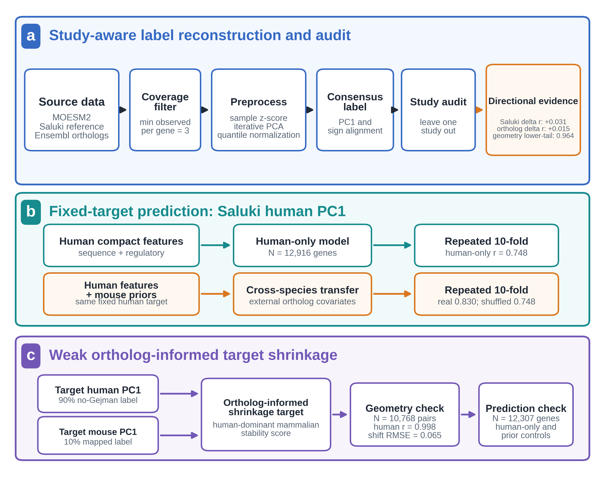
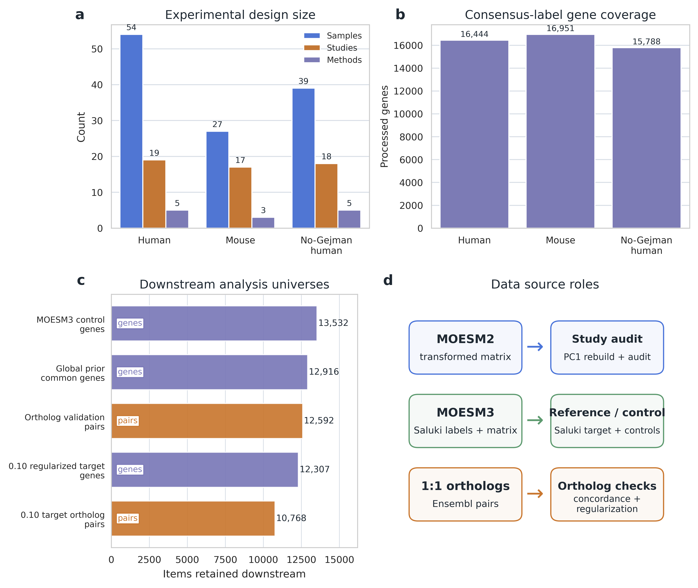
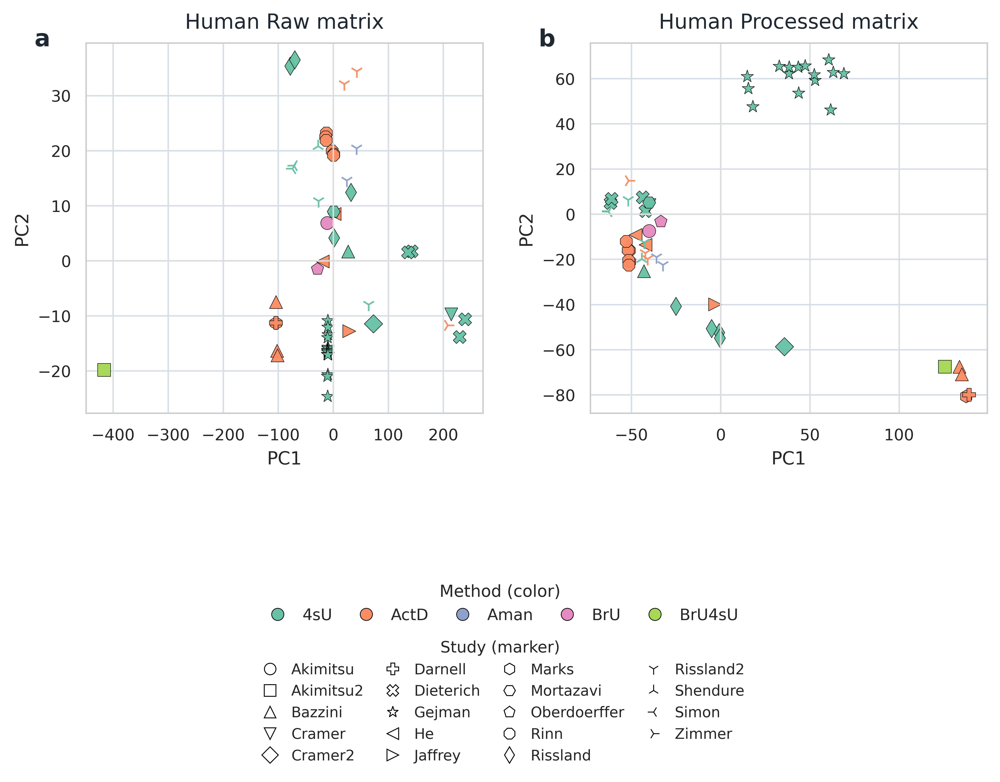
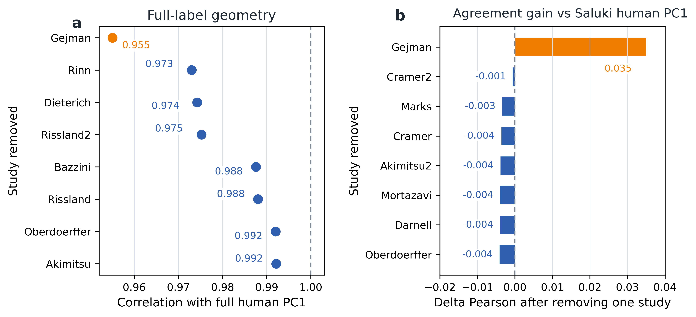
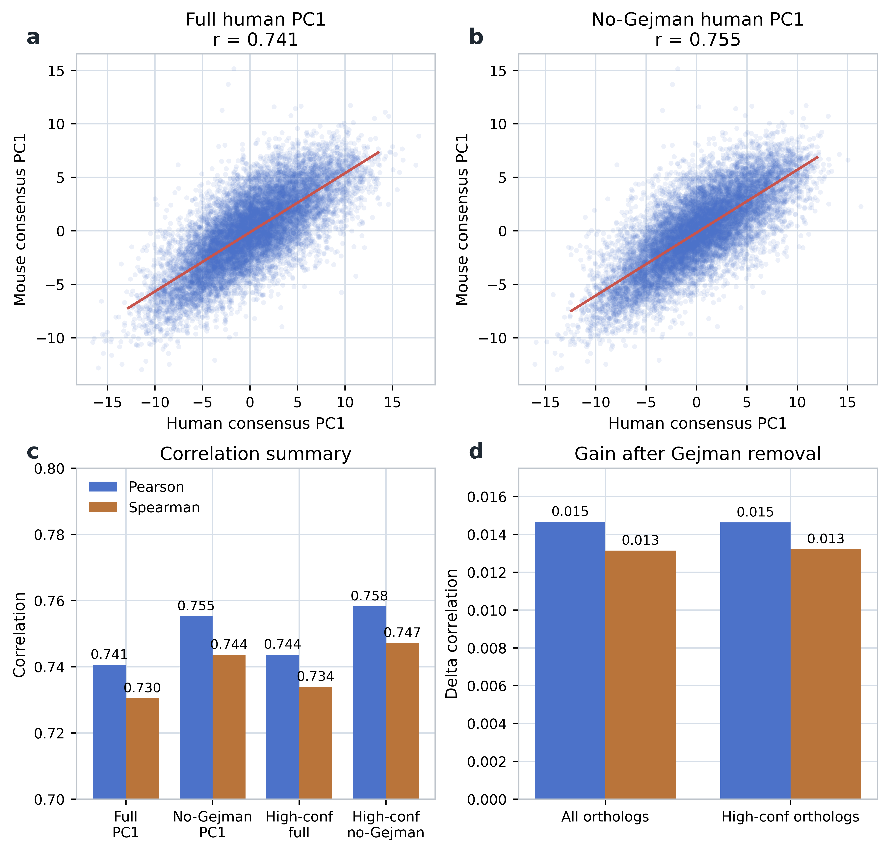
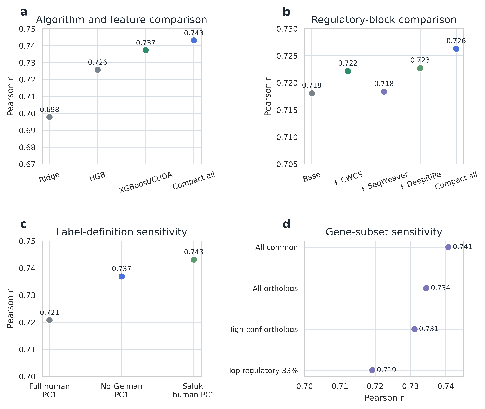
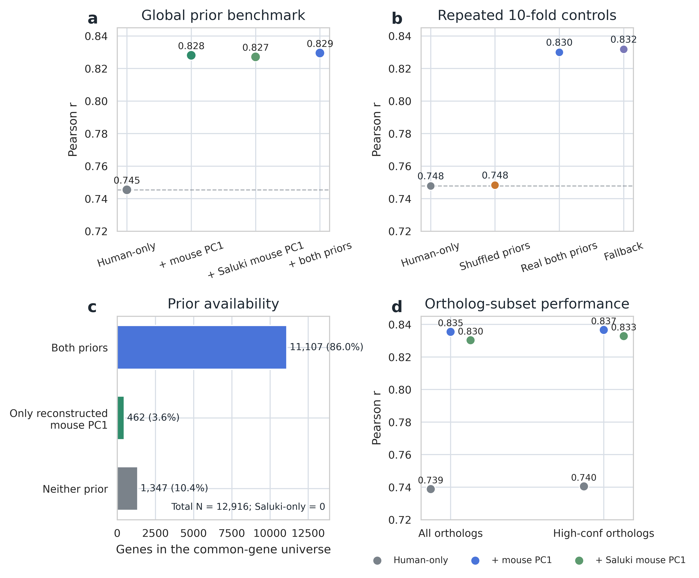
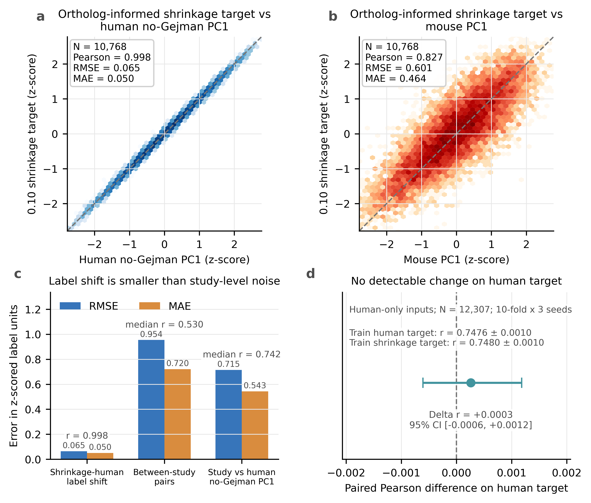

# 面向哺乳动物 mRNA 半衰期预测的 study-aware 标签审计、跨物种迁移与同源基因目标收缩

**稿件类型：** 中文内部审阅版（对应 *Bulletin of Mathematical Biology* 投稿稿）  
**作者：** Wenzhuo Wang<sup>1</sup>，Ying Shao*<sup>1</sup>  
**单位：** <sup>1</sup> 大连海事大学理学院，辽宁大连 116026  
**通讯作者：** Ying Shao；邮箱：yshao@dlmu.edu.cn<br>
**ORCID：** Ying Shao：https://orcid.org/0000-0002-4056-5757<br>
**基金：** 本研究未获得专项资助。  
**关键词：** mRNA half-life；study heterogeneity；label audit；target shrinkage；cross-species transfer；XGBoost

## 摘要

哺乳动物 mRNA 半衰期 compendium 混合了不同实验方案、细胞状态和处理流程，使标签质量与模型性能相互混杂。本文提出一套可复现框架，用于共识标签审计、固定目标预测、跨物种迁移和弱同源基因目标收缩。在 13,265 个共同基因上，移除 Gejman 后与 Saluki human 第一主成分（PC1）标签的一致性由 r=0.9515 升至 r=0.9829。该 study 的 PC1 位移落在 500 次同样本量随机移除的零分布内，且在两种 study-balanced 估计中由第 1 降至第 3。相反，随机移除均未复制其 Saluki 一致性增益或 human-mouse ortholog 一致性增益（两者单侧经验 p=0.002）；ortholog 相关由 r=0.741 升至 r=0.755。在固定 Saluki human PC1 目标下，human-only 模型在重复 10-fold 评估中达到 r=0.748±0.001；加入外部 mouse ortholog priors 后达到 r=0.830±0.001，打乱 gene-prior 对应关系后回落至 r=0.748±0.001。在 12,307 个满足建模输入要求的基因上，$\lambda=0.10$ 的同源基因目标收缩仍与 human no-Gejman PC1 几乎一致（r=0.998）；在单独定义的 10,768 个映射同源基因对中，均方根误差为 0.065。Cross-target evaluation 未检测到 human 标签可预测性下降（差值=+0.0003；95% 置信区间 -0.0006 至 0.0012）。这些分析分别量化样本数影响、跨物种协变量增益和监督目标改变。

## 1. 引言

mRNA 稳定性调控是基因表达程序中不可忽视的一层。即便转录水平相同，不同转录本也会因降解速率差异而表现出截然不同的稳态丰度和翻译输出(Ross 1995; Garneau et al. 2007; Schoenberg and Maquat 2012; Rambout and Maquat 2024)。经典研究已经证明，密码子组成、核糖体推进速率、3′UTR 元件、RNA 结合蛋白结合位点、RNA 结构和 RNA 修饰都会影响 mRNA 半衰期(Meyer et al. 2012; Wang et al. 2014; Presnyak et al. 2015; Wu et al. 2019; Hia et al. 2019; Grimson et al. 2007; Agarwal et al. 2015; Mauger et al. 2019)。因此，half-life 预测与基础生物学、变异功能解释和 RNA 药物工程均密切相关(Leppek et al. 2022; Sample et al. 2019; Cetnar et al. 2024; Musaev et al. 2024)。

从数据层面看，哺乳动物 mRNA 半衰期测量已经从小规模实验发展到跨研究 compendium。转录抑制法、4sU/5EU 代谢标记、核苷重编码及相关高通量流程，使研究者得以在不同细胞背景中对数千到上万基因估计降解速率(Schwanhausser et al. 2011; Rabani et al. 2011; Tani et al. 2012; Schwalb et al. 2012; Duffy et al. 2015; Herzog et al. 2017; Schofield et al. 2018; Muhar et al. 2018)。这类资源的主要难点是数据异质性。常规标准化之后，高通量矩阵仍可能保留明显的 batch effect 和 study-specific processing structure(Johnson et al. 2007; Leek et al. 2010)。研究来源、实验方法、时间点设计、细胞背景和后续变换流程都会在 gene × sample 矩阵中留下结构性痕迹。将这些观测值简单视为同质样本，可能使模型同时吸收技术结构和生物结构。

Saluki 相关工作对这一问题给出了一个非常重要的第一代解决方案：先把多个研究整合为 compendium，再在统一预处理后提取 PC1 共识标签，以此作为序列建模目标(Agarwal and Kelley 2022)。该工作既提供了 mammalian half-life benchmark，也展示了深度序列模型在此任务上的潜力。与此同时，它也暴露出一个更深的问题：如果共识标签本身仍带有 study-level 偏差，下游性能比较就会同时反映模型能力与标签质量。Benchmark 导向的计算生物学研究需要显式处理这一问题。

本研究把标签诊断而非更大模型作为首个问题。完整 leave-one-study-out 重建先以不使用 Saluki 标签的 PC1 stability 筛查高影响 study，再用 Saluki human PC1 一致性和 human-mouse ortholog 一致性检查改变方向。在 Saluki human PC1 固定不变时，我们比较 human-only baseline 与加入外部 mouse ortholog priors 的 cross-species transfer。随后构建 $\lambda=0.10$ 的同源基因信息收缩目标，并通过 cross-target evaluation 检查原 human 标签的可预测结构。输入增强与目标收缩改变 prediction problem 的不同部分，因此分开评估。

## 2. 相关工作

### 2.1 哺乳动物 mRNA 半衰期的大规模测量与整合

早期关于 mRNA 稳定性的综述与系统研究已经指出，不同转录本的降解速率差异是哺乳动物基因表达控制的重要来源(Ross 1995; Garneau et al. 2007; Schoenberg and Maquat 2012)。随后，转录组尺度实验扩展到传统抑制法、代谢标记和核苷重编码等多条技术路线(Schwanhausser et al. 2011; Rabani et al. 2011; Tani et al. 2012; Schwalb et al. 2012; Duffy et al. 2015; Herzog et al. 2017; Schofield et al. 2018; Muhar et al. 2018)。Duan 等人测量了 human lymphoblastoid cell lines 间的 RNA stability 差异；该数据源在 Saluki compendium 中对应 Gejman study(Duan et al. 2013)。Friedel 等人较早展示了 mammalian half-life 的保守规律(Friedel et al. 2009)，Agarwal 与 Kelley 则把这一方向推进为系统 compendium 和 sequence-based benchmark(Agarwal and Kelley 2022)。然而，现有工作大多把“如何从 noisy multi-study matrix 中得到 gene-level consensus label”视为隐含步骤，而非独立方法问题。

### 2.2 决定 mRNA 稳定性的序列与生化因素

从机制角度看，密码子最优性、翻译效率与降解耦合是近年来最有影响力的发现之一(Presnyak et al. 2015; Wu et al. 2019; Hia et al. 2019)。与此同时，miRNA 靶向规则、3′UTR 顺式元件和 RNA 结构也被证明会系统影响半衰期(Mayr 2017; Grimson et al. 2007; Agarwal et al. 2015; Mauger et al. 2019)。m6A 等 RNA 修饰研究则提供了另一层解释(Meyer et al. 2012; Wang et al. 2014)。这些发现为 sequence-to-stability 预测提供了明确的生物学基础。

### 2.3 计算模型：从表格学习到深度序列模型

在计算建模层面，随机森林、梯度提升树及其现代实现如 XGBoost/LightGBM 仍是异构特征建模的强基线(Breiman 2001; Friedman 2001; Chen and Guestrin 2016; Ke et al. 2017)。更靠近原始序列输入的方向，则包括 DeepBind、跨物种序列活性预测模型、Enformer 与 DNABERT 等(Alipanahi et al. 2015; Kelley 2020; Avsec et al. 2021; Ji et al. 2021)。本文采用统一、透明的建模与评估框架，定量分析标签诊断和跨物种先验对预测表现的影响。

## 3. 材料与方法

图 1 给出总体分析，表 1 定义方法模块，表 2 对应各分析宇宙。标签审计先于模型预测。固定目标分析比较 human-only 输入与外部 mouse ortholog covariates；target-shrinkage 分析则修改监督目标。两类 prediction setting 分开评估。具体数据路径、脚本入口和复现命令见补充材料 S15 及 Data and Code Availability。



**图 1** study-aware benchmark 的总体方法框架。a，共识标签重建与审计：MOESM2 先保留至少 3 个样本有观测值的基因，再经 sample-wise z-score、迭代 PCA 插补、quantile normalization 和 PC1 提取后进行 leave-one-study-out 检查；MOESM3 与 Ensembl ortholog 分别提供 Saluki 处理口径参照和跨物种比较轴。图中同时给出方向性一致性增益和未显著的同样本量 geometry-null 结果。b，固定目标预测：目标始终为 Saluki human PC1，分别评估 human-only 输入与 mouse-prior transfer 输入，并以 fold-wise permutation 检查 gene identity mapping。c，弱同源基因目标收缩：90% human no-Gejman PC1 与 10% mapped mouse PC1 构成新目标；标签距离、study-noise comparison 和 cross-target evaluation 共同检查其 human 主导性。所有数值均来自对应结果表，流程图由可复现的矢量绘图脚本生成。

**表 1** 方法模块、逻辑输入与验证目的。主文只保留每个模块的分析逻辑和结论用途；具体文件名、脚本路径、结果表和复现命令见补充材料 S15 及 Data and Code Availability 中指定的版本化 GitHub 仓库。

| 方法模块 | 逻辑输入 | 核心操作 | 验证作用 |
| --- | --- | --- | --- |
| 数据整理 | 公开 human/mouse half-life 矩阵与样本元信息 | 解析物种、study、实验方法、细胞类型和重复；建立 human、mouse 与 no-Gejman 子集 | 明确样本结构和基因宇宙，避免把不同任务口径混在一起 |
| 共识标签重建 | gene × sample half-life 矩阵 | 覆盖度过滤、样本标准化、缺失值插补、分布对齐和 PC1 提取 | 得到可复现的 half-life consensus label，并与 Saluki 发布 PC1 标签对齐 |
| Study influence | 按 study 分组的样本子集 | 每次移除一个 study 后完整重建标签；以 PC1 stability 筛查，再用 Saluki agreement 检查改变方向 | 分离不使用 Saluki 标签的筛查与已发布处理口径比较；下游模型分数不参与排序 |
| Ortholog concordance | human-mouse one-to-one ortholog genes | 比较 human full PC1、no-Gejman PC1、Saluki human PC1 与 mouse 标签的一致性 | 检查标签改变是否趋向跨物种保守结构 |
| Human-only prediction | human sequence/regulatory features | gene-level out-of-fold XGBoost benchmark | 定量 human-only 表征的预测表现；作为透明 human-only 基线 |
| Prior-enhanced prediction | human features + mouse ortholog priors | prior-enhanced OOF benchmark、permutation control 和 residual analysis | 检验 gene-specific cross-species signal；mouse-side covariates 独立于 human target 构建 |
| 0.10 同源基因信息目标收缩 | human consensus label + mapped mouse ortholog label | 标准化后按 90:10 加权组合；量化标签 shift、study-noise scale 与 cross-target performance | 构建 human-dominant mammalian stability target；与固定目标 benchmark 分开解释 |

### 3.1 数据来源、元信息解析与共同基因宇宙

本文使用 Agarwal 与 Kelley 的 Saluki 论文公开补充数据(Agarwal and Kelley 2022)。其中，MOESM2 提供 human 和 mouse 的 transformed mRNA half-life gene × sample 矩阵，是标签重建和留一研究影响审计的主输入；前两列为 Ensembl gene ID 和 gene name，后续列为不同 study、实验方法、细胞类型和重复样本的 transformed values。MOESM3 提供 Saluki 发布的 “half-life (PC1)” summary label 及 processed sample values。本文将其 human 侧发布标签称为 **Saluki human PC1**，并将其固定为所有 fixed-target benchmark 的监督目标；mouse 侧发布标签称为 **Saluki mouse PC1**，经 ortholog 映射后作为外部 mouse-side prior 使用。MOESM3 的 human 工作表说明 Saluki human PC1 基于剔除 Gejman 后的数据集，mouse 工作表基于全部 mouse 数据集。因此，发布的 PC1 列用于定义固定监督目标和 Saluki 处理口径参照，processed sample columns 仅用于次级控制；二者均不参与从 MOESM2 开始的本地标签重建。预计算的 Saluki sequence/regulatory feature blocks 来自配套公开数据集（DOI：[10.5281/zenodo.6326409](https://doi.org/10.5281/zenodo.6326409)）。由于 MOESM2 已经是 transformed values，本研究不再重复执行 log transform，而是从 sample-wise standardization 开始。

样本元信息由样本名和本地整理表解析得到，包括 `species`、`study`、`method`、`cell type` 和 `replicate`。human 全量分析包含 54 个样本、19 个 study 和 5 类实验方法；mouse 分析包含 27 个样本、17 个 study 和 3 类实验方法；剔除 Gejman 后的 human 子集包含 39 个样本和 18 个 study。human-mouse ortholog 映射来自 Ensembl release 115 comparative genomics 资源(Dyer et al. 2025)。

文中的基因数属于任务特异的分析宇宙，并非同一母集合连续筛减所得。标签审计支路从经过覆盖度过滤的 human、mouse 和 no-Gejman 重建集合出发；fixed-target 支路使用 human compact features、Saluki human PC1、human full PC1 和 human no-Gejman PC1 的 12,916-gene 交集；target-shrinkage 支路先在 Saluki-like 10-sample coverage 规则保留的 12,644 个 human genes 上构建目标，再分别使用 12,307 个 model-eligible genes 做预测、使用 10,768 个 one-to-one pairs 做 label-distance 分析。后两者交集为 10,682 个 human genes，但互不构成完整包含关系。表 2 给出三条支路的完整图谱；派生的 coverage 和 sensitivity subsets 见补充表 S6。



**图 2** 数据来源、样本结构与代表性分析宇宙。a，human、mouse 和 no-Gejman human 子集的样本数、study 数和实验方法数。b，预处理后进入共识标签分析的基因覆盖。c，标签审计、fixed-target 和 target-shrinkage 支路中的代表性 gene 或 ortholog-pair 数量；这些柱条不是同一集合的连续筛减序列。d，MOESM2、MOESM3 和 Ensembl ortholog 资源在本文中的分工：分别对应主线标签重建、Saluki 口径参照/控制以及跨物种比较与映射。精确集合关系见表 2 和补充表 S6。

**表 2** 分析宇宙图谱。每个固定定义的核心集合均有唯一 ID 和分析用途；精确纳入规则、动态 leave-one-study-out 计数及派生的 coverage/sensitivity subsets 见补充表 S6。

| 支路 | ID 与分析宇宙 | N 与单位 | 主要用途 |
| --- | --- | ---: | --- |
| 标签重建/审计 | L1，human full reconstruction | 16,444 genes | Full-human PC1、sample PCA 和 human LOO 的起始标签 |
| 标签重建/审计 | L2，mouse full reconstruction | 16,951 genes | Mouse PC1、mouse PCA/LOO 和 reconstructed mouse-prior 来源 |
| 标签重建/审计 | L3，human no-Gejman reconstruction | 15,788 genes | No-Gejman PC1 和 primary dynamic-coverage Gejman comparison |
| 标签重建/审计 | A1，fixed-LOO sensitivity | 14,244 genes | 仅用于 fixed-universe LOO sensitivity |
| 标签重建/审计 | A2，fixed human-Saluki comparison | 13,265 genes | 固定基因 Saluki agreement 与 paired bootstrap |
| 标签重建/审计 | A3，human-mouse ortholog concordance | 12,592 pairs | 审计 Gejman 相关标签改变的跨物种方向 |
| Fixed-target prediction | P1，broad feature-target universe | 13,532 genes | Regulatory-block ablation 与 MOESM3 派生标签控制 |
| Fixed-target prediction | P2，global prediction universe | 12,916 genes | 主线 human-only、transfer、permutation 与 repeated-CV benchmark |
| Fixed-target prediction | P3，both-priors subset | 11,107 genes | Prior coverage analysis 与 two-stage residual decomposition |
| Target shrinkage | S1，shrinkage target-construction universe | 12,644 genes | 构建 0.10 ortholog-informed target |
| Target shrinkage | S2，shrinkage prediction universe | 12,307 genes | 主线 shrinkage-target prediction、ablation 与 cross-target evaluation |
| Target shrinkage | S3，shrinkage mapped-pair set | 10,768 pairs | Human-mouse label distance、target geometry 与 study-noise comparison |

只有 P2 和 S2 是两条预测任务的主训练/评估宇宙。P1 用于辅助的特征与标签控制，P3 是 prior coverage/residual subset，并非另一套主训练 cohort。L 和 A 系列用于构建或审计标签，也不是额外的预测 cohort。

本文没有把 10,682-gene S2/S3 overlap 强制作为所有分析的共同主集合。这样做会令每项任务都以 reconstructed mouse-ortholog mapping 为纳入条件，从 fixed-target benchmark 中删除 2,234 个 genes（17.3%），并改变 human-only analysis 的估计对象。因此，同一任务内部的比较严格使用相同 gene IDs 和 folds，而不同任务的分数保持分开标记。

### 3.2 样本层面 PCA 与 compendium 异质性诊断

在构建监督标签之前，我们首先在 sample level 检查 compendium 的主要结构。对 raw transformed matrix，仅在缺失位置执行 iterative low-rank PCA 插补以便可视化；该处理沿用不完整高维矩阵的低秩估计思路(Tipping and Bishop 1999; Troyanskaya et al. 2001)。对 processed matrix，则执行与标签重建一致的 sample-wise z-score、iterative PCA imputation 和 quantile normalization(Bolstad et al. 2003)。随后在 sample × gene 空间计算前两个主成分，并将样本按 study 或 method 着色。两种 PCA 视图的矩阵口径、插补参数和用途见补充表 S3。

该探索性 PCA 用于判断矩阵的主要变异是否包含明显的 study/method 结构。若样本主要按 study 聚类，标签来源就会影响 downstream model 的性能解释。Human PCA 显示，预处理改变了 PC 几何结构，但 study/method 相关结构仍然存在，因此需要进一步进行 leave-one-study-out 分析。Mouse 结果保留在补充材料中，因为两个物种呈现不同的异质性模式。



**图 3** Human sample-level PCA 诊断。a，raw transformed matrix 的 sample-level PCA。b，经过 sample-wise z-score、iterative PCA imputation 和 quantile normalization 后的 processed matrix。每个点代表一个实验样本，颜色表示实验方法，点形表示 study，图内 legend 给出对应关系。两个面板均显示 human compendium 中存在 study/method 相关结构。预处理改变了 PC 几何结构，但相关结构仍然存在；两面板使用独立 PC 尺度，因此仅作定性解读。

### 3.3 共识标签重建流程

共识标签重建在 gene × sample 矩阵上执行。对每个 species 或 study-removal 子集，我们依次执行 coverage filter、sample-wise z-score、iterative PCA imputation 和 quantile normalization；随后在处理后的矩阵上提取 PC1，并将其方向与 gene-wise mean 对齐。这样得到的 PC1 被用作本地共识标签。

本地流程提供一个可审计、可反复运行的标签重建，同时承认 Saluki 未公开的处理细节无法被精确复制。在全量 human 重建标签与 Saluki human PC1 共同覆盖的 13,921 个基因上，Pearson 为 0.948；mouse 重建标签与其参照的 Pearson 为 0.958。后文用于 Gejman 配对推断的 full-label Pearson 0.9515 则来自另行固定的 A2 集合（13,265 个同时具有 full、no-Gejman 和 Saluki 标签的基因），两者并非同一基因宇宙上的重复估计。0.10 同源基因信息目标收缩采用 Saluki-like coverage 口径，即 human 至少 10 个 non-missing samples、mouse 至少 5 个 non-missing samples。对应的 human 和 mouse PC1 均由 MOESM2 本地重建；“Saluki-like” 仅指上述 coverage filter 阈值。

### 3.4 留一研究剔除（leave-one-study-out）影响分析

对每个 study $s$，我们移除其全部样本，并重新执行 coverage filter、z-score、PCA imputation、quantile normalization 和 PC1 extraction。若 $L_{\mathrm{full}}$ 为全量标签、$L_{-s}$ 为移除 study 后重建的标签，则 PC1 stability 定义为

```equation
number: 1
S_s = \operatorname{corr}(L_{\mathrm{full}}, L_{-s})
```

式（1）的数值越低，表示几何影响越大。对比较标签 $R$，agreement change 定义为

```equation
number: 2
A_s(R) = \operatorname{corr}(L_{-s}, R) - \operatorname{corr}(L_{\mathrm{full}}, R)
```

式（2）在每项比较对应的共同基因上配对计算。

Study audit 分为两个阶段。PC1 stability 先筛查高影响 study，不使用 MOESM3、Saluki human PC1 或任何下游模型分数。随后分别用 Saluki human PC1 一致性和 human-mouse ortholog concordance 检查改变方向。由于 Saluki 数据说明已标注 Gejman，前一项比较量化对已发布处理选择的恢复，不能据此判断该 study 在生物学上无效。Ortholog concordance 则提供作用不同的跨物种检查。

由于 Gejman 占 human 全部 54 个样本中的 15 个，我们增加了 size-matched null。每次从其余 39 个非 Gejman 样本中无放回抽取 15 个样本，完整重跑标签流程，共重复 $B=500$ 次。令 $N_{\mathrm{extreme}}$ 表示零分布中至少与观测统计量同样极端的次数，单侧经验 p 值定义为

```equation
number: 3
p_{\mathrm{emp}} = \frac{1 + N_{\mathrm{extreme}}}{B + 1}
```

PC1 stability 使用低尾，两个 agreement gains 使用高尾。该分析把“删除大量样本造成多大几何变化”与“变化是否沿 Saluki 处理参照和 ortholog 比较轴向预定方向移动”分开。

三类敏感性分析用于检查流程依赖。第一，在 primary dynamic coverage 之外，构建同时满足 full matrix 和全部 leave-one-study-out matrix 覆盖阈值的 fixed gene universe。第二，改变每个基因最少观测样本数（3、5、10）和 PCA 插补秩（3、5、10），并以 sample-wise median imputation 替代 iterative PCA imputation。第三，用两种方法降低样本数不平衡：在 PCA 前将 study $s$ 中每个样本乘以 $1/\sqrt{n_s}$，使各 study 的总平方权重相等；或先将每个 study 的 processed samples 折叠为 study mean profile，再提取 PC1。完整定义和结果见补充材料 S5。

### 3.5 Ortholog 一致性作为跨物种标签检查

为避免标签诊断只在 human measurements 内部自洽，我们把 human-mouse one-to-one ortholog concordance 作为跨物种比较(Koonin 2005; Gabaldon and Koonin 2013)。具体来说，我们将 human full PC1、human no-Gejman PC1、Saluki human PC1 分别映射到 one-to-one ortholog genes，并与本地重建 mouse PC1 或 Saluki mouse PC1 比较 Pearson/Spearman 相关。分析同时在全部 one-to-one ortholog pairs 与 high-confidence ortholog subset 中重复。High-confidence 直接采用 Ensembl Compara release 115 的二元字段 `is_high_confidence`。完整分析保留全部 `ortholog_one2one` pairs，子集分析保留 `is_high_confidence == 1` 的配对。

Saluki 一致性与 ortholog concordance 的作用不同。若移除某个 human study 只提高与 Saluki 标签的一致性，结果更符合对其处理口径的机械贴近。二者同步改善则支持标签向跨物种保守的 mRNA stability 结构移动，但不能确定具体分子机制，也不意味底层数据来源完全独立。本文依据两项比较的联合模式解释 Gejman。

### 3.6 0.10 同源基因信息收缩目标的构建与 cross-target 验证

我们用少量 ortholog constraint 构建反映哺乳动物保守稳定性的 human-dominant target。该步骤改变监督目标，但保持 human 特征定义不变。我们分别构建本地重建的 human no-Gejman PC1 和采用 Saluki-like coverage 口径的 mouse PC1，并各自执行 z-score；随后通过 one-to-one ortholog 将 mouse label 映射到 human genes。对有 ortholog signal 的 human gene，令 $H$ 表示标准化 human label，$M$ 表示映射后的标准化 mouse label。一般收缩目标及本文采用的操作点为

```equation
number: 4
T_{\lambda} = (1-\lambda)H + \lambda M, \qquad T_{0.10} = 0.90H + 0.10M
```

没有 ortholog signal 的 gene 保留 $H$。加权组合后整体重新 z-score，并按 Saluki human PC1 的方向对齐。下文将其称为 **0.10 同源基因信息收缩目标**。它是构建目标，并非新的实验性 human half-life measurement；`ortholog_regularized` 仅作为代码和结果文件字段保留。

这一操作可由测量误差模型解释。令 $Z$ 表示共享的哺乳动物稳定性轴，$\Delta$ 表示物种特异偏移，$\varepsilon_H$ 与 $\varepsilon_M$ 表示 compendium-specific errors，则观测标签可写为

```equation
number: 5
H = Z + \varepsilon_H, \qquad M = Z + \Delta + \varepsilon_M
```

将式（5）代入式（4）可得

```equation
number: 6
T_{\lambda} = Z + \lambda\Delta + (1-\lambda)\varepsilon_H + \lambda\varepsilon_M
```

记 $\sigma_H^2=\operatorname{Var}(\varepsilon_H\mid\Delta)$、$\sigma_M^2=\operatorname{Var}(\varepsilon_M\mid\Delta)$，且 $C_{HM}=\operatorname{Cov}(\varepsilon_H,\varepsilon_M\mid\Delta)$，则条件误差方差为

```equation
number: 7
V_{\lambda} = (1-\lambda)^2\sigma_H^2 + \lambda^2\sigma_M^2 + 2\lambda(1-\lambda)C_{HM}
```

若两类误差独立，则 $C_{HM}=0$。若误差还满足条件零均值，则该目标相对 $Z$ 的均方误差为

```equation
number: 8
\operatorname{E}\left[(T_{\lambda}-Z)^2\mid\Delta\right] = V_{\lambda} + \lambda^2\Delta^2
```

因此，增大 $\lambda$ 可能降低 human 标签噪音的贡献，但会按 $\lambda\Delta$ 增加潜在物种偏移。式（4）-（8）描述最终整体 re-z-score 之前、已映射基因上的混合过程；re-z-score 保持相关性，但会改变误差的数值尺度。这是一个 bias-variance 工作模型；本文不预设误差独立，也不预设 $\lambda=0.10$ 在理论上最优。

该目标先在 Saluki-like 10-sample coverage 规则保留的 12,644 个 human genes 上构建，再接受三类预先分开的检查。第一，在 10,768-pair 映射集合中计算它与 human、mouse 标签的 Pearson、Spearman、MSE、RMSE 和 MAE。第二，把 $T_{0.10}-H$ 的误差与 no-Gejman human studies 之间的 study-to-study variability 放在同一 z-scored label scale 上比较。第三，在同时具有 human `compact_all` features 和 Saluki human PC1 的 12,307 个 genes 上执行 cross-target evaluation：分别以 human no-Gejman PC1 或 $T_{0.10}$ 训练模型，再统一在原 human no-Gejman PC1 上评估折外预测。两套模型使用相同 1802 维 human-only features、相同 10-fold × 3 random seeds 和相同模型参数；Pearson 差值用 gene-level paired bootstrap 给出 95% CI。该设计检验 target shrinkage 是否损害原 human target 的可预测性。

主分析固定使用 $\lambda=0.10$，将 mouse contribution 限制在 10%。该值并非通过最大化 prior-enhanced CV 选择。$\lambda=0.05$、0.10 和 0.30 的敏感性结果全部在补充材料中报告；较大的 $\lambda$ 虽可进一步提高与 mouse prior 对齐后的可预测性，但也产生更大的 target shift，因此不作为本文主结论的操作点。

### 3.7 序列/调控特征构建与 human-only 基线评估

Human-only 路线保持目标不变，并使用两层特征空间。第一层为 526 维 base sequence features，由 Ensembl release 115 的 representative transcripts 生成，覆盖 5′UTR、CDS 和 3′UTR 的长度、GC content、codon frequency、region-level 3-mer 以及 3′UTR 4-mer。第二层为 1802 维 `compact_all` features，即在 base sequence features 上合并 Saluki datapack 中已预计算的 CWCS、SeqWeaver 和 DeepRiPe regulatory blocks(Agarwal et al. 2015; Park et al. 2021; Ghanbari and Ohler 2020)。

所有 human-only benchmark 均以 Saluki human PC1 为主监督目标，并采用 gene-level out-of-fold evaluation。主结果使用 XGBoost/CUDA，固定设置为 `tree_method=hist`、`device=cuda`、`max_depth=6`、`learning_rate=0.02`、`min_child_weight=4`、`subsample=0.9`、`colsample_bytree=0.75` 和 `reg_lambda=1.0`。Human-only benchmark 最多允许 5,000 棵树并使用 120 轮 early stopping；global prior benchmark 最多允许 3,000 棵树并使用 100 轮 early stopping。在每个 outer fold 内，从 outer-training genes 中再保留 `max(512, outer-training genes 的 10%)` 作为 inner validation subset。外层 held-out fold 不参与 early stopping，只在模型拟合完成后用于一次最终预测。主文报告 5-fold OOF 结果，并用 10-fold × 3 random seeds 作为 split-sensitivity robustness check。

所有模型均采用 gene-level OOF evaluation，未复刻 Saluki 的固定 test split。统一设计用于在同一特征表和标签宇宙中比较标签处理、prior 输入和控制实验。Human-only 路线由此提供透明、可复现的基线。

### 3.8 跨物种先验增强评估

Global cross-species transfer benchmark 保持 Saluki human PC1 目标不变，并以 human gene 为建模单位。我们在 human `compact_all` 特征上额外拼接 6 列 mouse 信息：`mouse_pc1` 和 Saluki mouse PC1 两列 prior、两列 availability indicators，以及两列 high-confidence ortholog indicators。`mouse_pc1` 是本地重建的 mouse prior；Saluki mouse PC1 是 Saluki 发布的 mouse label，在本文中作为 prior 使用。二者提供相关但不完全相同的跨物种稳定性信息。两类 prior 均只由 mouse-side measurements 和 ortholog mapping 构建，并在 human cross-validation 之前固定。训练折和 held-out 折的 human target values 均不参与其构建。因此，该设定作为输入外部跨物种协变量的 cross-species transfer 报告。

这些指示列把 prior 数值、可用性和映射置信度分开编码。若某个 human gene 缺少 mouse prior，对应 prior value 与 availability indicator 均暂记为 0；有值时 indicator 为 1。High-confidence 列记录该 ortholog 在 Ensembl Compara 中是否满足 `is_high_confidence == 1`。完整共同基因宇宙同时包含 prior 可用与缺失的 genes，因此能够反映整个 benchmark 的性能。

因此，fixed-target benchmark 的训练和评估集合是同一个 global prediction universe：12,916 个同时具有 compact features、Saluki human PC1、human full PC1 和 human no-Gejman PC1 的 human genes。Human-only `compact_all`、单 prior、双 priors 和 shuffled-prior controls 都在这些 genes 上做 gene-level OOF evaluation。both-priors 子集包含其中 11,107 个同时具有 `mouse_pc1` 和 Saluki mouse PC1 的 genes，只用于 prior coverage 解读和 residual analysis，不替代主训练全集。Target-shrinkage 支路中，12,644 个 target-construction genes 有 12,307 个满足建模输入要求，另有 10,768 个形成 mapped human-mouse pairs 用于 label-distance analysis。两个末端集合共有 10,682 个 genes：1,625 个 prediction genes 没有 reconstructed mouse mapping，因而保留 human label；86 个 mapped-pair genes 缺少完整 prediction inputs。

### 3.9 控制实验、评价指标与使用边界

本文用四类控制回答四个直接问题。第一，permutation control 检查 prior-enhanced gain 是否依赖 gene-specific prior，而不只是多出几列特征或特定缺失模式：在每个 fold 内，只在原本具有 prior 数值的 genes 之间打乱 `mouse_pc1` 和 Saluki mouse PC1，同时保持 prior 可用性与 high-confidence 指示列不变。第二，residual analysis 检查 transfer result 是否只是在复述 prior：分析限定在同时具有两类 mouse priors 的 `both_priors_available` 子集（N=11,107）。在每个 outer fold 内，RidgeCV 只在 outer-training genes 上拟合；该模型对 outer-training genes 的拟合值用于定义训练 residual，held-out prior prediction 则单独生成。XGBoost 只使用 outer-training residual 和 human `compact_all` features，因此最终 held-out prediction 仍为 OOF。第三，no-direct-prior ablation 检查 0.10 同源基因信息收缩目标的高分是否完全依赖构造目标时使用的本地重建 mouse PC1。第四，3.6 节的 cross-target evaluation 检查目标收缩是否损害原 human label 上的折外预测。

模型性能报告 Pearson、Spearman 和 $R^2$；标签距离报告 Pearson、Spearman、MSE、RMSE、MAE、median absolute error 和 p95 absolute error。除非特别说明，所有 prediction results 都是 out-of-fold predictions，而不是训练集内拟合分数。mean ± SD 表示不同 random seeds 对数据划分的敏感性，不作为抽样置信区间；关键相关差值另用 paired gene/ortholog bootstrap 给出 95% CI，cross-target comparison 使用 2,000 次重采样，其余主张使用 5,000 次重采样（补充表 S14-S15）。主文报告支撑核心结论的结果，补充材料保留完整 ranking、multi-seed summaries、prior ablation、label distance、study-noise comparison 与 bootstrap 输出。

最后，本文的预测使用边界分为三层。base sequence model 只需要明确分区的 5′UTR、CDS 和 3′UTR，可用于新转录本或人工序列，但不等同于完整 `compact_all`。`compact_all` 适用于 Saluki 预计算 feature datapack 中已包含的 Ensembl human genes。prior-enhanced model 还需要 mouse ortholog prior；若两类 mouse prior 均缺失，则退回 human-only compact model。

生成式 AI 工具用于文稿结构与语言起草支持、代码审查和图形布局建议，未用于生成分析数据或最终图件。所有算法实现、统计数值、文献引用、图件和最终表述均由作者核验；作者对最终稿及其可复现性承担责任。

**表 3** 预测设定、目标、输入与解释边界。

| 建模设定 | 目标标签 | 输入特征 | 适用解释与边界 |
| --- | --- | --- | --- |
| Base sequence | Saluki human PC1 | 526 维序列统计特征 | 可用于新序列，但仅对应基础序列层级 |
| Compact human-only | Saluki human PC1 | 1802 维 `compact_all` | pure human sequence/regulatory benchmark；作为 human-only 基线 |
| Global prior-enhanced | Saluki human PC1 | `compact_all` + two mouse priors + flags | 使用独立于 human target 构建的 mouse-side covariates 进行 cross-species transfer |
| 0.10 同源基因信息目标收缩 | $T_{0.10}$ shrinkage target | human-only 或 prior-enhanced 特征 | human-dominant mammalian stability target；用 cross-target evaluation 检查原 human 可预测性 |
| Shuffled/no-direct controls | 同对应主目标 | 打乱 prior 或移除 direct prior value | 检查性能增益是否来自 gene-specific cross-species signal |

## 4. 结果

### 4.1 study-aware 审计区分样本数影响与标签改变方向

全量 human 重建标签与 Saluki human PC1 在 13,921 个共同基因上的 Pearson 为 0.948，说明本地流程复现了其主要结构。在 primary sample-weighted 分析中，leave-one-study-out PC1 stability 将 Gejman 排在 19 个 study 的第 1 位：移除其 15 个样本后 r=0.955，第二位 study 为 r=0.973。在 dynamic/fixed gene universe、每个基因最少 3/5/10 个观测、PCA 插补秩 3/5/10 以及 sample-wise median imputation 下，Gejman 均保持第 1。

Size-matched analysis 改变了这一几何排序的解释。500 次完整流程重跑中，每次从 39 个非 Gejman 样本随机移除 15 个，PC1 stability 中位数为 0.944（95% 零分布区间 0.932-0.956）；Gejman 的 0.955 并非异常偏低（单侧经验 p=0.964）。在 equal-study PCA weighting 和 study-mean collapse 下，Gejman 也均由第 1 降至第 3。其 raw PC1 geometry 影响因此部分来自样本数，现有数据未将其识别为 sample-count-adjusted statistical outlier。

但标签改变的方向具有 study specificity。在固定的 13,265 个配对共同基因上，移除 Gejman 后与 Saluki human PC1 的 Pearson 由 0.9515 升至 0.9829，增益 0.0314（95% bootstrap 置信区间 0.0298-0.0330）。500 次 size-matched removals 均未获得同等增益（零分布中位数 -0.0926；单侧经验 p=0.002）。图 4b 显示的是 primary dynamic-coverage 口径，每次移除后在当时可用的配对基因上计算；Gejman 的该估计为 +0.0349。该处理参照比较不参与 stability 排序，任何下游模型分数也未进入 study audit；由于 Saluki human PC1 本身是在移除 Gejman 后发布的，该结果量化的是对已发布处理选择的恢复，而不是独立验证。



**图 4** Human studies 的 primary sample-weighted leave-one-study-out audit。a，点图显示对 full-label geometry 影响最大的 8 个 study；横坐标为 PC1 stability，数值越低表示影响越大，虚线表示 $r=1$。该排序不使用 Saluki PC1。b，agreement change 定义为 Pearson 相关差 $\Delta r=r_{\mathrm{LOO,Saluki}}-r_{\mathrm{full,Saluki}}$，并在每次移除后可用的配对基因上按 primary dynamic-coverage 口径计算。Gejman 的图中数值为 +0.0349；正文用于 bootstrap 的固定 13,265-gene 配对估计为 +0.0314。Size-matched、fixed-universe、预处理与 study-balanced 分析见补充材料 S5 和补充图 S4。

Human-mouse ortholog 提供第二项比较。在 12,592 个 one-to-one pairs 中，移除 Gejman 后 Pearson concordance 由 0.741 升至 0.755，增益 0.0147（95% bootstrap 置信区间 0.0111-0.0181）；Spearman 由 0.730 升至 0.744。Ensembl high-confidence subset 中的增益仍为 0.0146。500 次 size-matched removals 均未达到该 full-set ortholog gain（零分布中位数 -0.0616；单侧经验 p=0.002）。样本数影响标签移动幅度；移除 Gejman 则使标签同时靠近 Saluki 处理参照和保守 ortholog 结构。



**图 5** No-Gejman 标签的 ortholog concordance analysis。a-b，每个点代表一个 human-mouse one-to-one ortholog pair；横轴为 human consensus PC1，纵轴为 mouse consensus PC1。a 使用 full human PC1，b 使用 no-Gejman human PC1；红线为用于视觉辅助的普通最小二乘拟合线。c，比较 full PC1、no-Gejman PC1 及其 high-confidence ortholog subsets 的 Pearson 与 Spearman。d，汇总 all one-to-one 与 high-confidence subsets 中移除 Gejman 后的配对 Pearson 和 Spearman gains。

### 4.2 human-only compact sequence/regulatory 模型给出稳定的固定目标基线

在固定 Saluki human PC1 目标下，primary global analysis 的 `compact_all` 在 12,916 个基因上达到 Pearson=0.745、Spearman=0.737、R2=0.554。在统一 common-universe 的 matched comparison 中，Ridge、histogram gradient boosting、GPU XGBoost 和 `compact_all` 的 Pearson 分别为 0.698、0.726、0.737 和 0.743（图 6a）。Matched 与 primary 结果相差 0.002，来自不同 cross-validation 和训练配置。

Regulatory-block comparison 在另一个含 13,532 个基因的 broad feature-target universe 中进行，结果显示单个 block 的贡献并不一致。CWCS 和 DeepRiPe 单独加入时均高于 base，SeqWeaver 单独加入时近似持平，合并后的 `compact_all` 最高（图 6b）。在 matched 12,916-gene global prediction universe 中，`compact_all` 对 full human PC1、human no-Gejman PC1 和 Saluki human PC1 的 Pearson 分别为 0.721、0.737 和 0.743（图 6c）。三折 gene-subset analysis 仍保持相同的整体性能区间，没有把结论集中在某个选择性子集（图 6d）。这些分析建立了可复现的 human-only OOF baseline，但不复刻 Saluki 的固定 train-test split。



**图 6** Human-only fixed-target benchmark 的证据面板。a，在 12,916-gene global prediction universe 上进行 matched 5-fold 比较，包括 Ridge、histogram gradient boosting、GPU XGBoost 和 `compact_all`。b，在独立的 13,532-gene broad feature-target universe 上进行 5-fold regulatory-block comparison；单个 block 的贡献并不完全一致，合并全部 blocks 的 `compact_all` 最高。c，在 12,916-gene global prediction universe 上进行 matched 5-fold label-definition sensitivity，比较 full human PC1、human no-Gejman PC1 和 Saluki human PC1。d，三折比较 all-common、all-ortholog、high-confidence ortholog 与 top-regulatory-33% subsets；subset 数值不外推为 global performance。

### 4.3 固定 human 目标下的跨物种迁移产生 gene-specific prior 增益

随后保持 Saluki human PC1 不变，只改变输入信息。Human-only `compact_all` 的 Pearson 为 0.745；加入本地重建 mouse PC1 后升至 0.828，只加入 Saluki mouse PC1 作为 prior 时为 0.827，同时加入两类 prior 时为 0.829（图 7a）。因此，两类 mouse-side priors 均含有较强且部分冗余的跨物种信息。

10-fold × 3 random seeds 的评估中，human-only `compact_all` 为 0.748±0.001，shuffled-prior control 为 0.748±0.001，real dual-prior model 为 0.830±0.001；± 表示 across-seed SD。对缺少 prior 的 genes 退回 human-only prediction 后，coverage-aware fallback rule 为 0.832±0.001。在 12,916 个 benchmark genes 中，11,107 个具有两类 priors，462 个仅有本地重建 mouse PC1，1,347 个两类均缺失（图 7b-c）。这些 coverage groups 直接界定了各模型的可用范围。



**图 7** 固定 human 目标下 cross-species transfer 的证据面板。a，比较 human-only、本地重建 mouse PC1、Saluki mouse PC1 和 dual-prior 输入。b，三组 repeated 10-fold controls；误差线为 across-seed SD。Shuffling 保留 prior availability，但破坏 gene-prior identity，增益随之消失。c，共同 human 基因宇宙中的 prior availability。d，full one-to-one 与 high-confidence ortholog subsets 中的模型绝对性能。

Permutation control 将增益定位到 gene-prior correspondence。Primary 5-fold 分析中，real dual-prior model 达到 Pearson=0.829、R2=0.688；fold-wise prior shuffling 后回到 Pearson=0.745、R2=0.553，接近 human-only baseline。Shuffling 保持 prior availability 与 high-confidence indicators 不变，仅破坏每个 gene 与 prior value 的对应。将三组 held-out predictions 按 gene 求平均后，real-prior 与 shuffled-prior 的相关分别为 0.8324 和 0.7531，配对增益 0.0794（95% 置信区间 0.0735-0.0855）。

Residual decomposition 表明 prior 很强，但并非全部信息。在同时具有两类 priors 的 11,107 个 genes 上，prior-only RidgeCV 的 Pearson=0.792、$R^2=0.627$，human `compact_all` alone 的 Pearson=0.739、$R^2=0.544$。加入一个只由 outer-training residual 学得的 OOF human-feature correction 后，最终达到 Pearson=0.826、$R^2=0.675$。Human features 对 prior 未解释方差的解释比例定义为

```equation
number: 9
R_{\mathrm{remaining}}^2 = \frac{R_{\mathrm{final}}^2 - R_{\mathrm{prior}}^2}{1 - R_{\mathrm{prior}}^2}
```

式（9）的结果为 12.8%。该子集分析用于分解信息，不替代 12,916-gene 主 benchmark。

### 4.4 弱同源基因目标收缩保持 human 主导性，未检测到 human-label 可预测性下降

该分析改变监督 target。在 12,307 个 model-eligible genes 上，收缩 target 与 human no-Gejman PC1 的 Pearson 为 0.9982（95% bootstrap 置信区间 0.9981-0.9983）。在单独定义的 10,768 个 mapped one-to-one ortholog pairs 中，收缩前 human no-Gejman PC1 与本地重建 mouse PC1 的 Pearson 为 0.789（RMSE=0.663；MAE=0.512）；应用 $\lambda=0.10$ 后，新 target 与 human label 的 Pearson 为 0.9979（RMSE=0.065；MAE=0.050），与 mouse PC1 的 Pearson 为 0.827。该操作因此只对 human label 作轻度 ortholog-informed 调整。它属于目标构建，不向 prediction model 添加 penalty。

**表 4** 0.10 同源基因信息收缩目标与 human/mouse labels 及 study-level variability 的同尺度比较。所有误差指标均在 z-scored label units 上计算；study-level rows 报告中位数。

| 比较对象 | N 或比较数 | Pearson | RMSE | MAE | 解释 |
| --- | ---: | ---: | ---: | ---: | --- |
| Shrinkage target vs human no-Gejman PC1 | 10,768 ortholog pairs | 0.998 | 0.065 | 0.050 | human 标签结构仍占主导 |
| Shrinkage target vs mouse PC1 | 10,768 ortholog pairs | 0.827 | 0.601 | 0.464 | 仅向跨物种保守方向轻微移动 |
| Human no-Gejman PC1 vs mouse PC1 | 10,768 ortholog pairs | 0.789 | 0.663 | 0.512 | 收缩前 human 与 mouse 标签已存在差异 |
| No-Gejman study-study label pairs（中位数） | 153 study pairs | 0.530 | 0.954 | 0.720 | 普通 studies 之间的 variability |
| Single-study vs human no-Gejman PC1（中位数） | 18 studies | 0.742 | 0.715 | 0.543 | 单 study 相对 human consensus 的偏离 |

该 target displacement 也远小于 study-level variability。No-Gejman study labels 两两比较的 median Pearson=0.530、RMSE=0.954、MAE=0.720；single studies 相对 human no-Gejman PC1 的 median Pearson=0.742、RMSE=0.715、MAE=0.543。Cross-target evaluation 未检测到原 human 标签可预测性下降。直接以 human no-Gejman PC1 训练并在该标签上评估得到 r=0.7476±0.0010；以收缩 target 训练后回到同一 human label 上评估得到 r=0.7480±0.0010，配对差值为 +0.0003（95% 置信区间 -0.0006 至 0.0012）。由于该区间跨过 0，且未预先设定等效界值，该结果不构成形式等效性证明。



**图 8** 0.10 ortholog-informed target shrinkage 保持 human 主导结构，且未检测到原 human 标签可预测性下降。a，收缩 target 与 human no-Gejman PC1 几乎沿对角线分布。b，该 target 与 mouse PC1 的相关低于其与 human label 的相关。c，其位移小于同一 z-scored scale 上的 study-study 和 study-consensus 差异。d，两类 target 使用相同 12,307 genes、human-only features、folds、seeds 和参数训练，并统一在原 human target 上评估。点为合并三组 OOF prediction vectors 后得到的 Pearson 差，误差线为 gene-level paired bootstrap 95% 置信区间；正文中的数值为 across-seed mean±SD。

对该 target 的预测构成独立 conserved-target test。它与 Saluki human PC1 的相关仍为 0.987。在同一 12,307 genes 上，human-only prediction 为 0.754±0.001，dual-prior prediction 为 0.855±0.001。移除构造 target 时使用的本地重建 mouse PC1、仅保留 Saluki mouse PC1 及 indicators 后仍为 0.852±0.001；只保留 missingness/high-confidence indicators 时回到 0.753±0.001。结果支持一个 human-dominant mammalian stability target，其保守成分在使用外部 ortholog 信息时更容易预测。由于这里使用不同 target，该结果与 fixed Saluki human PC1 下的模型排名分开报告。

## 5. 讨论

本文将标签构建纳入 benchmark 评估。Study influence、外部跨物种协变量和 target shrinkage 分别采用与其改变对象相匹配的控制。

样本数分析修正了对 Gejman 的解释。其 15 个样本在普通 sample-weighted PCA 中具有较大杠杆，两种 study-balanced estimators 均降低了它的几何排序。现有数据不能证明 sample-count-adjusted outlier，也不能确定唯一实验原因。但随机移除同样数量的其他样本没有复制 Saluki agreement 和 ortholog concordance 的同步正向变化。前者量化对已发布处理选择的恢复，后者提供跨物种检查。两项比较的联合模式支持“样本数杠杆之上叠加有方向的 study effect”。其他 compendia 也应区分 geometric influence 与标签改变方向。

固定目标分析进一步区分了 human representation 与 cross-species transfer。Compact model 表示当前 human sequence/regulatory feature table 所能提供的预测，而 mouse priors 是额外的 ortholog-level measured covariates。其增益可能包含保守的 transcript-stability determinants、共享测量结构或二者共同作用；本文设计不能据此指定分子机制。Permutation control 至少表明 availability flags 和 feature count 不足以产生增益，gene-specific correspondence 是必要条件。Residual analysis 也显示，在强 mouse prior 之外仍保留 human feature information。

$\lambda=0.10$ 分析是 noisy cross-study target 的 shrinkage estimator。它把 human consensus 轻度拉向相关的 ortholog signal，且在原 human label 上未检测到预测性能下降。我们将该 score 解释为定义明确的 mammalian stability target，而非新的实验 half-life measurement。其他具有相关外部信号的 multi-study molecular phenotypes 也可采用类似分析，但应同时报告 label displacement、cross-target performance 和 input coverage。

## 6. 局限性

本文仍有三方面局限。第一，标签审计和主要 benchmarks 仍基于单一公开 compendium。Size-matched null 控制了样本数，但随机移除的是独立样本而不是完整的相关 pseudo-studies；study balancing 也改变了几何排序，因此仍需独立 half-life 资源检验可迁移性。第二，mouse priors 虽独立于 human target 构建，却不是每个稳定性决定因素在机制上完全独立的测量。Cross-species transfer 与 0.10 target shrinkage 分别改变输入信息和 target definition，不能放在同一 leaderboard；经验选择的 $\lambda=0.10$ 也需独立校准。第三，本文没有重新训练 Saluki 或其他 large sequence models；当前实现也不是 arbitrary unannotated sequences 的 one-click predictor，因为 base-sequence、compact-regulatory 与 prior-enhanced predictions 需要不同输入资源。

## 7. 结论

Study-aware auditing 表明，Gejman 对 human consensus-label geometry 的影响具有样本数敏感性，但其 Saluki agreement 与 ortholog concordance 的正向增益未被 500 次 size-matched removals 复制。在固定 Saluki human PC1 目标下，compact human-only model 提供了可复现基线；加入 gene-specific mouse priors 后，重复 10-fold 性能升至 Pearson=0.830，而 permutation 会消除该增益。$\lambda=0.10$ 的 ortholog-informed target shrinkage 仍与 human no-Gejman PC1 几乎一致，cross-target evaluation 未检测到其折外可预测性下降。这些结果构成一套可审计的 mammalian mRNA half-life benchmark 框架。

## 8. Statements and Declarations

### Funding

本研究未获得专项资助。

### Author Contributions

Wenzhuo Wang 负责研究构思、方法设计、软件实现、正式分析、数据整理、结果验证、图表制作和论文初稿撰写。Ying Shao 负责研究构思、方法设计、结果验证、项目监督、项目管理和论文审阅与修改。两位作者均审阅并批准最终稿。

### Data Availability

本文使用的 half-life 矩阵来自 Saluki 论文公开补充材料；预计算 Saluki feature datapack 可从 Zenodo 获取（DOI：[10.5281/zenodo.6326409](https://doi.org/10.5281/zenodo.6326409)）；ortholog 映射来自 Ensembl comparative genomics 资源(Agarwal and Kelley 2022; Dyer et al. 2025)。结果表、图件源数据和复现说明已通过版本化仓库 [wwzdl/mrna-pc1-label](https://github.com/wwzdl/mrna-pc1-label) 公开。

### Code Availability

代码、图件生成脚本和结果复现流程已通过 [wwzdl/mrna-pc1-label](https://github.com/wwzdl/mrna-pc1-label) 公开；与当前两作者稿件对应的审计版本标记为 `mRNA-PC1-label-v1.4.2`。

### Competing Interests

作者声明不存在任何已知的、可能对本文所报告工作产生影响的竞争性经济利益或个人关系。

### Ethics Approval

本研究基于公开数据和计算分析完成，不涉及新的动物实验、人体受试者招募或临床干预；因此伦理审批不适用。

## 9. 参考文献

Agarwal V, Bell GW, Nam JW, Bartel DP (2015) Predicting effective microRNA target sites in mammalian mRNAs. eLife 4:e05005. https://doi.org/10.7554/eLife.05005

Agarwal V, Kelley DR (2022) The genetic and biochemical determinants of mRNA degradation rates in mammals. Genome Biology 23(1):245. https://doi.org/10.1186/s13059-022-02811-x

Alipanahi B, Delong A, Weirauch MT, Frey BJ (2015) Predicting the sequence specificities of DNA- and RNA-binding proteins by deep learning. Nature Biotechnology 33:831-838. https://doi.org/10.1038/nbt.3300

Avsec Z, Agarwal V, Visentin D, Ledsam JR, Grabska-Barwinska A, Taylor KR, Assael Y, Jumper J, Kohli P, Kelley DR (2021) Effective gene expression prediction from sequence by integrating long-range interactions. Nature Methods 18:1196-1203. https://doi.org/10.1038/s41592-021-01252-x

Bolstad BM, Irizarry RA, Astrand M, Speed TP (2003) A comparison of normalization methods for high density oligonucleotide array data based on variance and bias. Bioinformatics 19(2):185-193. https://doi.org/10.1093/bioinformatics/19.2.185

Breiman L (2001) Random forests. Machine Learning 45:5-32. https://doi.org/10.1023/A:1010933404324

Cetnar DP, Hossain A, Vezeau GE, Salis HM (2024) Predicting synthetic mRNA stability using massively parallel kinetic measurements, biophysical modeling, and machine learning. Nature Communications 15:9601. https://doi.org/10.1038/s41467-024-54059-7

Chen T, Guestrin C (2016) XGBoost: A scalable tree boosting system. Proceedings of the 22nd ACM SIGKDD International Conference on Knowledge Discovery and Data Mining 785-794. https://doi.org/10.1145/2939672.2939785

Duan J, Shi J, Ge X, Dolken L, Moy W, He D, Shi S, Sanders AR, Ross J, Gejman PV (2013) Genome-wide survey of interindividual differences of RNA stability in human lymphoblastoid cell lines. Scientific Reports 3:1318. https://doi.org/10.1038/srep01318

Duffy EE, Rutenberg-Schoenberg M, Stark CD, Kitchen RR, Gerstein MB, Simon MD (2015) Tracking distinct RNA populations using efficient and reversible covalent chemistry. Molecular Cell 59(5):858-866. https://doi.org/10.1016/j.molcel.2015.07.023

Dyer SC, Austine-Orimoloye O, Azov AG, Barba M, Barnes I, Barrera-Enriquez VP, et al (2025) Ensembl 2025. Nucleic Acids Research 53(D1):D948-D957. https://doi.org/10.1093/nar/gkae1071

Friedel CC, Dolken L, Ruzsics Z, Koszinowski UH, Zimmer R (2009) Conserved principles of mammalian transcriptional regulation revealed by RNA half-life. Nucleic Acids Research 37(17):e115. https://doi.org/10.1093/nar/gkp542

Friedman JH (2001) Greedy function approximation: A gradient boosting machine. The Annals of Statistics 29(5):1189-1232. https://doi.org/10.1214/aos/1013203451

Gabaldon T, Koonin EV (2013) Functional and evolutionary implications of gene orthology. Nature Reviews Genetics 14(5):360-366. https://doi.org/10.1038/nrg3456

Garneau NL, Wilusz J, Wilusz CJ (2007) The highways and byways of mRNA decay. Nature Reviews Molecular Cell Biology 8:113-126. https://doi.org/10.1038/nrm2104

Ghanbari M, Ohler U (2020) Deep neural networks for interpreting RNA-binding protein target preferences. Genome Research 30(2):214-226. https://doi.org/10.1101/gr.247494.118

Grimson A, Farh KKH, Johnston WK, Garrett-Engele P, Lim LP, Bartel DP (2007) MicroRNA targeting specificity in mammals: determinants beyond seed pairing. Molecular Cell 27(1):91-105. https://doi.org/10.1016/j.molcel.2007.06.017

Herzog VA, Reichholf B, Neumann T, Rescheneder P, Bhat P, Burkard TR, Wlotzka W, von Haeseler A, Zuber J, Ameres SL (2017) Thiol-linked alkylation of RNA to assess expression dynamics. Nature Methods 14:1198-1204. https://doi.org/10.1038/nmeth.4435

Hia F, Yang SF, Shichino Y, Yoshinaga M, Murakawa Y, Vandenbon A, Fukao A, Fujiwara T, Landthaler M, Natsume T, Adachi S, Iwasaki S, Takeuchi O (2019) Codon bias confers stability to human mRNAs. EMBO Reports 20(11):e48220. https://doi.org/10.15252/embr.201948220

Ji Y, Zhou Z, Liu H, Davuluri RV (2021) DNABERT: pre-trained Bidirectional Encoder Representations from Transformers model for DNA-language in genome. Bioinformatics 37(15):2112-2120. https://doi.org/10.1093/bioinformatics/btab083

Johnson WE, Li C, Rabinovic A (2007) Adjusting batch effects in microarray expression data using empirical Bayes methods. Biostatistics 8(1):118-127. https://doi.org/10.1093/biostatistics/kxj037

Ke G, Meng Q, Finley T, Wang T, Chen W, Ma W, Ye Q, Liu TY (2017) LightGBM: A highly efficient gradient boosting decision tree. Advances in Neural Information Processing Systems 30. https://proceedings.neurips.cc/paper_files/paper/2017/hash/6449f44a102fde848669bdd9eb6b76fa-Abstract.html

Kelley DR (2020) Cross-species regulatory sequence activity prediction. PLOS Computational Biology 16(7):e1008050. https://doi.org/10.1371/journal.pcbi.1008050

Koonin EV (2005) Orthologs, paralogs, and evolutionary genomics. Annual Review of Genetics 39:309-338. https://doi.org/10.1146/annurev.genet.39.073003.114725

Leek JT, Scharpf RB, Bravo HC, Simcha D, Langmead B, Johnson WE, Geman D, Baggerly K, Irizarry RA (2010) Tackling the widespread and critical impact of batch effects in high-throughput data. Nature Reviews Genetics 11(10):733-739. https://doi.org/10.1038/nrg2825

Leppek K, Byeon GW, Kladwang W, Wayment-Steele HK, Kerr CH, Xu AF, Kim DS, Topkar VV, Choe C, Rothschild D, et al (2022) Combinatorial optimization of mRNA structure, stability, and translation for RNA-based therapeutics. Nature Communications 13:1536. https://doi.org/10.1038/s41467-022-28776-w

Mauger DM, Cabral BJ, Presnyak V, Su SV, Reid DW, Goodman B, Link K, Khatwani N, Reynders J, Moore MJ, McFadyen IJ (2019) mRNA structure regulates protein expression through changes in functional half-life. Proceedings of the National Academy of Sciences 116(48):24075-24083. https://doi.org/10.1073/pnas.1908052116

Mayr C (2017) Regulation by 3'-untranslated regions. Annual Review of Genetics 51:171-194. https://doi.org/10.1146/annurev-genet-120116-024704

Meyer KD, Saletore Y, Zumbo P, Elemento O, Mason CE, Jaffrey SR (2012) Comprehensive analysis of mRNA methylation reveals enrichment in 3' UTRs and near stop codons. Cell 149(7):1635-1646. https://doi.org/10.1016/j.cell.2012.05.003

Muhar M, Ebert A, Neumann T, Umkehrer C, Jude J, Wieshofer C, Rescheneder P, Lipp JJ, Herzog VA, Reichholf B, et al (2018) SLAM-seq defines direct gene-regulatory functions of the BRD4-MYC axis. Science 360(6390):800-805. https://doi.org/10.1126/science.aao2793

Musaev D, Abdelmessih M, Vejnar CE, Yartseva V, Weiss LA, Strayer EC, Takacs CM, Giraldez AJ (2024) UPF1 regulates mRNA stability by sensing poorly translated coding sequences. Cell Reports 43:114074. https://doi.org/10.1016/j.celrep.2024.114074

Park CY, Zhou J, Wong AK, Chen KM, Theesfeld CL, Darnell RB, et al (2021) Genome-wide landscape of RNA-binding protein target site dysregulation reveals a major impact on psychiatric disorder risk. Nature Genetics 53:166-173. https://doi.org/10.1038/s41588-020-00761-3

Presnyak V, Alhusaini N, Chen YH, Martin S, Morris N, Kline N, Olson S, Weinberg D, Baker KE, Graveley BR, Coller J (2015) Codon optimality is a major determinant of mRNA stability. Cell 160(6):1111-1124. https://doi.org/10.1016/j.cell.2015.02.029

Rabani M, Levin JZ, Fan L, Adiconis X, Raychowdhury R, Garber M, Gnirke A, Nusbaum C, Hacohen N, Friedman N, Amit I, Regev A (2011) Metabolic labeling of RNA uncovers principles of RNA production and degradation dynamics in mammalian cells. Nature Biotechnology 29:436-442. https://doi.org/10.1038/nbt.1861

Rambout X, Maquat LE (2024) Nuclear mRNA decay: regulatory networks that control gene expression. Nature Reviews Genetics 25:679-697. https://doi.org/10.1038/s41576-024-00712-2

Ross J (1995) mRNA stability in mammalian cells. Microbiological Reviews 59(3):423-450. https://doi.org/10.1128/mr.59.3.423-450.1995

Sample PJ, Wang B, Reid DW, Presnyak V, McFadyen IJ, Morris DR, Seelig G (2019) Human 5' UTR design and variant effect prediction from a massively parallel translation assay. Nature Biotechnology 37:803-809. https://doi.org/10.1038/s41587-019-0164-5

Schoenberg DR, Maquat LE (2012) Regulation of cytoplasmic mRNA decay. Nature Reviews Genetics 13(4):246-259. https://doi.org/10.1038/nrg3160

Schofield JA, Duffy EE, Kiefer L, Sullivan MC, Simon MD (2018) TimeLapse-seq: adding a temporal dimension to RNA sequencing through nucleoside recoding. Nature Methods 15(3):221-225. https://doi.org/10.1038/nmeth.4582

Schwalb B, Schulz D, Sun M, Zacher B, Dumcke S, Martin DE, Cramer P, Tresch A (2012) Measurement of genome-wide RNA synthesis and decay rates with Dynamic Transcriptome Analysis (DTA). Bioinformatics 28(6):884-885. https://doi.org/10.1093/bioinformatics/bts052

Schwanhausser B, Busse D, Li N, Dittmar G, Schuchhardt J, Wolf J, Chen W, Selbach M (2011) Global quantification of mammalian gene expression control. Nature 473:337-342. https://doi.org/10.1038/nature10098

Tani H, Mizutani R, Salam KA, Tano K, Ijiri K, Wakamatsu A, Isogai T, Suzuki Y, Akimitsu N (2012) Genome-wide determination of RNA stability reveals hundreds of short-lived noncoding transcripts in mammals. Genome Research 22(5):947-956. https://doi.org/10.1101/gr.130559.111

Tipping ME, Bishop CM (1999) Probabilistic principal component analysis. Journal of the Royal Statistical Society: Series B 61(3):611-622. https://doi.org/10.1111/1467-9868.00196

Troyanskaya O, Cantor M, Sherlock G, Brown P, Hastie T, Tibshirani R, Botstein D, Altman RB (2001) Missing value estimation methods for DNA microarrays. Bioinformatics 17(6):520-525. https://doi.org/10.1093/bioinformatics/17.6.520

Wang X, Lu Z, Gomez A, Hon GC, Yue Y, Han D, Fu Y, Parisien M, Dai Q, Jia G, et al (2014) N6-methyladenosine-dependent regulation of messenger RNA stability. Nature 505:117-120. https://doi.org/10.1038/nature12730

Wu Q, Medina SG, Kushawah G, DeVore ML, Castellano LA, Hand JM, Wright M, Bazzini AA (2019) Translation affects mRNA stability in a codon-dependent manner in human cells. eLife 8:e45396. https://doi.org/10.7554/eLife.45396
