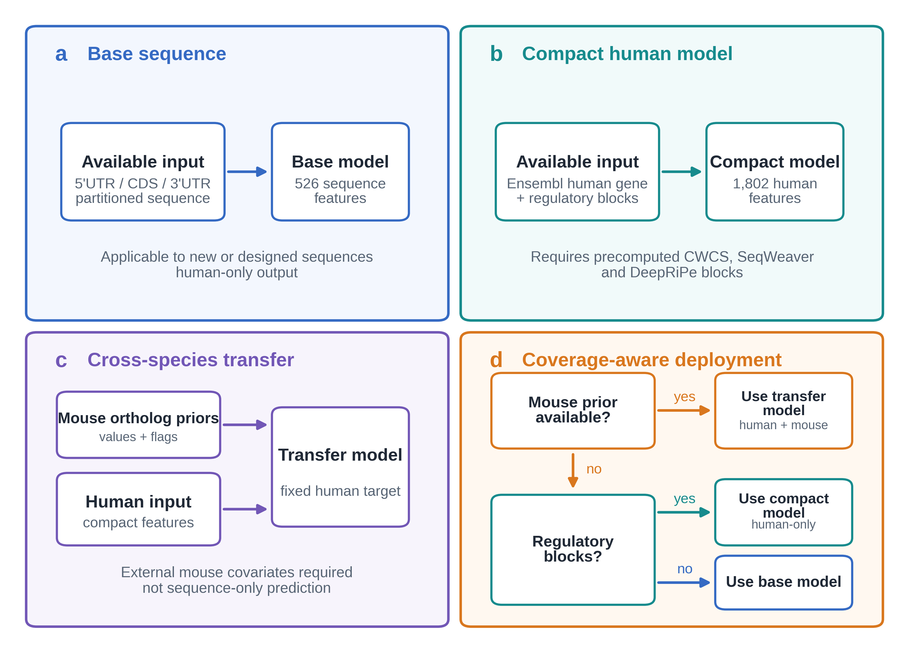
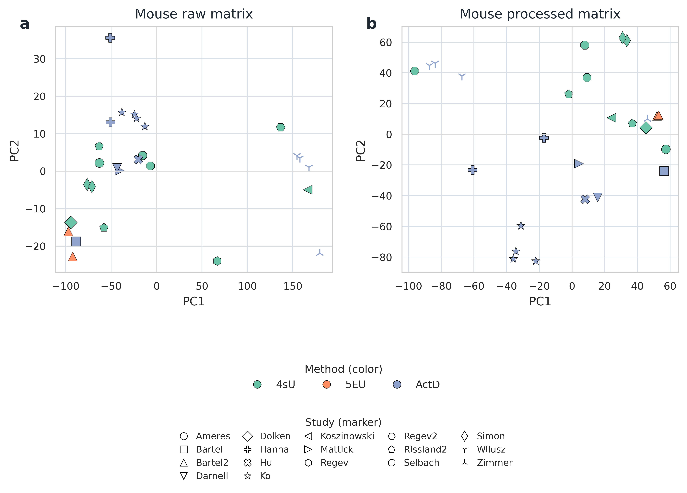
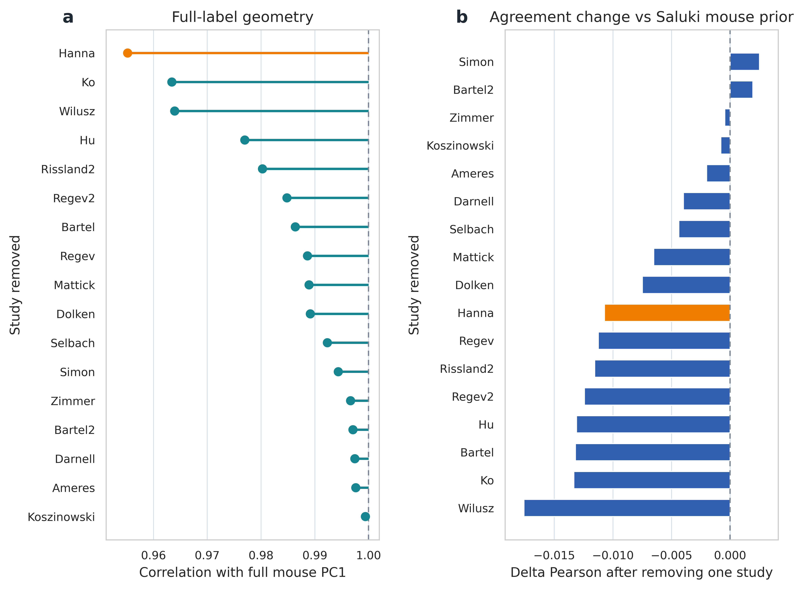
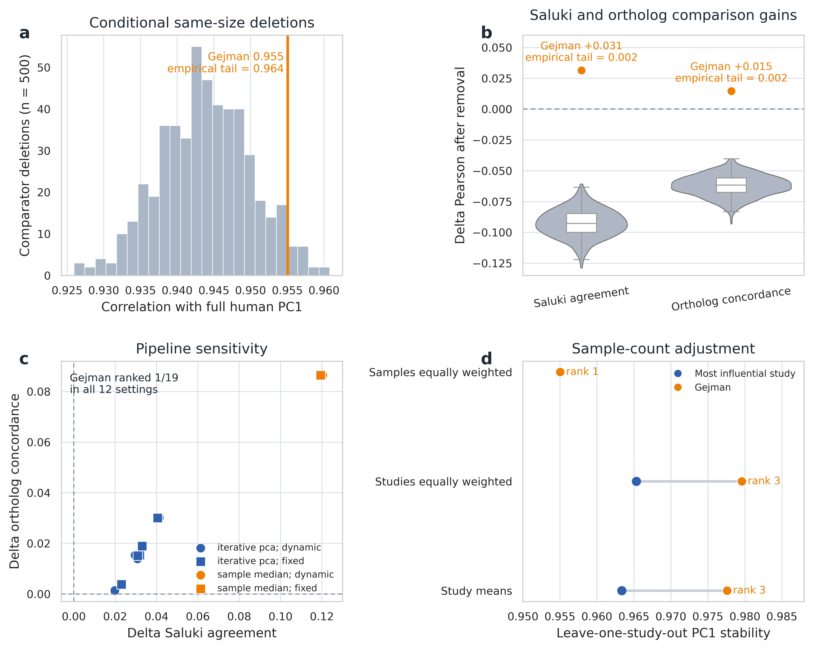

# 补充材料：面向哺乳动物 mRNA 半衰期预测的 study-aware 标签审计、跨物种迁移与同源基因目标收缩

**期刊：** *Bulletin of Mathematical Biology*  
**论文题名：** Study-aware label auditing, cross-species transfer, and ortholog-informed target shrinkage for mammalian mRNA half-life prediction  
**作者：** Wenzhuo Wang，Ying Shao  
**单位：** 大连海事大学理学院，辽宁大连 116026  
**通讯作者：** Ying Shao；邮箱：yshao@dlmu.edu.cn
**ORCID：** Ying Shao：https://orcid.org/0000-0002-4056-5757

## S1. 补充说明

本补充材料围绕主文的三项主结论展开。第一，study-aware label audit 用不依赖 Saluki 标签的 PC1 stability 筛查高影响 study，区分样本数杠杆与方向性比较增益，再用 Saluki agreement 与 ortholog concordance 评估改变方向。第二，在 Saluki human PC1 固定不变时，human-only baseline 与 cross-species transfer setting 分开评估，并由 permutation、paired bootstrap、residual decomposition 和 multi-seed 检查支撑。第三，0.10 同源基因信息目标收缩构建 human-dominant mammalian stability target，并由标签距离、study-noise scale、cross-target evaluation 和 prior ablation 共同界定。该目标是主文的核心标签构建结果，但不参与固定 Saluki human PC1 的排行榜。

与主文相比，补充材料的功能不是重复最高分，而是保留支撑结论所需的方法细节，包括 sample-level PCA 定义、完整 study-influence 结果路径、同样本量删除与预处理敏感性、prior 置换与 residual controls、ortholog 标签距离、训练集合边界、10-fold split-sensitivity checks 以及实现细节说明(Agarwal and Kelley 2022; Chen and Guestrin 2016; Pedregosa et al. 2011)。

## S2. 数据提取、预处理与 ortholog 定义

本节只补充主文 3.1 未展开的字段、参数和定义口径。源数据仍来自 Saluki 论文公开 supplement 中的 `MOESM2` 与 `MOESM3` 表格(Agarwal and Kelley 2022)。其中，`MOESM2` 是 human 与 mouse 的 transformed mRNA half-life gene × sample 矩阵，前两列为 Ensembl gene ID 和 gene name，后续列为不同 study、实验方法、细胞类型和重复样本的 transformed values；这是本文标签重建与留一研究影响分析的主输入。`MOESM3` 是 Saluki 发布的进一步处理矩阵，第三列为 `half-life (PC1)` summary label，后续列为 processed sample values。本文将 human 侧发布标签记为 Saluki human PC1；将 mouse 侧发布 PC1 经 one-to-one ortholog 映射到 human genes 后作为外部小鼠协变量时，记为 Saluki mouse PC1。代码字段 `mouse_pc1` 则专指我们由 `MOESM2` 本地重建的 mouse prior。`MOESM3` 的 human 工作表说明 Saluki human PC1 基于剔除 `Gejman` 后的数据集，mouse 工作表基于全部 mouse 数据集，因此它在本文中主要充当参照与控制，而不是替代主线重建流程的训练标签来源。由于 `MOESM2` 已经是 transformed values，本研究中的再分析不再重复执行 log 变换，而是从 sample-wise z-score 开始，再执行 iterative PCA 缺失值插补和 quantile normalization(Tipping and Bishop 1999; Troyanskaya et al. 2001; Bolstad et al. 2003)。

`compact_all` 使用的预计算 sequence/regulatory feature blocks 来自配套公开 Saluki 数据集（DOI：[10.5281/zenodo.6326409](https://doi.org/10.5281/zenodo.6326409)）。

Ortholog 映射来自 Ensembl Compara release 115 的 mouse-human homology 表(Dyer et al. 2025)。我们只保留 `homology_type = ortholog_one2one` 且 `homology_species = homo_sapiens` 的记录；orthology 的解释沿用既有 evolutionary-genomics 定义(Gabaldon and Koonin 2013)。High-confidence ortholog 也不是本文重新设阈值得到的子集，而是直接采用 Ensembl 二元字段 `is_high_confidence`。按照 Ensembl orthology QC 文档，该发布标记在可用时根据序列一致性及 gene-order conservation 或 whole-genome alignment 阈值赋值，否则使用系统树合规性作为后备判据。本文不重建上游 QC，仅用 `is_high_confidence == 1` 定义更严格的敏感性子集。

主文已报告本地重建标签与 Saluki 标签的总体一致性；这里仅记录该流程对 baseline consensus label 的复现是可信的：human 全量重建 PC1 与 Saluki human PC1 的 Pearson 为 0.948，mouse 为 0.958。具体参数口径见补充表 S1，模型输入边界见补充表 S2。

### 补充表 S1. 标签重建和留一研究影响分析的复现参数

| 步骤 | 参数/口径 | 输出 | 说明 |
|:--|:--|:--|:--|
| 输入矩阵 | `MOESM2` transformed human/mouse half-life matrix | species-specific gene × sample matrix | 不重复 log transform；从 transformed values 开始 |
| 元信息整理 | `study`、`method`、`cell type`、`replicate`、`species` | standardized sample metadata | 样本名解析后手工核对，用于 study-level leave-one-out |
| Coverage filter | 主线重建 `min_observed_per_gene=3` | retained genes | 用于可复现的全量标签审计和留一研究影响分析 |
| Saluki-like coverage | human `min_observed_per_gene=10`；mouse `min_observed_per_gene=5` | 本地重建的、采用 Saluki-like coverage 口径的 human/mouse labels | 用于 0.10 同源基因信息目标收缩 |
| Sample standardization | sample-wise z-score | standardized matrix | 降低不同实验尺度差异 |
| Missing-value handling | iterative PCA imputation；最多 30 iterations；tolerance `1e-6` | complete matrix | 避免简单均值填补扭曲 gene-level covariance |
| Distribution alignment | quantile normalization | processed matrix | 降低样本分布差异对 PC1 的影响 |
| Consensus extraction | PCA on gene × sample matrix；PC1 sign aligned to gene-wise mean | reconstructed PC1 label | human full vs Saluki human PC1 Pearson=0.948；mouse=0.958 |
| Study influence | leave-one-study-out 后完整重跑上述流程 | PC1 stability screen 与 Saluki-label agreement validation | 不依赖 Saluki 标签的 stability 负责筛查；Saluki agreement 负责参照验证；下游模型分数不参与排序 |

### 补充表 S2. 建模输入、适用对象和不可越界的解释

| 模型层级 | 必需输入 | 可用于新序列？ | 主要输出 | 不应越界的表述 |
|:--|:--|:--|:--|:--|
| Base sequence model | 5′UTR、CDS、3′UTR 分区序列 | 可以 | base sequence human-only prediction | 不能声称达到 `compact_all` 或 prior-enhanced 最高性能 |
| Compact human-only model | Saluki datapack 中的 Ensembl `gene_id` + base features + CWCS/SeqWeaver/DeepRiPe 预计算 blocks | 仅在重新生成 regulatory blocks 后可以 | pure human sequence/regulatory benchmark | 主文应把它写成透明 human-only 基线，而不是 sequence-only 胜出声明 |
| Global prior-enhanced model | `compact_all` + 两个 mouse prior 数值 + 可用性/高置信 0/1 指示列 | 需要可映射 mouse ortholog prior | 使用独立于 human target 构建的 mouse-side covariates 进行 cross-species transfer | 不能写成 sequence-only 或 raw-sequence end-to-end |
| Coverage-aware fallback | prior coverage status + human-only prediction | 适用于部署分层 | 有 prior 时用 prior-enhanced；无 prior 时退回 human-only | 不能对 missing-prior genes 外推 prior-enhanced 结论 |
| 0.10 同源基因信息目标收缩 | human no-Gejman PC1 + mapped mouse PC1 + `λ` | 不是单独的新序列预测器 | human-dominant mammalian stability target | 不能写成新的直接 human half-life ground truth，也不能与固定目标结果混排 |



**补充图 S1** 不同输入条件下的预测使用边界。a，仅有 5′UTR/CDS/3′UTR 分区序列时，只能使用 base sequence human-only 模型。b，已有 Ensembl human gene 且能合并预计算 regulatory blocks 时，可使用 compact sequence/regulatory 模型。c，若进一步存在可映射 mouse ortholog prior，可使用 prior-enhanced 模型；这些 mouse-side covariates 独立于 human target 构建，因此该结果属于 cross-species transfer setting。d，实际部署时应按 prior 覆盖情况选择模型层级；没有 mouse prior 的基因应退回 compact human-only 或 base sequence 层级。

## S3. 样本层面 PCA 诊断

样本 PCA 是留一研究影响分析之前最直观的可视化诊断。正文图 3 已保留 human raw/processed PCA 作为主证据，这里不再重复放置相同图件，而是补充算法口径与 mouse 侧结果。human 原始矩阵的 sample PCA 显示，样本主要按 study 与 method 聚类，而不是按 cell type 聚类，这与原始论文的核心观察一致(Agarwal and Kelley 2022)。预处理改变了 PC 几何结构，但仍保留 study-of-origin 结构。Mouse 视图也保留该结构。由于 human 和 mouse 面板的 PCA 轴分别拟合且数值尺度不同，本文不比较两物种的绝对离散程度。

这里的 sample-level PCA 只用于可视化诊断，不用于构建监督标签，也不参与下游模型训练。Raw view 与 processed view 的差别在于：raw view 尽量保留 `MOESM2` transformed matrix 的原始尺度，只为了解决 PCA 不能处理缺失值的问题而填补 missing entries；processed view 则使用与标签重建相同的预处理流程，用于观察标准化和分布对齐之后 study/method structure 是否仍然存在。低秩 PCA 插补不是利用 Saluki human PC1 或任何下游预测标签监督完成的，而是只在 gene × sample 矩阵内部利用低秩结构重建缺失位置。

具体插补算法如下。设输入矩阵为 $X$，行为 genes、列为 samples，并以 $\mathcal{M}$ 表示原始缺失位置集合；首先保留至少有 3 个 observed samples 的基因。第一步，用每个 sample 列的均值初始化该列缺失值；如果某一列全缺失，则初始化为 0（实际数据中未出现这种情况）。第二步，在当前填补矩阵上执行 `sklearn.decomposition.PCA(svd_solver="full", random_state=0)`，得到 rank-$k$ 低秩表示并用 `inverse_transform` 重构矩阵。第三步，只把 $\mathcal{M}$ 中的值替换为低秩重构值，原始 observed entries 在整个迭代过程中保持不变。第 $t$ 轮的收敛量定义为

```equation
number: S1
\delta_t = \max_{(i,j)\in\mathcal{M}} \left|X_{ij}^{(t)} - X_{ij}^{(t-1)}\right|
```

若 $\delta_t<\mathrm{tol}$，说明相邻两轮对缺失值的估计已经几乎不再改变，算法提前停止；否则继续迭代直到最大迭代次数。Raw view 使用 $k=5$、`max_iter=10`、`tol=1e-5`；processed view 使用标签重建默认设置，即 $k=\min\{5,\min(n_{\mathrm{genes}},n_{\mathrm{samples}})-1\}$、`max_iter=30`、`tol=1e-6`。完成插补后，将 gene × sample 矩阵转置为 sample × gene 矩阵，再计算前两个 sample PCs。

复现脚本如下：

```bash
bash scripts/run_sample_pca_imputation_reproducibility.sh --species both
```

默认输出目录为 `results/sample_pca_imputation_reproducibility/`。其中每个 species 子目录包含 `raw_low_rank_imputed_matrix.tsv`、`processed_matrix.tsv`、`sample_pca_raw.tsv`、`sample_pca_processed.tsv`、`sample_pca_raw_vs_processed.png` 和 `imputation_and_pca_parameters.json`。参数 JSON 记录输入矩阵、coverage filter、raw/processed 插补参数、sample PCA 方向和“未使用任何标签或模型信息”的边界说明。

### 补充表 S3. Sample-level PCA 诊断中的 raw 与 processed 矩阵口径

| PCA 视图 | 输入矩阵 | 缺失值处理 | 额外预处理 | PCA 计算方式 | 用途与边界 |
|:--|:--|:--|:--|:--|:--|
| Raw transformed view | `MOESM2` transformed gene × sample matrix after `min_observed_per_gene=3` coverage filter | 仅为可视化填补缺失值；iterative low-rank PCA imputation，`n_components=5`、`max_iter=10`、`tol=1e-5` | 不执行 sample-wise z-score，不执行 quantile normalization，不提取 PC1 标签 | 将填补后的矩阵转置为 sample × gene 后计算前两个 PCs | 展示 transformed matrix 中的 study/method 结构；不作为监督标签或模型输入 |
| Processed view | 同一 coverage-filtered `MOESM2` matrix | 使用标签重建流程中的 iterative PCA imputation；默认 `max_iter=30`、`tol=1e-6` | `apply_log=False`；sample-wise z-score 与 quantile normalization | 将 processed gene × sample matrix 转置为 sample × gene 后计算前两个 PCs | 评估标准化、插补和分布对齐后是否仍保留 study/method 结构；用于决定是否需要 leave-one-study-out 审计 |



**补充图 S2** Mouse raw 与 processed sample-level PCA。a，raw transformed matrix，仅为可视化对缺失值插补。b，经过 sample-wise standardization、iterative PCA imputation 和 quantile normalization 的 processed matrix。每个点代表一个 mouse half-life 样本；颜色表示实验方法，点形表示 study。预处理后仍保留 study-of-origin 结构；由于物种特异 PCA 轴和尺度分别拟合，不与正文图 3 比较绝对 PC 离散程度。

## S4. 留一研究影响的补充排序与结果路径

正文图 4 展示的是 sample-weighted human leave-one-study-out 主分析，因此补充材料不重复该图，只保留 mouse 全排序。完整 human 与 mouse 数值分别保存在 `results/study_influence/human/study_influence.tsv` 和 `results/study_influence/mouse/study_influence.tsv`。在主分析中，`PC1 stability` 不使用 Saluki PC1，并将 `Gejman` 排为第一；`Saluki-PC1 agreement gain` 随后量化对已发布处理选择的恢复，ortholog concordance 再提供跨物种比较。同样本量、固定基因宇宙和预处理敏感性见 S5。任何下游 human-only、cross-species transfer 或 target-shrinkage 模型分数都不参与该判断。Mouse 中，移除 `Hanna` 虽会显著改变 full-label geometry，却不会提高与 Saluki mouse PC1 的一致性，因此不作与 human 相同的解释。

这种 human/mouse 非对称性表明，几何 influence 高不自动等于应删除。Human 主分析的几何排序受样本数影响，但同样本量随机删除不能重现 Saluki agreement 和 ortholog concordance 的正向改善。因此，本文将结果解释为叠加在样本数杠杆上的方向性 study effect，而不是声称该 study 在所有生物学分析中都无效。Mouse 侧缺少同样的多证据一致性，因此保留原始 compendium 结构。



**补充图 S3** Mouse leave-one-study-out full ranking。a，圆点表示每个 leave-one-study-out PC1 与 full mouse PC1 的相关系数；数值越低，说明该 study 对共识标签几何影响越大，虚线表示 `r = 1`。b，条形表示移除每个 study 后与 Saluki mouse PC1 的一致性变化。`Hanna` 的 stability 最低，但 agreement change 为负，因此 mouse 未出现正文图 4 中 human `Gejman` 的多证据一致性。

## S5. Human study influence 的样本数、基因宇宙与预处理敏感性

主分析的 leave-one-study-out estimator 对每个样本赋予相同权重。由于 `Gejman` 占 54 个 human 样本中的 15 个，删除该 study 比删除多数其他 study 移除更多样本。为量化这一影响，我们从其余 39 个非 Gejman 样本中无放回随机抽取 15 个样本，完整重跑标签重建流程，共重复 500 次。Gejman 的观测 stability 为 0.955；随机删除零分布中位数为 0.944，95% 区间为 0.932-0.956，单侧经验 `p=0.964`。因此，仅凭 PC1 几何变化不能把 Gejman 解释为经样本量校正后的异常 study。

两条方向性比较指标呈现不同结果。移除 Gejman 后，Saluki agreement 增益为 +0.0314，而随机删除零分布中位数为 -0.0926（95% 区间 -0.1151 至 -0.0713）；ortholog concordance 增益为 +0.0147，而随机删除零分布中位数为 -0.0616（95% 区间 -0.0800 至 -0.0476）。500 次随机删除均未达到这两个观测增益，对应单侧经验 `p=0.002`。因此，证据不支持“样本量校正后的几何异常”，但支持同样本量删除无法产生的 study-specific 改善方向。

基因宇宙和预处理敏感性提供了互补证据。在 dynamic/fixed coverage、coverage threshold、PCA 插补 rank 以及 iterative-PCA/sample-median 插补的 12 种设置中，`Gejman` 均排第一，且两条比较增益均为正。相反，当以 $1/\sqrt{n_s}$ 对 study 样本进行 PCA 加权，或先将每个 study 压缩为一个均值 profile 时，`Gejman` 的几何影响排序均由第一降为第三。这些结果明确了可稳健支持的结论：主分析排序对常见预处理选择稳定，但对 study 权重敏感；Saluki 处理参照与 ortholog 比较增益的方向保持稳定。



**补充图 S4** Human study influence 的样本量与流程敏感性。a，删除 15 个非 Gejman 样本并完整重跑流程 500 次所得 PC1 stability 零分布；数值越低表示几何变化越大，Gejman 观测值在下尾并不极端。b，Saluki agreement 与 ortholog concordance 增益的零分布；橙色点为 Gejman 观测增益，均超过 500 次随机删除结果。c，在 12 种 dynamic/fixed gene universe、coverage、rank 与 imputation 设置下，两条比较增益始终为正，且 `Gejman` 在 primary-style 设置中均排第一。d，采用两种 study-balanced estimator 后，几何排序均由第一变为第三。Panel source data 保存在 `manuscript/bmb_submission/figures/data/FigS04_panel_data.tsv`。

### 补充表 S4. Gejman study-influence 结果的样本数与流程敏感性

| 分析 | Gejman 结果 | 对照 | 经验 p 值或排序 | 解释 |
|:--|:--|:--|:--|:--|
| Primary sample-weighted geometry | stability 0.9550 | 同样本量零分布中位数 0.9438；95% 区间 0.9319-0.9561 | 单侧 `p=0.964` | 匹配删除样本数后，几何变化不极端 |
| Saluki agreement gain | +0.0314 | 零分布中位数 -0.0926；95% 区间 -0.1151 至 -0.0713 | 单侧 `p=0.002` | 随机删除不能重现方向性增益 |
| Ortholog concordance gain | +0.0147 | 零分布中位数 -0.0616；95% 区间 -0.0800 至 -0.0476 | 单侧 `p=0.002` | 随机删除不能重现跨物种增益 |
| Fixed gene universe，主预处理 | stability 0.9527；Saluki gain +0.0319；ortholog gain +0.0153 | 14,244 个 fixed-universe genes | rank 1/19 | Dynamic coverage 不产生方向性结果 |
| Preprocessing sensitivity | 12 种设置中两条增益均为正 | minimum observed samples 3/5/10；PCA rank 3/5/10；iterative PCA 或 sample median | 所有设置 rank 1/19 | 主排序对预处理选择稳定 |
| Equal-study PCA weighting | stability 0.9796 | 最低为 `Dieterich`，stability 0.9653 | rank 3/19 | 样本数影响主分析几何排序 |
| Study-mean collapse | stability 0.9776 | 最低为 `Dieterich`，stability 0.9634 | rank 3/19 | 独立 study balancing 得出相同限定 |

## S6. 置换对照的补充解释

主文报告了最核心的 permutation 结果：真实双 prior global 模型的 Pearson 为 0.829，而 prior 被打乱后回到 0.745。这里最关键的不是“分数掉了多少”，而是**到底什么被打乱了**。第一，这个打乱是 fold-aware 的，因此不会把训练折的 prior 顺序错误地泄露回测试折。第二，打乱只发生在原本有 prior 数值的基因之间；哪些基因没有 prior、对应的可用性 0/1 指示列、以及 high-confidence 0/1 指示列都保持不变，因此“缺哪些值”这一结构本身并没有被破坏。第三，真实 prior 相对 shuffled prior 的 Pearson 提升约为 +0.085，R2 提升约为 +0.135，说明真正起作用的是 prior 数值与基因身份之间的对应关系，而不是“额外多了几列”。

在三组独立随机划分的 10-fold OOF 评估中，真实双 prior global 模型为 Pearson 0.830±0.001，shuffled-prior control 为 0.748±0.001，human-only `compact_all` 也为 0.748±0.001；`coverage-aware fallback` 为 0.832±0.001。这里的 `±` 是 across-seed SD。三组 OOF predictions 合并后的 paired bootstrap 显示，real prior 相对 shuffled prior 的增益为 0.0794（95% CI 0.0735-0.0855），相对 human-only 的增益为 0.0799（95% CI 0.0740-0.0862）。因此，split sensitivity 与 gene-level uncertainty 都支持同一结论。

## S7. 残差分解的补充解释

残差分解的目的，是把 prior 信号和 human feature 信号分解开来看。直接相关分析已经表明，`mouse_pc1` 与 Saluki human PC1 的相关接近 0.78，因此 prior 本身就是强信号。为了避免把“prior 很强”误解成“prior-enhanced model 只是复制 prior”，我们把预测显式拆成两阶段 out-of-fold decomposition，而不是把 prior 和 human features 一起丢进同一个黑箱后再回头解释。

具体实现如下。第一，只保留同时具有 `mouse_pc1` 与 Saluki mouse PC1 的 `both_priors_available` genes（N=11,107），因为 prior-only 分解需要每个 gene 同时具备两类 mouse-side prior。第二，在每个 5-fold outer split 中，RidgeCV 仅使用 outer-training genes 的两列 prior 拟合。该模型对 outer-training genes 的拟合值用于定义 residual target，即 `Saluki human PC1 - fitted prior value`；对 held-out genes 则单独生成 RidgeCV prediction。第三，XGBoost/CUDA 只用 outer-training 的 human `compact_all` features 与 residuals 训练。第四，held-out genes 的最终预测为 `held-out prior prediction + held-out compact residual prediction`。Held-out human target 不进入任一训练阶段，因此整个分解仍为 OOF。

复现命令如下：

```bash
source scripts/activate_env.sh
python -m mrna_half_life_paper.prior_residual_analysis
```

### 补充表 S5. Prior residual analysis 的两阶段 OOF 分解

| 模型 | 基因数 | Prior 特征数 | Human 特征数 | Pearson r | Spearman ρ | R² | 相对 prior 的 ΔR² | 剩余方差解释比例 |
|:--|--:|--:|--:|--:|--:|--:|--:|--:|
| 仅 prior（线性） | 11,107 | 2 | 0 | 0.792 | 0.782 | 0.627 | 0.000 | 0.00% |
| 仅 human compact | 11,107 | 0 | 1,802 | 0.739 | 0.731 | 0.544 | -0.084 | NA |
| Prior 加 human residual | 11,107 | 2 | 1,802 | 0.826 | 0.818 | 0.675 | 0.048 | 12.79% |

剩余方差解释比例定义为

```equation
number: S2
R_{\mathrm{remaining}}^2 = \frac{R_{\mathrm{final}}^2 - R_{\mathrm{prior}}^2}{1 - R_{\mathrm{prior}}^2}
```

补充式（S2）表明，在 prior-only model 已经解释的部分之外，human `compact_all` features 还能解释约 12.8% 的剩余方差。因此，prior-enhanced model 更准确地说是 strong mouse prior 加 human correction，而不是 prior 单独就足够。

这组结果也明确了方法边界：held-out human genes 的监督标签不进入输入，所有预测均在 out-of-fold 框架下生成；但 mouse priors 本身是与目标相关的外部 gene-level 信息，因此相应结果属于 cross-species transfer，而不是 sequence-only setting。完整 transfer model 也不是简单复制 prior，而是在其基础上继续学习 human-specific 结构。

## S8. 0.10 同源基因信息目标收缩的补充解释与 cross-target 检验

该分析改变的是**监督目标**，global prior benchmark 改变的是**输入信息**，二者必须分开解释。0.10 同源基因信息收缩目标定义为 90% human no-Gejman z-scored label 加 10% mapped reconstructed-mouse z-scored label；没有 ortholog signal 的 human genes 保留 human label。它不是新的直接实验 half-life，而是从 multi-study compendium 中得到的 human-dominant mammalian stability score。

几何证据支持 human dominance。在 12,307 个 model-eligible genes 上，收缩 target 与 human no-Gejman PC1 的 Pearson 为 0.9982（95% bootstrap CI 0.9981-0.9983）。在单独定义的 10,768-pair mapped set 中，收缩前 human no-Gejman PC1 与本地重建 mouse PC1 的 Pearson 为 0.789，RMSE 为 0.663，MAE 为 0.512；收缩后 target 与 human no-Gejman PC1 的 Pearson 为 0.9979（RMSE=0.065；MAE=0.050），与 mouse PC1 的 Pearson 为 0.827。其 label shift 也远小于 ordinary study-to-study differences（S9 和补充表 S13）。

$\lambda$ 敏感性结果进一步说明为何主分析采用 0.10。相同 5-fold、三组 random seeds 的控制中，$\lambda=0.05$、0.10 和 0.30 对应的 target-versus-Saluki Pearson 分别为 0.988、0.987 和 0.975，target-versus-mapped-mouse Pearson 分别为 0.809、0.827 和 0.895，prior-enhanced target prediction 分别为 0.842、0.854 和 0.896。较大的 $\lambda=0.30$ 得分最高，但目标也更明显地向 mouse 方向移动；0.10 因此是限制跨物种贡献的保守操作点，而不是使 CV 分数最大的权重。完整结果见 `results/ortholog_regularized_label_multiseed/summary_by_label.tsv`。

Cross-target evaluation 进一步检查“改 target 是否损害原 human 标签”。在同一 12,307-gene universe、同一 1802 human-only features、同一 10-fold × 3 seeds 和相同模型参数下，以 human no-Gejman PC1 训练后在该目标上评估得到 r=0.7476±0.0010；改用 shrinkage target 训练、仍在原 human target 上评估得到 r=0.7480±0.0010。三组 OOF prediction 合并后的 paired difference 为 +0.0003（95% CI -0.0006 至 0.0012）。该区间跨过 0，因此未检测到下降；但由于没有预先设定等效界值，不能据此宣称形式等效。

使用显式 mouse priors 预测 shrinkage target 时可达到 0.855±0.001，而 fixed Saluki human PC1 的同宇宙 prior-enhanced baseline 为 0.839±0.001。这一差异反映 shrinkage target 与 conserved ortholog covariates 更一致，不能解释成 pure human sequence-only 能力提高。移除构造目标时使用的本地重建 `mouse PC1`、仅保留 Saluki mouse PC1 及指示列后仍为 0.852±0.001；只保留 missingness/high-confidence indicators 则回到 0.753±0.001。$\lambda=0.10$ 因而是有边界的核心标签构建结果，不是固定 human target 的替代排行榜。

## S9. $\lambda=0.10$ 标签偏移与 study-level 噪音的尺度比较

主文图 8c 和表 4 已给出“正则化引入的标签偏移远小于 study-level noise”的对应证据；本节只记录这一比较的精确计算口径。这里需要先区分两个概念：`human no-Gejman PC1` 是多个 study 综合后的 consensus label，而 `study mean label` 是把单个 study 内样本取均值后得到的 single-study proxy。后者天然带有更强的 study-specific measurement noise，因此其两两相关不应被误读为最终 consensus label 的稳定性。

具体计算分三步。第一，在 one-to-one ortholog human gene universe 上，对 MOESM2 human 样本执行 sample-wise z-score，避免不同样本量纲直接混合。第二，对每个 study 内样本取均值，得到 study mean label；随后每个 study mean label 自身再做 z-score，使其与 $\lambda=0.10$ target、human no-Gejman PC1 处在同一标准化标签尺度。第三，只进行方向对齐，即若某个 study label 与参考标签的 Pearson 为负，则乘以 $-1$；不执行线性拟合、不重标定斜率，也不使用下游模型预测值。18 个 no-Gejman studies 共形成 $\binom{18}{2}=153$ 个不重复 study pairs。主分析中方向对齐参考为 human no-Gejman PC1；直接改为对齐 $\lambda=0.10$ target 后，这些配对的中位 Pearson、RMSE 和 MAE 不变，因为 $\lambda=0.10$ target 与 human no-Gejman PC1 本身几乎同向（Pearson=0.9979）。

关键结果见补充表 S13。$\lambda=0.10$ target 与原 human no-Gejman PC1 几乎完全一致：Pearson=0.9979，RMSE=0.0646，MAE=0.0501。相比之下，normal studies 的 study mean labels 两两比较只有中位 Pearson=0.5303，中位 RMSE=0.9540，中位 MAE=0.7203；这个中位 Pearson 偏低，主要反映两个 single-study proxies 的独立噪音衰减，而不是方向对齐错误。更直接的量级比较来自误差指标：normal-study pair 的中位 RMSE 和 MAE 分别约为 $\lambda=0.10$ 标签 shift 的 14.8 倍和 14.4 倍。即使只保留样本数不少于 2 的 study，或先执行完整 Saluki-like preprocessing 再按 study 取均值，这个量级关系仍然成立。因而，更稳妥的说法不是“收缩位移可以忽略不计”，而是：$\lambda=0.10$ 代表一个相对于实验噪音尺度很小的 shrinkage。

## S10. 预测输入、调控特征来源与使用边界

本框架不能简单表述为“给一条裸序列即可得到完整预测”。当前模型的输入分为三个层级，每个层级对应不同的可用性和性能边界。第一层是 base sequence prediction：用户需要提供明确分区的 5′UTR、CDS 和 3′UTR 序列，模型据此计算区域长度、GC、codon frequency、区域 3-mer 和 3′UTR 4-mer 等基础特征。这一层最适合全新人工序列或没有外部注释的新 transcript，但它只对应 base sequence 或 human-only 预测，不包含完整 regulatory blocks，也不应宣称达到 prior-enhanced 最高性能。

第二层是 compact sequence/regulatory prediction，适用于 Saluki feature datapack 中已包含的 Ensembl human genes。这里的 CWCS、SeqWeaver 和 DeepRiPe 调控特征不是从裸序列即时计算出来的，而是来自预计算表格：`CWCS.txt.gz`、`SeqWeaver_predictions/*_avg.txt.gz` 和 `DeepRiPe_predictions_v83/*_avg.txt.gz`（Agarwal et al. 2015；Park et al. 2021；Ghanbari and Ohler 2020）。对已在这些表中的 genes，可直接合并调控块与基础序列特征，形成 `compact_all`。若 gene 不在 datapack 中，仅有 Ensembl ID 并不足够；新的人工序列则需重新运行对应的 miRNA/RBP/regulatory prediction pipelines。

第三层是 cross-species prior-enhanced prediction，适用于已有 human gene 且存在可映射 mouse ortholog prior 的场景。输入包括两个 prior 数值（`mouse_pc1` 和 Saluki mouse PC1）及对应的 availability/high-confidence 指示列。这些 mouse-side covariates 独立于 human target 构建；与 0.10 同源基因信息目标收缩不同，这一层并**不改变监督目标**，预测目标仍是 Saluki human PC1。没有任何 mouse prior 时，应采用 coverage-aware fallback，退回 human-only compact model。

prior-missingness 分层分析支持这一使用边界。在全部 12,916 个基因上，real both-prior 模型 Pearson 为 0.8300±0.0007；coverage-aware fallback 达到 0.8318±0.0008。两种 mouse prior 都可用的 11,107 个基因上，real both-prior 模型 Pearson 为 0.8433±0.0010，而 human-only 为 0.7456±0.0014；相反，在两种 mouse prior 都缺失的 1,347 个基因上，real both-prior 模型 Pearson 为 0.7555±0.0013，低于 human-only 的 0.7695±0.0006。因此，本研究的实际应用口径应写为：模型可支持 feature-based gene-level prediction；最高性能依赖 regulatory feature blocks 和 mouse ortholog priors；对于新序列，若只提供 5′UTR/CDS/3′UTR，则应限定为 base sequence human-only prediction。

### 补充表 S6. 完整分析宇宙账本与集合关系

当前稿件包含 12 个固定定义的核心集合，分属三条分析支路；另有 8 个只用于 coverage accounting 或 sensitivity analysis 的派生集合，因此机器可读账本共有 20 个固定行。它们不是同一母集合连续筛减的结果。Gene sets 用于标签构建或建模，ortholog-pair sets 用于配对的跨物种比较。Dynamic leave-one-study-out 另形成按每次移除重新求交的集合族，而非单一固定 universe：对 `Gejman` 而言，primary dynamic calculation 的 PC1 stability 使用 15,788 个 genes，Saluki agreement 使用 13,265 个 genes，ortholog comparison 使用 12,592 pairs。

| ID | 支路与集合 | N 与单位 | 纳入规则 | 主要用途 |
| --- | --- | ---: | --- | --- |
| L1 | Human full reconstruction | 16,444 genes | `MOESM2` human genes 在 54 个样本中至少 3 个有观测 | Full-human PC1、sample PCA 和 human LOO 的起始标签 |
| L2 | Mouse full reconstruction | 16,951 genes | `MOESM2` mouse genes 在 27 个样本中至少 3 个有观测 | Mouse PC1、mouse PCA/LOO 和 reconstructed mouse prior 来源 |
| L3 | Human no-Gejman reconstruction | 15,788 genes | Human genes 在 39 个 non-Gejman 样本中至少 3 个有观测 | No-Gejman PC1 和 primary dynamic-coverage Gejman comparison |
| A1 | Fixed-LOO sensitivity universe | 14,244 genes | 在全数据及每次 human study 移除后均满足 3-sample coverage rule | 仅用于 fixed-universe LOO sensitivity |
| A2 | Fixed human-Saluki comparison | 13,265 genes | Human full PC1、human no-Gejman PC1 与 Saluki human PC1 的交集 | 固定基因 Saluki agreement 与 paired bootstrap |
| A3 | Human-mouse ortholog concordance | 12,592 ortholog pairs | 同时具有 L1、L3、reconstructed mouse PC1 的 Ensembl one-to-one pairs | 审计 Gejman 相关标签改变的跨物种方向 |
| P1 | Broad feature-target universe | 13,532 genes | Human sequence-feature table 与 Saluki human PC1 的交集 | Regulatory-block ablation 与 `MOESM3` 派生标签控制 |
| P2 | Global prediction universe | 12,916 genes | P1 中同时存在于 L1 和 L3 的 genes | 主线 fixed-target human-only、transfer、permutation 与 repeated-CV benchmark |
| P3 | Both-priors subset | 11,107 genes | P2 中同时具有 reconstructed mouse PC1 和 Saluki mouse PC1 的 genes | Prior-complete coverage analysis 与 two-stage residual decomposition |
| S1 | Shrinkage target-construction universe | 12,644 genes | Saluki-like 10-sample coverage rule 保留的 human no-Gejman genes | 构建 0.10 ortholog-informed target |
| S2 | Shrinkage prediction universe | 12,307 genes | S1 中同时具有 human compact features 和 Saluki human PC1 的 genes | Human-only/prior target prediction、ablation 与 cross-target evaluation |
| S3 | Shrinkage mapped-pair set | 10,768 ortholog pairs | S1 human genes 中具有 Ensembl one-to-one reconstructed-mouse-PC1 match 的 pairs | Human-mouse label distance、target geometry 与 study-noise comparison |
| D1 | High-confidence ortholog audit | 12,376 ortholog pairs | A3 中 `is_high_confidence = 1` 的 Ensembl pairs | Ortholog-confidence sensitivity |
| D2 | Fixed-target reconstructed-prior subset | 11,569 genes | P2 中具有 reconstructed mouse ortholog prior 的 genes | Prior coverage 与 all-ortholog subset sensitivity |
| D3 | Fixed-target high-confidence subset | 11,389 genes | P2 中具有 high-confidence reconstructed ortholog 的 genes | High-confidence subset sensitivity |
| D4 | Fixed-target top-regulatory-33 subset | 4,262 genes | P2 中 regulatory score 最高的三分之一 genes | 图 6d regulatory subset sensitivity |
| D5 | Only reconstructed mouse prior | 462 genes | D2 中不属于 P3 的 genes | Prior-availability accounting |
| D6 | Missing both mouse priors | 1,347 genes | P2 中不属于 D2 或 P3 的 genes | Coverage-aware fallback 与 deployment boundary |
| D7 | Shrinkage prediction-mapping overlap | 10,682 genes | S2 与 S3 的 human-gene 交集 | 集合核算；S2 与 S3 不互相完整包含 |
| D8 | High-confidence shrinkage pairs | 10,626 ortholog pairs | S3 中 `is_high_confidence = 1` 的 Ensembl pairs | 补充表 S12 的 label-distance sensitivity |

Fixed-target coverage groups 将 P2 完整划分为：11,107 个 genes 同时有两类 priors，462 个只有 reconstructed mouse prior，0 个只有 Saluki mouse prior，1,347 个两类均无。Target-shrinkage 支路中，S2 与 S3 共有 10,682 个 genes；其余 1,625 个 S2 genes 没有 reconstructed mouse mapping，因此保留 human label；另有 86 个 S3 genes 缺少完整 prediction inputs，未进入 S2。本文没有把这个 10,682-gene S2/S3 overlap 强制用于所有分析，因为这会令每项任务都以 mouse mapping 为纳入条件，并从 P2 删除 2,234 个 genes（17.3%）。本文改为在每个任务内部使用完全相同的 gene IDs 和 folds 进行匹配比较。

## S11. MOESM3 派生监督标签控制实验

`MOESM3` 控制实验回答的是一个非常具体的问题：既然 Saluki 原文已经给出了 processed matrix 和 `half-life (PC1)` summary label，那我们是否应该直接用 `MOESM3` 上重新派生的标签来替代 Saluki human PC1 作为主监督目标？补充表 S7 的答案是否定的。保留 human `MOESM3` 全部样本、包括 `Gejman` 时，派生标签对 Saluki human PC1 的恢复能力整体下降；去掉 `Gejman` 后，`as_is_pc1` 基本只是回到与 Saluki human PC1 等价的水平；只有 `no_gejman_rerun_pipeline_pc1` 在 human-only 下带来极小增益，幅度大约在 `+0.001` 量级。

这组结果的意义不在于制造一个新的主标签，而在于解释为什么主线不直接改成 `MOESM3` 派生标签。它说明 `MOESM3` 更适合作为 Saluki 处理口径的控制和诊断资源，而不是更好的主任务标签来源。

### 补充表 S7. `MOESM3` 派生监督标签的下游 benchmark

| 特征集 | 目标标签 | 基因数 | 标签与 Saluki human PC1 的 Pearson | 对训练标签的 Pearson | 对 Saluki human PC1 的 Pearson | 对 Saluki human PC1 的 R² |
|:--|:--|--:|--:|--:|--:|--:|
| Human compact | MOESM3 no-Gejman：完整流程重跑 | 13,532 | 1.000 | 0.730 | 0.730 | 0.533 |
| Human compact | Saluki human PC1 | 13,532 | 1.000 | 0.729 | 0.729 | 0.530 |
| Human compact | MOESM3 no-Gejman：原处理值 PC1 | 13,532 | 1.000 | 0.729 | 0.729 | 0.530 |
| Human compact | MOESM3 no-Gejman：仅 z-score | 13,532 | 1.000 | 0.729 | 0.729 | 0.530 |
| Human compact | MOESM3 全样本：仅 z-score | 13,532 | 0.963 | 0.707 | 0.722 | 0.520 |
| Human compact | MOESM3 全样本：完整流程重跑 | 13,532 | 0.963 | 0.707 | 0.721 | 0.519 |
| Human compact | MOESM3 全样本：原处理值 PC1 | 13,532 | 0.963 | 0.707 | 0.721 | 0.520 |
| Base sequence | MOESM3 no-Gejman：仅 z-score | 13,532 | 1.000 | 0.720 | 0.720 | 0.518 |
| Base sequence | Saluki human PC1 | 13,532 | 1.000 | 0.720 | 0.720 | 0.517 |
| Base sequence | MOESM3 no-Gejman：原处理值 PC1 | 13,532 | 1.000 | 0.720 | 0.720 | 0.517 |
| Base sequence | MOESM3 no-Gejman：完整流程重跑 | 13,532 | 1.000 | 0.718 | 0.718 | 0.516 |
| Base sequence | MOESM3 全样本：完整流程重跑 | 13,532 | 0.963 | 0.698 | 0.713 | 0.507 |
| Base sequence | MOESM3 全样本：仅 z-score | 13,532 | 0.963 | 0.697 | 0.713 | 0.506 |
| Base sequence | MOESM3 全样本：原处理值 PC1 | 13,532 | 0.963 | 0.696 | 0.712 | 0.507 |

表内采用便于阅读的显示名称；精确 setting 标识和完整精度数值保留在 `results/moesm3_saluki_label_benchmark/summary.tsv`。

## S12. MOESM3 派生监督标签在 mouse prior 设定下的针对性控制

更严格的检验是：如果允许加入 `mouse prior`，这些 `MOESM3` 派生标签会不会突然比直接训练 Saluki human PC1 更优？补充表 S8 表明，答案仍然是否定的。在 focused prior benchmark 中，Saluki human PC1（代码字段 `Saluki_human_PC1`）加 `compact_all_plus_both_mouse_priors_global` 的 Pearson 为 `0.815917`，而最好的替代标签 `moesm3_no_gejman_rerun_pipeline_pc1 + compact_all_plus_both_mouse_priors_global` 为 `0.815588`，仍然略低。

因此，这两组控制实验共同支持一个更稳的投稿说法：`MOESM3` 派生标签可以作为对 Saluki 标签流程的解释性控制，但即使在 cross-species transfer setting 下，它们也不足以替代 Saluki human PC1 作为主监督目标。

### 补充表 S8. `MOESM3` 派生监督标签在 prior 设定下的针对性 benchmark

| 监督标签 | 特征设定 | 基因数 | 有重建 prior | 有 Saluki prior | 标签-Saluki r | OOF r（训练目标） | OOF r（Saluki 目标） | OOF R²（Saluki 目标） |
|:--|:--|--:|--:|--:|--:|--:|--:|--:|
| Saluki human PC1 | Human compact 加两个 mouse priors | 13,532 | 11,569 | 11,423 | 1.000 | 0.816 | 0.816 | 0.666 |
| MOESM3 no-Gejman：完整流程重跑 | Human compact 加两个 mouse priors | 13,532 | 11,569 | 11,423 | 1.000 | 0.816 | 0.816 | 0.665 |
| MOESM3 no-Gejman：完整流程重跑 | Human compact 加重建 mouse prior | 13,532 | 11,569 | 11,423 | 1.000 | 0.814 | 0.814 | 0.662 |
| Saluki human PC1 | Human compact 加重建 mouse prior | 13,532 | 11,569 | 11,423 | 1.000 | 0.814 | 0.814 | 0.662 |
| Saluki human PC1 | Human compact 加 Saluki mouse prior | 13,532 | 11,569 | 11,423 | 1.000 | 0.812 | 0.812 | 0.659 |
| MOESM3 no-Gejman：完整流程重跑 | Human compact 加 Saluki mouse prior | 13,532 | 11,569 | 11,423 | 1.000 | 0.812 | 0.811 | 0.658 |
| MOESM3 no-Gejman：完整流程重跑 | 仅 human compact | 13,532 | 11,569 | 11,423 | 1.000 | 0.730 | 0.730 | 0.533 |
| Saluki human PC1 | 仅 human compact | 13,532 | 11,569 | 11,423 | 1.000 | 0.729 | 0.729 | 0.530 |

表内采用便于阅读的显示名称；精确 setting 标识和完整精度数值保留在 `results/moesm3_saluki_label_prior_benchmark_smoketest/summary.tsv`。

## S13. 10-fold 稳健性、弱同源正则化与不确定性补充表

补充表 S9-S15 汇总严格检查。S9 报告 global prior benchmark 的三组 10-fold 稳健性；S10 报告 0.10 同源基因信息收缩目标与固定 Saluki-PC1 baseline 的同宇宙比较；S11 报告 prior ablation；S12-S13 报告标签距离与 study-noise scale；S14 报告 human-only cross-target evaluation；S15 给出标签审计、ortholog concordance 和 prior gain 的 paired bootstrap CI。

### 补充表 S9. Global prior 的 10-fold 稳健性

| 设定 | Prior 模式 | 折数 | Seeds | 基因数 | Pearson r（均值 ± SD） | Spearman ρ（均值 ± SD） | R²（均值 ± SD） |
|:--|:--|--:|--:|--:|:--|:--|:--|
| Human compact 加两个 mouse priors | 真实 priors | 10 | 3 | 12,916 | 0.830 ± 0.001 | 0.824 ± 0.001 | 0.689 ± 0.001 |
| Human compact 加两个 mouse priors | 打乱 priors | 10 | 3 | 12,916 | 0.748 ± 0.001 | 0.741 ± 0.001 | 0.558 ± 0.001 |
| 仅 human compact | 无 prior | 10 | 3 | 12,916 | 0.748 ± 0.001 | 0.740 ± 0.001 | 0.558 ± 0.002 |
| Coverage-aware fallback | 按 prior 可用性选择模型 | 10 | 3 | 12,916 | 0.832 ± 0.001 | 0.826 ± 0.001 | 0.690 ± 0.001 |

### 补充表 S10. 三个随机种子下的 10-fold target benchmark

| 目标与 mouse comparator | λ | 基因数 | 目标-Saluki r | 目标-mouse r | 真实 prior OOF r | Human-only OOF r | 打乱 prior OOF r | 真实-打乱 Δr |
|:--|--:|--:|--:|--:|:--|:--|:--|:--|
| 0.10 收缩目标；重建 mouse PC1 | 0.10 | 12,307 | 0.987 | 0.827 | 0.855 ± 0.001 | 0.754 ± 0.001 | 0.753 ± 0.001 | 0.102 ± 0.001 |
| Saluki human PC1；Saluki mouse PC1 | 0 | 12,307 | 1.000 | 0.798 | 0.839 ± 0.001 | 0.754 ± 0.001 | 0.754 ± 0.001 | 0.085 ± 0.000 |

### 补充表 S11. 0.10 同源基因信息目标收缩的 10-fold prior-ablation benchmark

| 设定 | 特征数 | 折数 | Seeds | OOF r（训练目标） | OOF r（Saluki） | 相对 fixed-target prior 基线的 Δr |
|:--|--:|--:|--:|:--|:--|:--|
| human-only features | 1802 | 10 | 3 | 0.754 ± 0.001 | 0.753 ± 0.001 | -0.086 ± 0.001 |
| availability/confidence indicators only | 1806 | 10 | 3 | 0.753 ± 0.000 | 0.753 ± 0.001 | -0.086 ± 0.000 |
| Saluki mouse PC1 only | 1805 | 10 | 3 | 0.852 ± 0.001 | 0.835 ± 0.001 | 0.013 ± 0.001 |
| no direct reconstructed mouse PC1 value | 1807 | 10 | 3 | 0.852 ± 0.001 | 0.835 ± 0.001 | 0.013 ± 0.001 |
| reconstructed mouse PC1 only | 1805 | 10 | 3 | 0.854 ± 0.000 | 0.836 ± 0.000 | 0.015 ± 0.000 |
| both mouse priors | 1808 | 10 | 3 | 0.855 ± 0.001 | 0.837 ± 0.001 | 0.016 ± 0.001 |

### 补充表 S12. Human-mouse ortholog label distance

| 比较 | Ortholog 子集 | N | Pearson r | Spearman ρ | MSE | RMSE | MAE | 绝对误差中位数 | 绝对误差第 95 百分位数 |
|:--|:--|--:|--:|--:|--:|--:|--:|--:|--:|
| Human no-Gejman PC1 vs reconstructed mouse PC1 | 全部 one-to-one | 10,768 | 0.789 | 0.782 | 0.440 | 0.663 | 0.512 | 0.413 | 1.330 |
| Shrinkage target vs reconstructed mouse PC1 | 全部 one-to-one | 10,768 | 0.827 | 0.820 | 0.361 | 0.601 | 0.464 | 0.373 | 1.209 |
| Shrinkage target vs human no-Gejman PC1 | 全部 one-to-one | 10,768 | 0.998 | 0.998 | 0.004 | 0.065 | 0.050 | 0.041 | 0.129 |
| Saluki human PC1 vs Saluki mouse PC1 | 全部 one-to-one | 10,768 | 0.798 | 0.788 | 0.418 | 0.646 | 0.503 | 0.411 | 1.285 |
| Shrinkage target vs Saluki human PC1 | 全部 one-to-one | 10,768 | 0.990 | 0.992 | 0.020 | 0.142 | 0.094 | 0.063 | 0.291 |
| Human no-Gejman PC1 vs reconstructed mouse PC1 | 高置信 | 10,626 | 0.791 | 0.784 | 0.436 | 0.660 | 0.510 | 0.410 | 1.326 |
| Shrinkage target vs reconstructed mouse PC1 | 高置信 | 10,626 | 0.829 | 0.822 | 0.357 | 0.598 | 0.462 | 0.371 | 1.201 |
| Shrinkage target vs human no-Gejman PC1 | 高置信 | 10,626 | 0.998 | 0.998 | 0.004 | 0.064 | 0.050 | 0.041 | 0.129 |
| Saluki human PC1 vs Saluki mouse PC1 | 高置信 | 10,626 | 0.800 | 0.789 | 0.414 | 0.644 | 0.500 | 0.409 | 1.275 |
| Shrinkage target vs Saluki human PC1 | 高置信 | 10,626 | 0.990 | 0.992 | 0.020 | 0.142 | 0.094 | 0.063 | 0.290 |

### 补充表 S13. Study-level noise versus $\lambda=0.10$ label shift

| 比较 | Cohort | 比较数 | Pearson r 中位数 | Residual r 中位数 | RMSE 中位数 | MAE 中位数 |
|:--|:--|--:|--:|--:|--:|--:|
| `λ = 0.10` target vs human no-Gejman PC1 | all one-to-one ortholog genes | 1 | 0.9979 | NA | 0.0646 | 0.0501 |
| study mean label pairs | no-Gejman studies | 153 | 0.5303 | NA | 0.9540 | 0.7203 |
| study-specific residual pairs | no-Gejman studies | 153 | NA | 0.0796 | 0.9540 | 0.7203 |
| study labels vs human no-Gejman PC1 | no-Gejman studies | 18 | 0.7420 | NA | 0.7145 | 0.5429 |
| study mean label pairs | no-Gejman studies with at least two samples | 21 | 0.5756 | NA | 0.8963 | 0.6963 |
| study-specific residual pairs | no-Gejman studies with at least two samples | 21 | NA | 0.0337 | 0.8963 | 0.6963 |
| study mean label pairs | no-Gejman full preprocessing before study averaging | 153 | 0.5937 | NA | 0.9014 | 0.6779 |
| study-specific residual pairs | no-Gejman full preprocessing before study averaging | 153 | NA | 0.1026 | 0.9014 | 0.6779 |

### 补充表 S14. 0.10 同源基因信息收缩目标的 human-only cross-target evaluation

两类模型使用相同的 12,307 个 genes、1802 维 human-only `compact_all` 特征、10 folds、3 random seeds 和相同超参数。`mean ± SD` 中的 SD 表示 across-seed split sensitivity。

| 训练目标 | 评估目标 | 基因数 | Pearson r（均值 ± SD） | R²（均值 ± SD） | RMSE（均值 ± SD） | MAE（均值 ± SD） |
|:--|:--|--:|:--|:--|:--|:--|
| human no-Gejman PC1 | human no-Gejman PC1 | 12307 | 0.7476 ± 0.0010 | 0.5572 ± 0.0015 | 0.6687 ± 0.0012 | 0.5260 ± 0.0013 |
| 0.10 同源基因信息收缩目标 | human no-Gejman PC1 | 12307 | 0.7480 ± 0.0010 | 0.5582 ± 0.0014 | 0.6680 ± 0.0011 | 0.5248 ± 0.0009 |
| human no-Gejman PC1 | 0.10 同源基因信息收缩目标 | 12307 | 0.7532 ± 0.0010 | 0.5651 ± 0.0015 | 0.6627 ± 0.0012 | 0.5215 ± 0.0014 |
| 0.10 同源基因信息收缩目标 | 0.10 同源基因信息收缩目标 | 12307 | 0.7538 ± 0.0010 | 0.5664 ± 0.0014 | 0.6617 ± 0.0010 | 0.5201 ± 0.0009 |
| human no-Gejman PC1 | Saluki human PC1 | 12307 | 0.7529 ± 0.0014 | 0.5638 ± 0.0021 | 0.6723 ± 0.0016 | 0.5273 ± 0.0017 |
| 0.10 同源基因信息收缩目标 | Saluki human PC1 | 12307 | 0.7533 ± 0.0013 | 0.5650 ± 0.0019 | 0.6714 ± 0.0015 | 0.5261 ± 0.0014 |

在原 human no-Gejman PC1 上，每个 gene 的三组 OOF predictions 取平均后，Pearson 分别为 0.75233（human-target training）和 0.75259（shrinkage-target training）。Paired difference 为 +0.00026，2,000 次 gene bootstrap 的 95% CI 为 -0.00061 至 0.00118。该平均只用于汇总 split sensitivity，不构成额外的模型融合。置信区间跨越 0，说明当前分辨率下没有证据表明目标收缩训练降低或提高了原 human 标签的可预测性；本文不把这一结果表述为未经预设界值的统计等效性检验。

### 补充表 S15. 关键相关差值的 paired bootstrap uncertainty

除 cross-target analysis 单独使用 2,000 次 bootstrap 外，本表使用 5,000 次 gene 或 one-to-one ortholog-pair bootstrap。Prior rows 中的 prediction 是三组 10-fold OOF vectors 的 gene-wise mean。

| claim | N | candidate A Pearson | candidate B Pearson | A - B | 95% CI for difference |
|:--|--:|--:|--:|--:|:--|
| Saluki agreement: no-Gejman vs full human PC1 | 13265 | 0.98294 | 0.95152 | 0.03142 | 0.02978 to 0.03303 |
| Ortholog concordance: no-Gejman vs full, all one-to-one | 12592 | 0.75528 | 0.74062 | 0.01466 | 0.01110 to 0.01814 |
| Ortholog concordance: no-Gejman vs full, high confidence | 12376 | 0.75829 | 0.74366 | 0.01463 | 0.01099 to 0.01811 |
| Real prior vs human-only seed-averaged OOF prediction | 12916 | 0.83244 | 0.75253 | 0.07991 | 0.07398 to 0.08617 |
| Real prior vs shuffled-prior seed-averaged OOF prediction | 12916 | 0.83244 | 0.75306 | 0.07938 | 0.07348 to 0.08554 |

## S14. 投稿口径边界与表格格式说明

主文和补充材料采用四项解释规则。第一，pure human 路线是透明的 human-only fixed-target benchmark。第二，更高的 fixed-target 性能限定在 cross-species transfer setting，因为输入显式包含 mouse ortholog priors。第三，0.10 同源基因信息目标收缩是核心标签构建结果，但其 0.855 只表示 shrinkage target 在显式跨物种输入下的可预测性；cross-target test 未检出 human-label predictability 下降。由于未预设等效界值且置信区间跨越零，该结果不构成正式等效性证明。第四，完整 compact/prior-enhanced 预测依赖预计算调控特征和可用 mouse ortholog prior，新序列只能在提供 5′UTR/CDS/3′UTR 后进入 base sequence prediction。

本补充中的所有表格当前都以紧凑 Markdown 表形式保存，便于脚本重建、版本比对和后续自动抽取。提交版排版时可整理为三线表：保留顶线、表头线和底线，弱化或删除多余竖线，便于后续统一整理为正式投稿版。

## S15. 复现入口与表格说明

主文表 1 和表 2 分别概括方法模块与分析宇宙，不列本地绝对路径。具体结果文件、脚本入口和复现命令见本节及公开的版本化仓库：`https://github.com/wwzdl/mrna-pc1-label`。下表中的路径均为仓库相对路径，便于审稿人和读者在不同计算环境中复现。

在仓库根目录中，分阶段复现入口为：

```bash
bash scripts/create_env.sh
source scripts/activate_env.sh
bash scripts/reproduce_bmb_key_results.sh labels
bash scripts/reproduce_bmb_key_results.sh models
bash scripts/reproduce_bmb_key_results.sh figures
```

`labels` 阶段下载 MOESM2/MOESM3，并运行标签重建、study influence、ortholog concordance、label distance、study noise 和 PCA 插补分析。`models` 阶段需要按 README 放置 18.8 GB 的公开 Saluki datapack（DOI：[10.5281/zenodo.6326409](https://doi.org/10.5281/zenodo.6326409)），并需要支持 CUDA 的 XGBoost 环境；如果 human sequence feature table 不存在，该阶段会从 Ensembl release 115 自动重建。`figures` 阶段从固定结果表重画全部活跃图件、重建 DOCX/PDF，并运行投稿审计。MOESM2、MOESM3 和 Ensembl release 115 mouse-homology 文件均由下载/分析代码校验 checksum。仓库同时提供便携依赖文件、Conda 配置和 `requirements-validated.txt`，后者记录通过最终预投稿审计的直接软件包版本。

### 补充表 S16. 主要复现入口与结果文件

| 类别 | 路径或入口 | 用途 |
|:--|:--|:--|
| 版本化仓库 | `https://github.com/wwzdl/mrna-pc1-label` | 提供代码、结果表、图件脚本和环境说明；当前两作者稿件审计标签为 `mRNA-PC1-label-v1.4.1` |
| 分阶段复现入口 | `scripts/reproduce_bmb_key_results.sh` | 按当前结果路径运行 `labels`、`models` 和 `figures` 三个阶段 |
| 环境与输入完整性 | `requirements.txt`、`environment.yml`、`requirements-validated.txt`、`scripts/fetch_real_data.sh` | 记录便携与已验证依赖，并以 checksum 校验公开补充输入 |
| OOF 完整性审计 | `scripts/audit_oof_integrity.py` | 检查规范基因数、gene ID 唯一性、不同 setting/seed 的共同宇宙、fold 覆盖和预测缺失 |
| 分析宇宙账本 | `scripts/audit_analysis_universes.py`、`results/bmb_analysis_universe_ledger.tsv` | 从源数据/结果表重算 12 个核心集合和派生交集，并验证集合关系 |
| 主文与补充稿件 | `manuscript/bmb_submission/` | 保存中英文主文、补充材料、DOCX 稿件和投稿图件 |
| Sample-level PCA 插补复现 | `scripts/run_sample_pca_imputation_reproducibility.sh`、`scripts/reproduce_sample_pca_imputation.py` | 复现 raw/processed sample PCA 的低秩插补、坐标、参数 JSON 和诊断图 |
| Human-only benchmark | `results/human_compact_oof_models.tsv` | 汇总 base sequence 与 compact feature 的 out-of-fold 结果 |
| Global prior benchmark | `results/human_global_mouse_prior_benchmark.tsv`、`results/tenfold_global_prior/summary_by_setting.tsv` | 记录 mouse-prior-enhanced 模型及 10-fold 稳健性 |
| Prior control | `results/human_global_mouse_prior_permutation_control.tsv`、`results/prior_residual_analysis/summary.tsv` | 支撑 shuffled-prior control 与两阶段 residual analysis |
| 0.10 同源基因信息目标收缩 | `results/ortholog_regularized_label_10fold_main/summary_by_label.tsv`、`results/ortholog_regularized_label_multiseed/summary_by_label.tsv`、`results/ortholog_prior_ablation_lambda0p1_10fold/summary_by_setting.tsv` | 记录 `λ = 0.10` target benchmark、λ sensitivity 与 prior ablation |
| Human-only cross-target evaluation | `results/ortholog_regularized_cross_target/summary_aggregate.tsv`、`results/ortholog_regularized_cross_target/paired_bootstrap_ci.tsv` | 检验 shrinkage-target training 后原 human-label predictability 是否发生变化 |
| Key-claim uncertainty | `results/key_claim_bootstrap/paired_bootstrap_summary.tsv` | 给出 Gejman、ortholog concordance 与 real-prior gain 的 paired bootstrap CI |
| 标签距离与 study noise | `results/ortholog_label_distance/distance_summary.tsv`、`results/study_noise_vs_orthoreg_shift/noise_summary.tsv` | 比较 label shift、human-mouse distance 与 study-to-study variability |
| Study-influence 敏感性 | `src/mrna_half_life_paper/study_influence_sensitivity.py`、`results/study_influence_sensitivity/` | 复现同样本量随机删除、fixed-universe、预处理和 study-balanced controls |
| 主文 target-shrinkage 验证图 | `scripts/plot_bmb_ortholog_regularized_target.py`、`manuscript/bmb_submission/figures/main/Fig08_ortholog_regularized_target_cn.*` | 生成图 8 的 label geometry、study-noise 和 cross-target panels |
| 主文 ortholog concordance 图 | `scripts/redraw_bmb_ortholog_combined_cn.py`、`manuscript/bmb_submission/figures/main/Fig05_ortholog_summary_cn.*` | 由 ortholog 结果表直接生成图 5 的 paired scatter、correlation summary 与 gain panels |
| 标签审计与 ortholog concordance | `results/study_influence/**/*.tsv`、`results/ortholog_analysis/*.tsv` | 保存 leave-one-study-out、Saluki-label agreement 和 human-mouse consistency 结果 |
| 使用边界分析 | `results/prior_missingness_analysis/summary_by_coverage.tsv`、`docs/prior_residual_analysis.md` | 说明 prior 缺失时的性能边界和 residual analysis 实现 |

主要图件和稿件生成脚本包括 `scripts/redraw_bmb_dataset_summary_cn.py`、`scripts/redraw_bmb_human_pca_panel.py`、`scripts/redraw_bmb_study_influence_cn.py`、`scripts/redraw_bmb_ortholog_combined_cn.py`、`scripts/plot_bmb_ortholog_regularized_target.py`、`scripts/redraw_bmb_sequence_progression_cn.py`、`scripts/redraw_bmb_prior_summary_cn.py`、`scripts/redraw_bmb_flow_figures.py`、`scripts/redraw_bmb_supplementary_diagnostics.py`、`scripts/render_markdown_to_docx.py` 和 `scripts/render_markdown_to_pdf.py`。`scripts/audit_analysis_universes.py` 重建机器可读的 universe ledger，并检查正文使用的核心/派生集合关系。流程图与诊断图均使用 matplotlib 原生矢量对象，不裁切或嵌入 AI 生成图片；图件同时输出 editable SVG/PDF 与 600 dpi PNG/TIFF。`ortholog_regularized_cross_target.py` 和 `bootstrap_bmb_key_claims.py` 分别生成 cross-target 与 paired-bootstrap 结果。当前 Markdown 表格是版本管理与脚本重建的源格式，提交版统一渲染为简洁的 DOCX/PDF。

## S16. 参考文献

Agarwal V, Bell GW, Nam JW, Bartel DP (2015) Predicting effective microRNA target sites in mammalian mRNAs. eLife 4:e05005. https://doi.org/10.7554/eLife.05005

Agarwal V, Kelley DR (2022) The genetic and biochemical determinants of mRNA degradation rates in mammals. Genome Biology 23(1):245. https://doi.org/10.1186/s13059-022-02811-x

Bolstad BM, Irizarry RA, Astrand M, Speed TP (2003) A comparison of normalization methods for high density oligonucleotide array data based on variance and bias. Bioinformatics 19(2):185-193. https://doi.org/10.1093/bioinformatics/19.2.185

Chen T, Guestrin C (2016) XGBoost: A scalable tree boosting system. Proceedings of the 22nd ACM SIGKDD International Conference on Knowledge Discovery and Data Mining 785-794. https://doi.org/10.1145/2939672.2939785

Dyer SC, Austine-Orimoloye O, Azov AG, Barba M, Barnes I, Barrera-Enriquez VP, et al (2025) Ensembl 2025. Nucleic Acids Research 53(D1):D948-D957. https://doi.org/10.1093/nar/gkae1071

Gabaldon T, Koonin EV (2013) Functional and evolutionary implications of gene orthology. Nature Reviews Genetics 14(5):360-366. https://doi.org/10.1038/nrg3456

Ghanbari M, Ohler U (2020) Deep neural networks for interpreting RNA-binding protein target preferences. Genome Research 30(2):214-226. https://doi.org/10.1101/gr.247494.118

Park CY, Zhou J, Wong AK, Chen KM, Theesfeld CL, Darnell RB, et al (2021) Genome-wide landscape of RNA-binding protein target site dysregulation reveals a major impact on psychiatric disorder risk. Nature Genetics 53:166-173. https://doi.org/10.1038/s41588-020-00761-3

Pedregosa F, Varoquaux G, Gramfort A, Michel V, Thirion B, Grisel O, Blondel M, Prettenhofer P, Weiss R, Dubourg V, et al (2011) Scikit-learn: Machine learning in Python. Journal of Machine Learning Research 12:2825-2830. https://jmlr.org/papers/v12/pedregosa11a.html

Tipping ME, Bishop CM (1999) Probabilistic principal component analysis. Journal of the Royal Statistical Society: Series B 61(3):611-622. https://doi.org/10.1111/1467-9868.00196

Troyanskaya O, Cantor M, Sherlock G, Brown P, Hastie T, Tibshirani R, Botstein D, Altman RB (2001) Missing value estimation methods for DNA microarrays. Bioinformatics 17(6):520-525. https://doi.org/10.1093/bioinformatics/17.6.520
